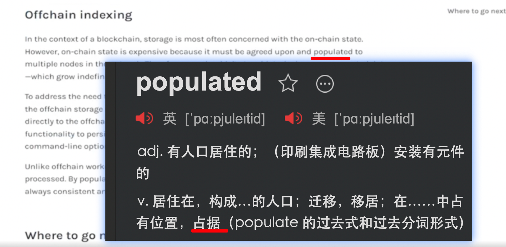

scaffolding
脚手架

convention
惯例

nested
嵌套的

integrate  
合并

intentional  
故意的

## 220923

  
populated  
占据

## 221001

  
adhere

  
on their behalf

  
malicious

  
substract

  
signal

## 221003

  
benchmark

      
escaping codes

## 221005

</img>  
braces

</img>  
parenthesis

## 221029

spot trading  
现货交易

margin trading  
保证金交易

## 221030

columns  
列

## 221101

syntax  
语法，句法

intersection  
交接（点或线）

lucid  
表达清楚的；易懂的

## 221108

intraday  
当天的，一天内的
