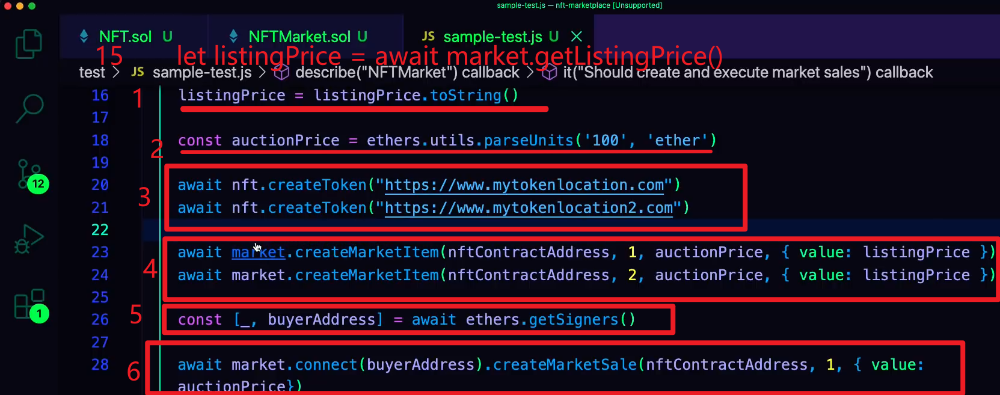
1，把它转换为 string 好和它交互  
2，设置把 nft 卖成多少钱的变量。  
3，创建 nft，需要提供 uri。  
4，把创建的 nft 放在市场售卖。  
5，在实际场景中，用户会用如 metamask 的钱包。在测试场景中，你可以获得很多测试账号的引用，如 hardhat node 可以获得 20 个本地测试号。这里用了 ether 的 libarary，用 ether.getsigners 就能获得。下划线是 seller，右边的是 buyer，不希望是同一个地址，所以两个分开。  
6，用 buyer 地址连接上 market。

访问 market items，并 console 出来

  
npx hardhat test 进行测试。看到了很多奇怪的数据，接下来进行些操作让这些数据更可读。

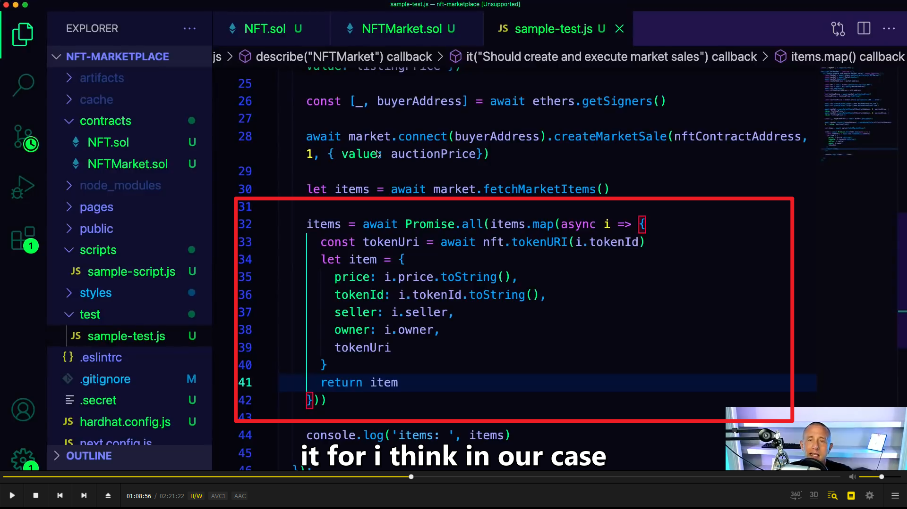
重写，让结果更可读  
map 它们，并让它们 update（实时更新？），想要 asynchronously 异步的，所以 promise.all，这样可以做异步的 mapping。  
add，map 方法接收一个数组，并依次用数组里的值作为参数调用函数，并用最终的返回值组成新数组。

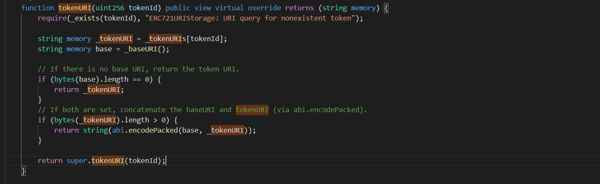  
add, tokenuri 方法，在 erc721 和 erc721storageuri 里都有，实际使用时，先调用如图 erc721storageuri 里的，然后因为返回 super.\*，则再将值交给 erc721storageuri 所继承的 erc721 合约，从而再调用 erc721 里的 tokenuri 方法

  
重写后的输出结果

开始写前端。先 npm run dev 开启前端。

  
index.js 包含主页面内容。

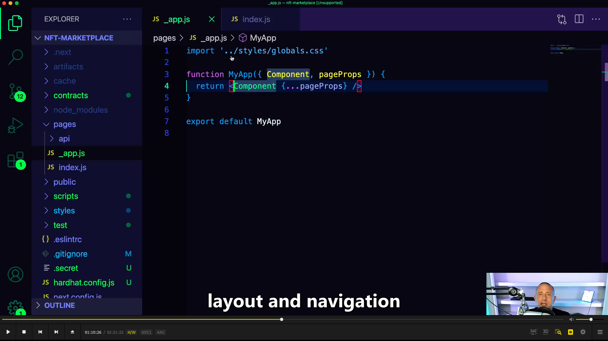
\_app.js 主要用于部署 layout 和 navigation。

  
删掉主页大部分内容，只加入一个 h1 home。

  
为了实现到其它页面，引入 link。

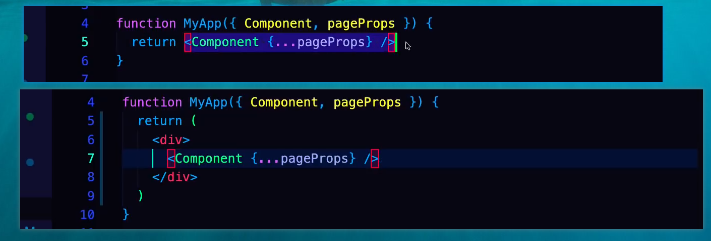
instead 只是返回被渲染的 component，我们把它放进 div 里。这样就可以 apply navigation 了。

准备 styling navigation with tailwind。  
1，border-b 就是 border bottom，p-6 是 padding 6.  
2，导航的标题。classname 都来自 tailwind。  
3，包裹 links 的 div。mt-4 是 margin top4.  
4，第一个 link 是 home。mr-6 是 margin right 6

  
  
重复就可以得到这个页面

  
usestate,useeffect 是 hooks，usestate 允许 keep up with local state。useeffect 允许 invoke a function 当 component loads 时  
axios 是个 data fetching 库。  
web3modal 用于连接 eth 钱包。  
(useEffect 钩子函数,第一个参数传函数,第二个可选参数是个数组类型  
不传(没写或者只写空数组)，则监控全局 useState 值，任何一个 useState 值发生变化则执行该函数  
传了，则监控该数组中的 useState 值，数组中的值发现变化则执行第一个参数的函数)

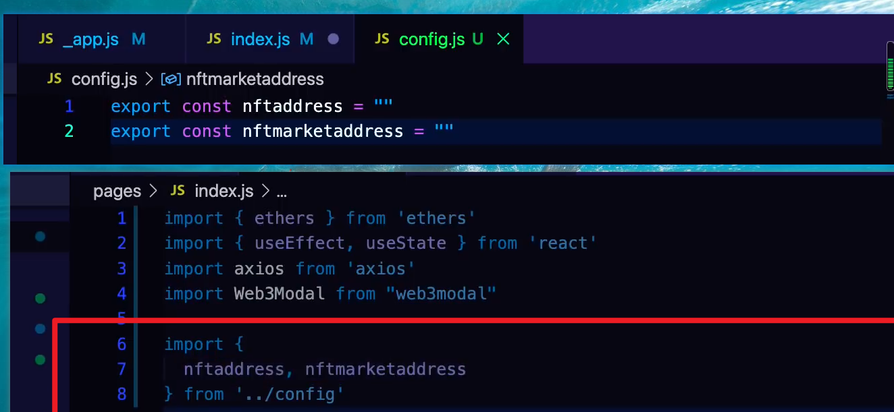
当部署合约时需要有个 ref to market address，和 nft address。

接下来需要 apis，它是 json 代表 contract。并允许客户端与之交互。  
当允许 npm hardhat test 时，hardhat 就已经编译它们，并将之放在 artifacts 文件夹中，所以这里先删除此文件夹。然后 npm hardhat compile 重新编译。再 import 引入。

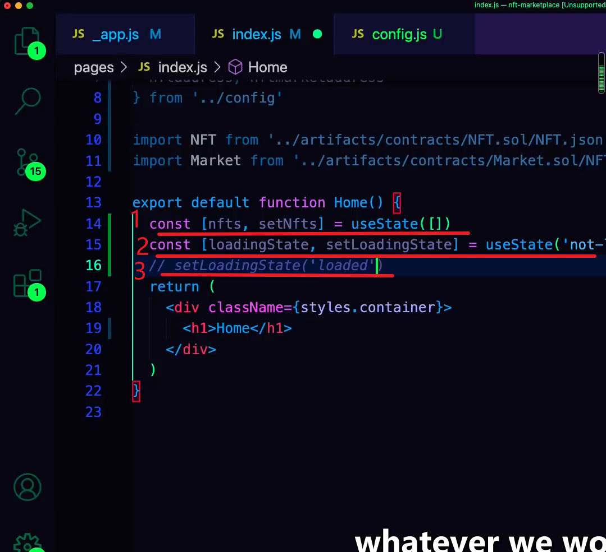
创建 inital state。  
1，先要有 an empty array of nfts(nfts). a function to reset that array of nfts(setNfts).  
2，当 app loads 时，have no nfts。就要 call smart contract 去 fetch that array。然后更新本地状态。  
2，loadingstate 是个变量，setloadingstate 允许更新这个变量。默认时，当 app load 时，loadingstate 被设置为 not-loaded。  
3，想改变时，就调用 setlaodingstate，使用 loadingstate 可以显示和隐藏 ui，这样可以 keep up with where the application is in the life cycle。

  

1, loadNFTs, call contract and fetch nfts. 当 app loads 或 componet loads 时调用  
2，因为 app loads 或 componet loads 时调用，所以使用之前提到的 useeffect 方法。~~(意思可能是因为 app loads 时，nfts 是空数组，就触发方法调用)~~ useeffect 用两个参数，第一个是触发时使用的函数，第二个是数组，填写具体 usestate 名，如果为空数组或不写则代表所有 usestate 状态发生更改时都触发函数。  
3，需要 ethers providers，因为是只读操作，不需要知道用户信息，所以使用一个很 generic 的 provider。JsonRpcProvider。  
4，configure the contract，passing in adress, abi, provider.  
5, also marketcontract. coz we are going to fetch the market items, then need to map over the market items. and want to get the token uri by interacting with a token contract. so we need both contracts.  
6, get data.  
7,map over all of those items.  
8,获得 token uri，并从中获得 token 的 metadata。当使用 ipfs 时，会上传一个 json 包含很多信息，如 token name，description，image 或 video（事实上是引用而不是真实的文件）。  
9，创造一个叫 price 的值（要 format 它），它是被 set 在 item property 里。所以这里设置个 item object。  
10，除了 price，还需要其它很多值，这样就可以很好的代表一个 nft 了。  
11，setNFTs。

  
当 loaded 后，但还没有 nft，就要显示 no items。

1，创建一个购买 nft 的 function。  
2，连接钱包。  
3，创建 provider，输入 connection 不仅因为需要地址，还因为要签名和执行交易。  
4，因为需要签名，所以需要个 signer  
5，get the ref to the contract。  
6，get the ref to the price。并 parseunit，将 string 换为 number。  
7，create the marketsell。将一个用户的钱转给另一个用户。并等待执行完毕。好执行以后的操作，如 reload screen，所以 loadNFTs()。

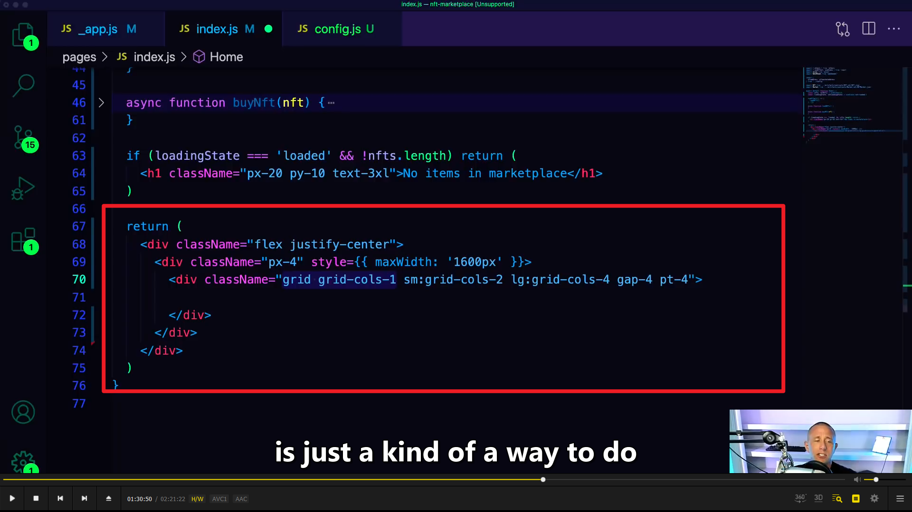  
主页设置，最大 1600px，根据用户屏幕，分不同的 column，屏幕大，column 多，响应式设计。

1，map over the nfts, 不仅 nft，还有 index，i。index 允许设置 key。  
2，每个在 array 里的 nft 都返回一个 div，并设置 style。rounded-xl 代表设置弧形边框  
3，显示图片  
4，显示 nft 名字和描述，设置固定高度。  
5，设置一个有黑色背景的容器，之前的是白色背景。容器里有 button 可以买 nft。

  

设置 deploy.js 文件，
开启本地节点并运行部署脚本  
把合约地址放入 config.js  
然后运行  
npx hardhat node  
npx hardhat run scripts/deploy.js --network localhost
npm run dev

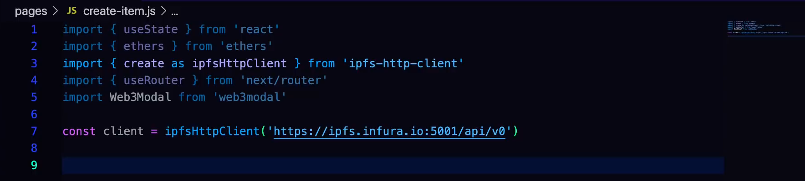
创建新建 nft 的页面，create-item.js  
1，引入依赖，其中 ipfs\* 允许通过 ipfs 来上传和下载文件。userouter 允许路由到不同的路由，也可以允许你知道 route uri 的值  
2，创建名为 client 的变量，inferior url，set and pins items to ipfs。

1，引入两个合约的 json。  
2，创建此组件的 default export。  
3，使用 usestate 创建一些 local state，file url 是允许用户上传的 ipfs 文件，forminput 组件允许用户 create nft，之前那个允许用户上传文件，这个允许用户上传 price，name，description。  
4，create a ref to the router,use useRouter() hook.  
5, 准备创建三个 function，第一个用于创造和上传 file url，因为现在是 null。 （usestate（null）），并且需要个 form input。所以创造 onchange function，然后 attach 它到 input。

  
1，也可以做个 callback。加入{progress\*}参数（没懂）  
2，当上传结束后，我们获得变量 added，使用它可以获得文件所在位置的 url。  
3，call setfileurl，这样当 create nft 时就知道 nft 保存在哪个位置了

create items for users to list items for sale,分为两个 function。第一个让用户创造 item 并保存至 ipfs，coz not only we have the url ref locally but we want upload a json representation including the name, description, image. 第二个用于 listing items for sell。这里是第一个 function。
1，从 forminput 中获得值。destructure 解构 获得名称，描述，价格。  
2，剩下的跟之前的代码类似。

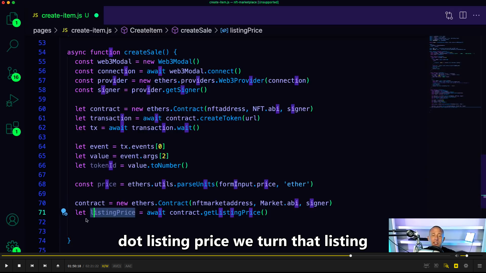  
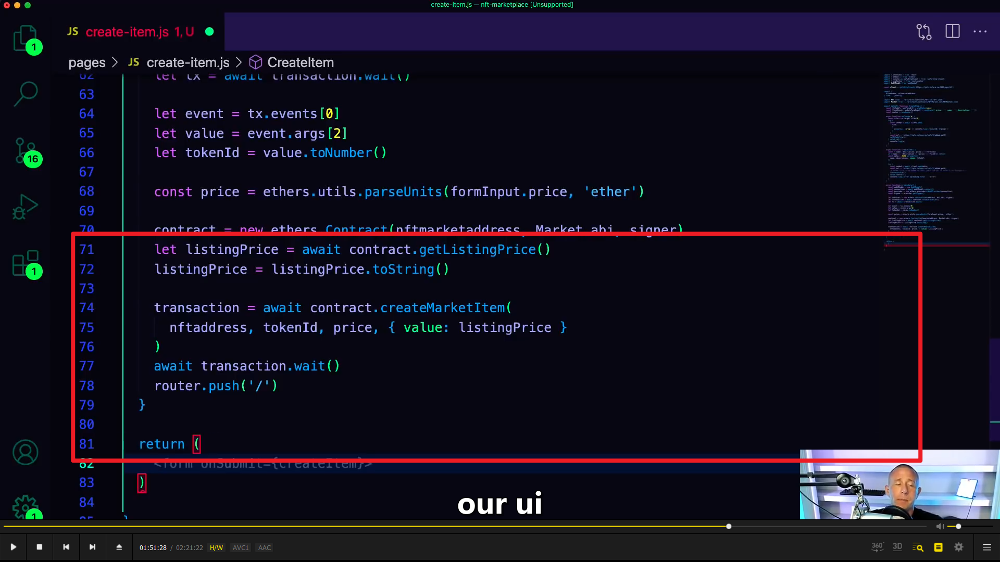
createsale 较简单。

  
返回 ui，创建新 nft 的对话框。

  
上传文件，上传文件的预览，上传文件的 button。此处 button onclick 名称应改为 createitem。

~~### 之后是创建 my-assets 页面和 creator-dashboard 页面。跟之前的类似，省略掉。~~
my-assets 类似 index.js。只是需要加 signer 和使用 fetchMyNFTs 方法。

  
polygon 测试网，mumbai。

  
部署时指定 mumbai

  
polygon matic 测试网 水龙头 faucet

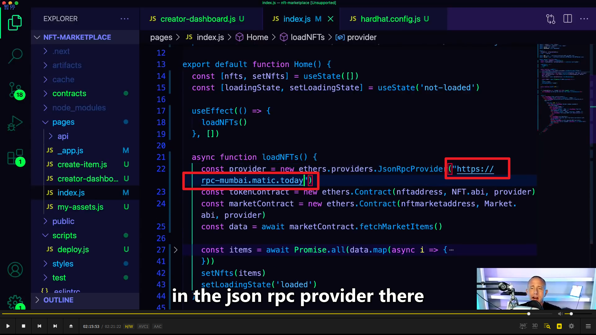  

