  
各种依赖的作用

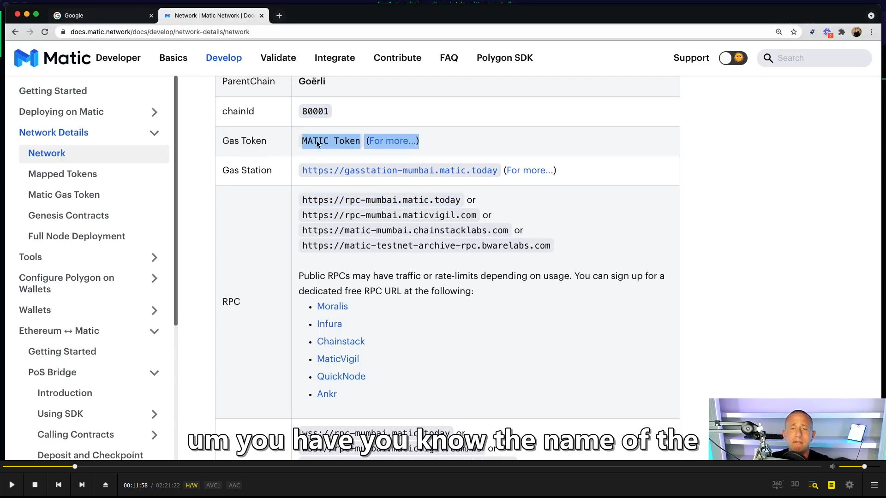  
matic doc

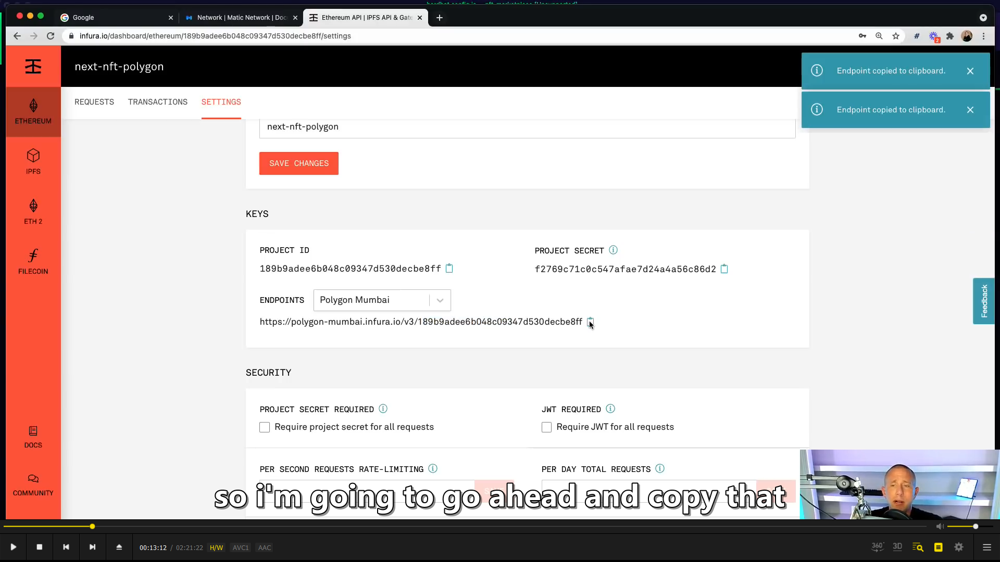  
公共节点可能会遇到过载问题，所以可以在 infura 自建节点

  
注意写法，${}，不想暴露 id 可以单独开个不上传的文件

  
安全引入 private key 的方法。

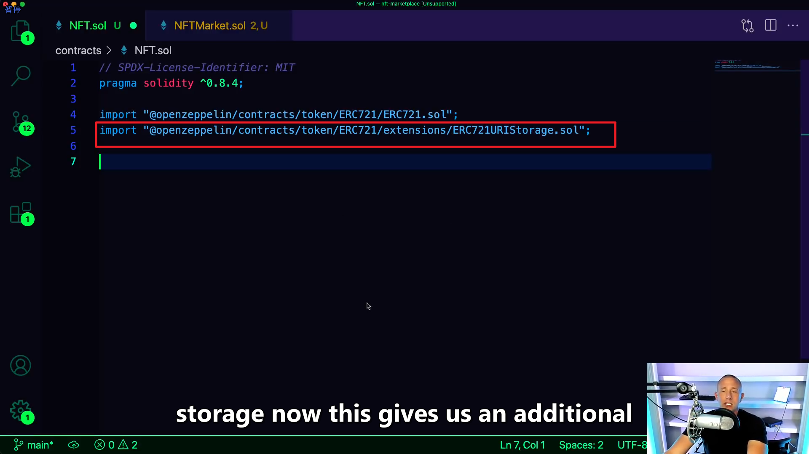  
额外的 function， set token uri 去 set like it sounds the token uri。

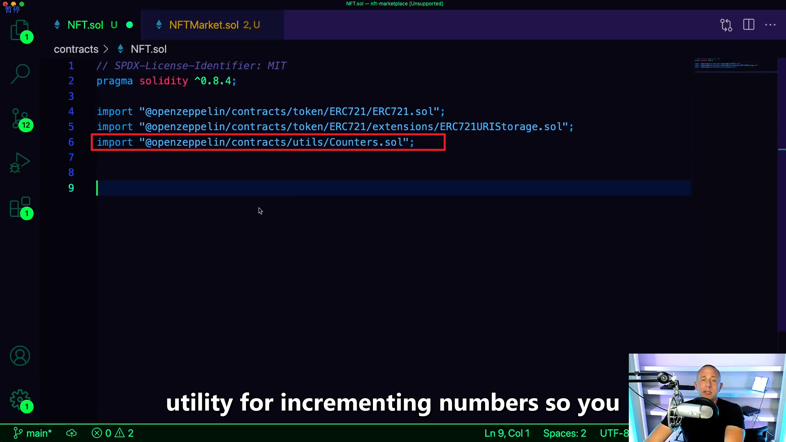  
用来增加数字

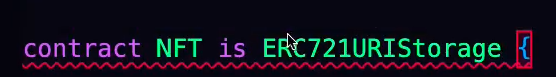
NFT 继承自 ERC721URIStorage 而 ERC721URIStorage 又继承自 ERC721

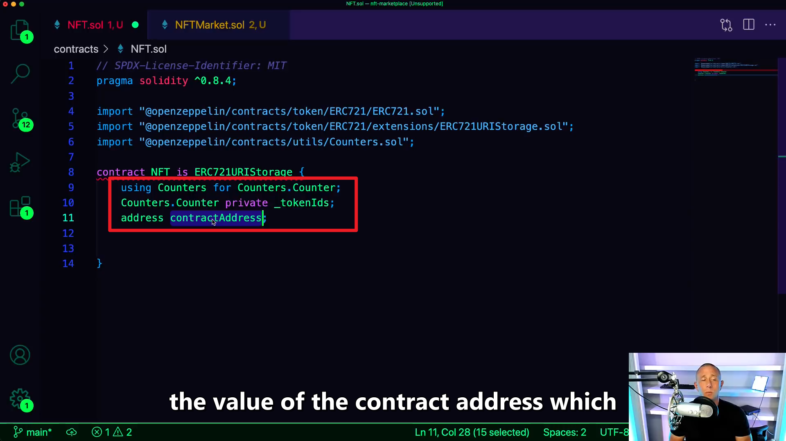
using A for B，可用于在合约的上下文中，将库函数（来自库 A）附加到任何类型（B）  
这里的 address 是 market contract 的。用来让 market contract 和 nft contract 交互

  
给这个 token 或 marketplace 许可去 transact 这 token between users 和 other contracts。

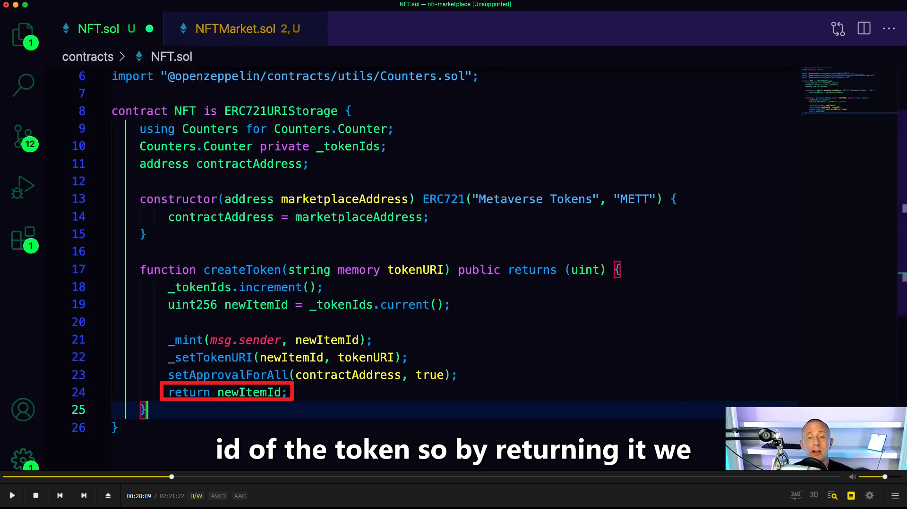  
想把 token 卖掉需要知道它的 id，所以返回它，客户端可以获知。

  
防止 re entry attack 的。

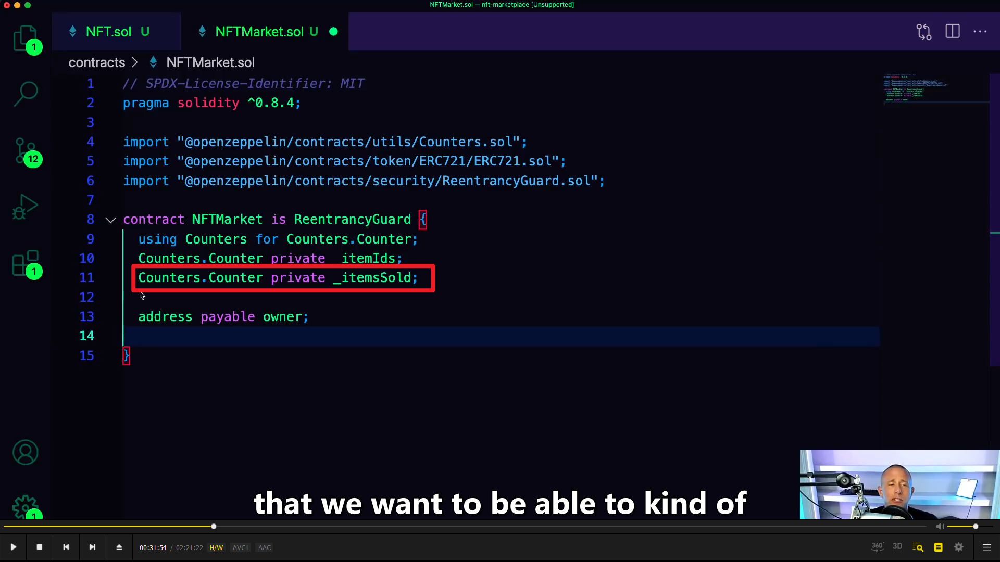  
solidity 没有动态数组，所以需要知道数组长度，所以需要 itemsSold。

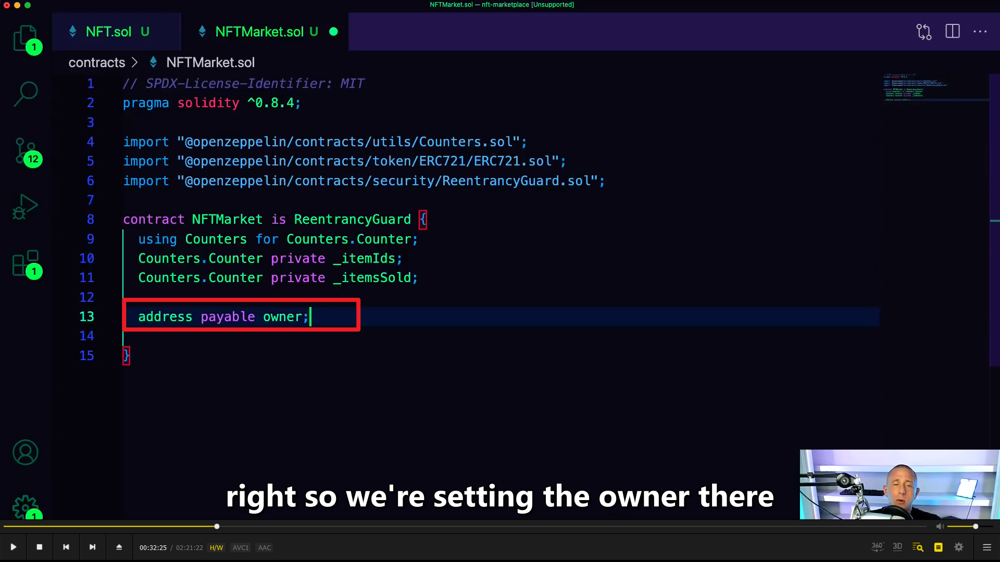  
设置 owner 可以方便获得佣金

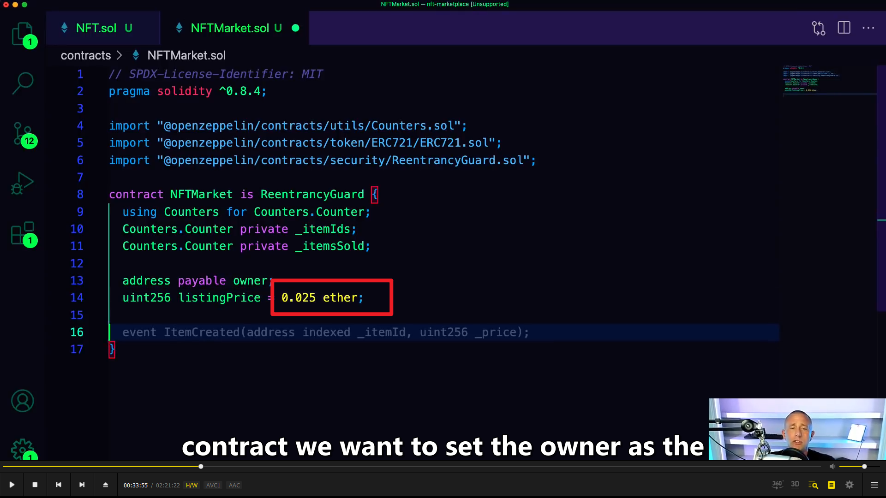  
尽管这里是 ether，但如果部署到 matic 网则是 matic。

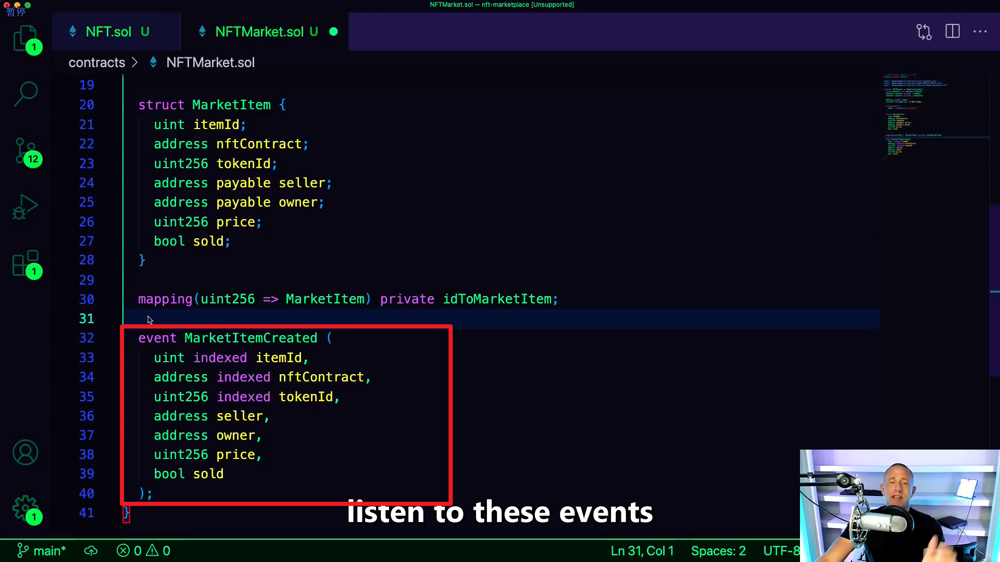  
一个 marketitem 被创建的时候产生的 event，提供给客户端

createMarketItem

  
createMarketSale

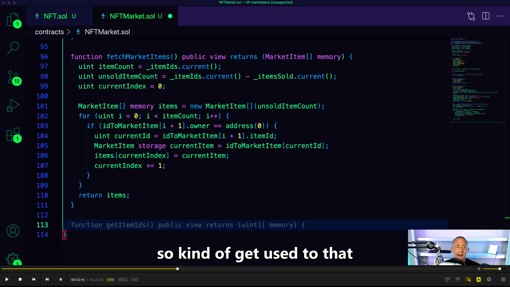
fetchMarketItems

fetchMyNFTs

sample-test
