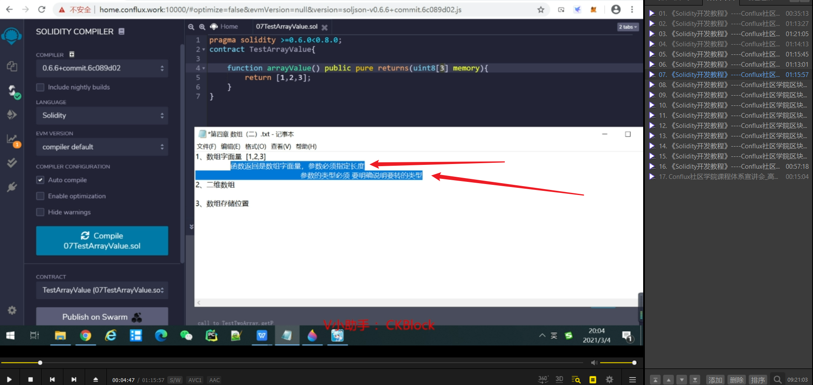
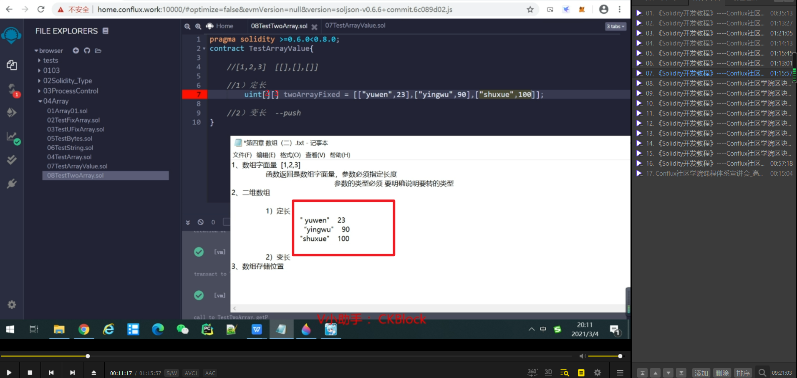
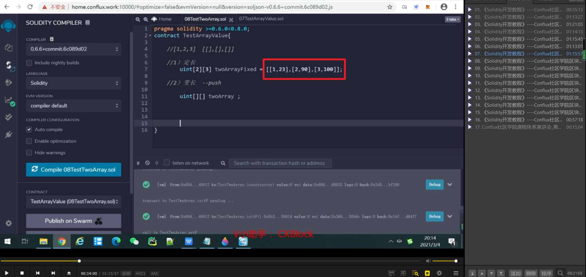
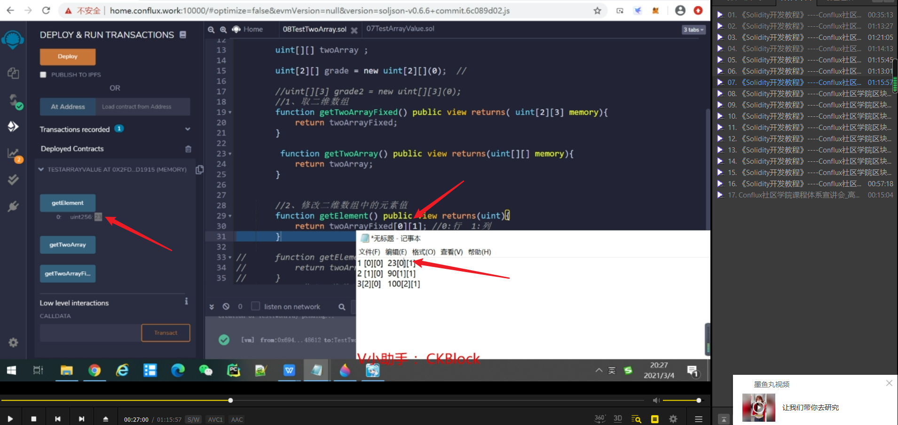
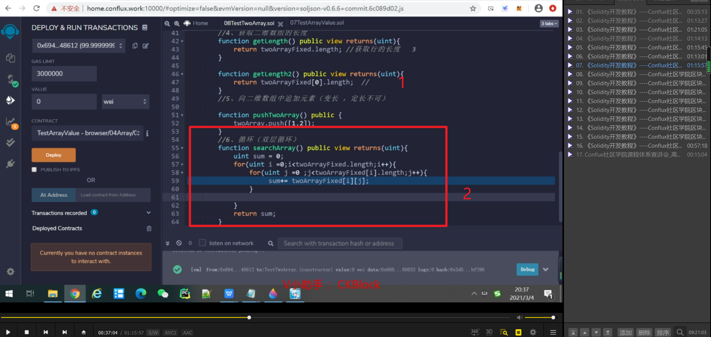
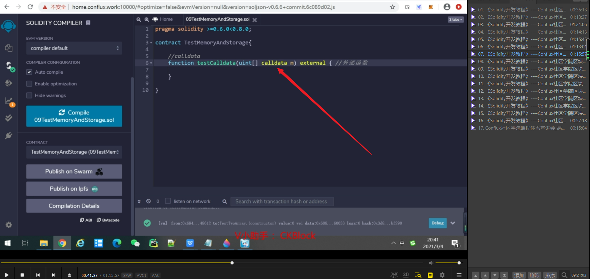
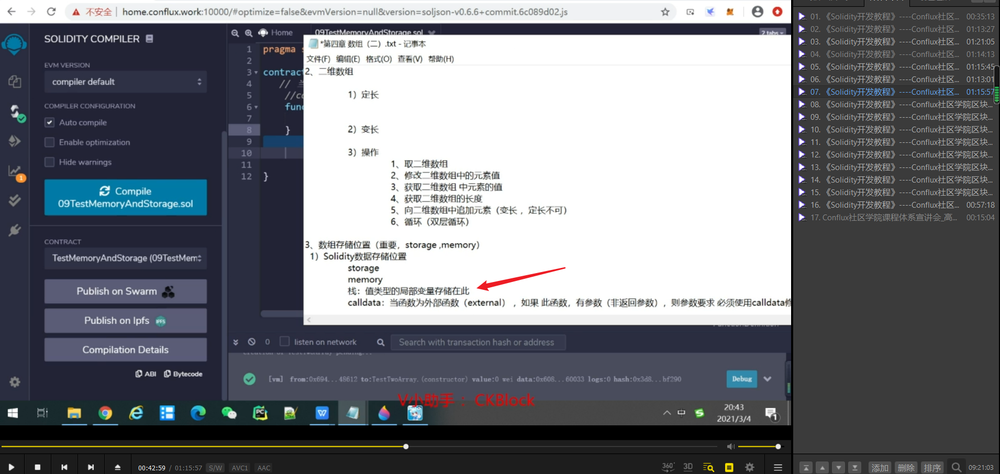
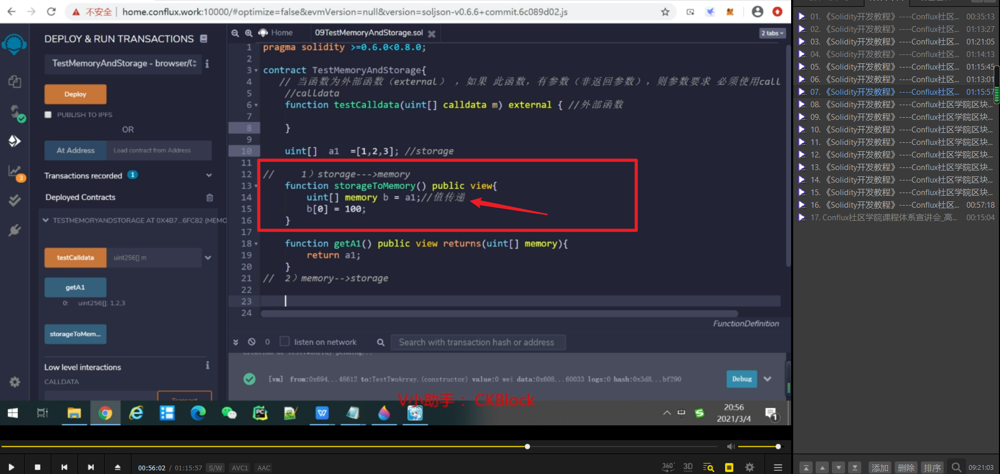
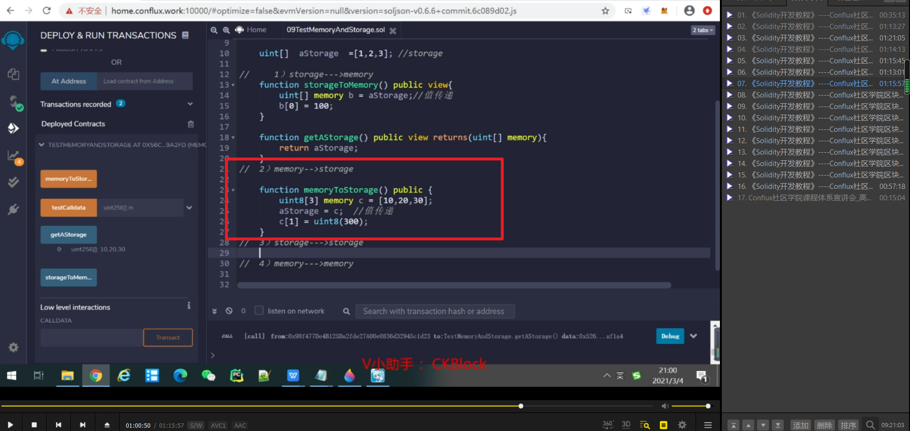

不想用uint8，比如这里用int，则只需要在返回值的第一个加上int，并用括号括起来，就是强制类型转换。

solidity这样代表三行两列，其它语言相反。

上一张图会报错，因为数组中用了不同类型。改正为此图。

获取的时候是先行后列（跟其它语言一致），跟之前的创建相反。

1，二维数组获取列的长度。     
2，二维数组双层循环。

当函数为外部函数，如果此函数有参数（非返回参数），则参数必须要求使用calldata。

栈，值类型局部变量存储于此，函数里面就叫局部变量。

storage转memory是值传递。（因为b修改了a未变）

memory转storage也是值传递。

storage到storage是引用传递，memory到memory也是引用传递。但这里强制转换出了错。所以本来是800变为了32。
