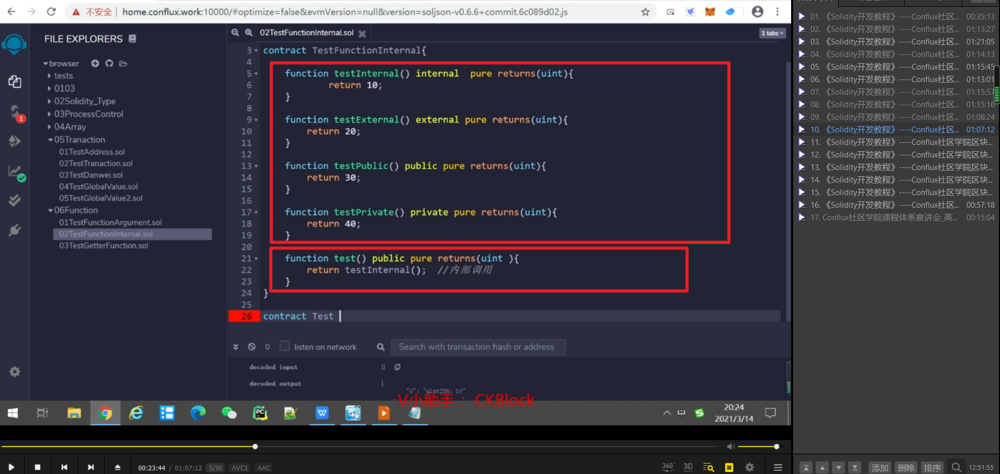
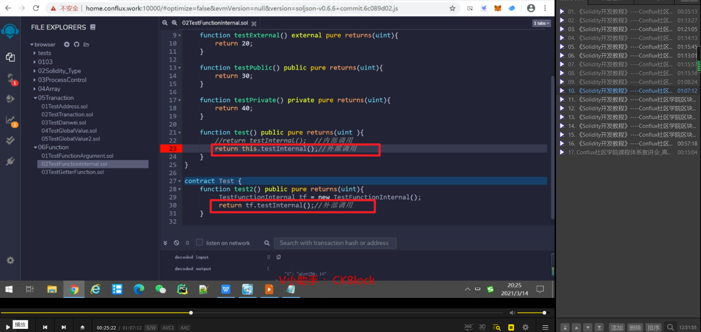
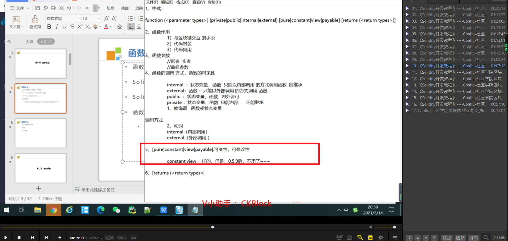
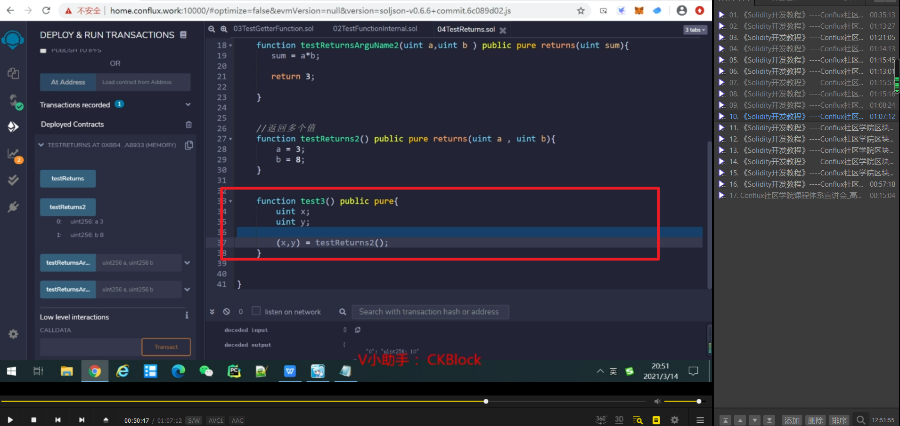
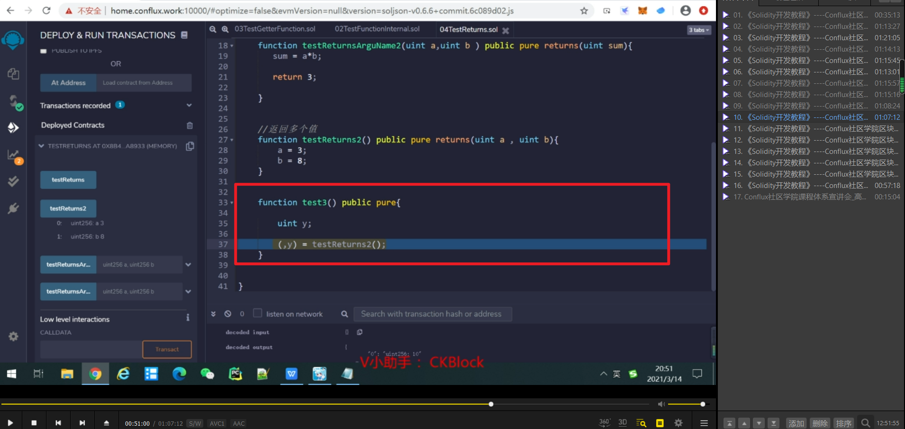
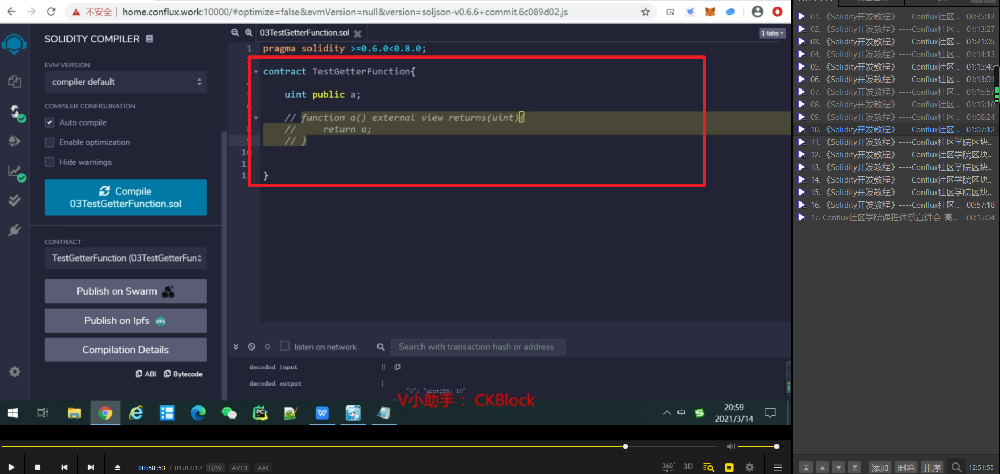

两种传实参的方式，第二种的意义在于可以调换a，b的顺序。

函数的可见性和调用方式，一个是修饰词，一个是动词。

列举了四种修饰词的函数。并测试了用内部调用调用内部调用修饰的函数。

这两种形式都叫外部调用，但由于目标函数为内部函数internal修饰，所以会报错。

几种调用形式是否可用的场景。internal和private一样，区别以后再说。

pure，不修改，不访问状态变量。view是要访问状态变量。payable是只有当需要交易时才用。         
mark 220311

因为return的参数里定义了sum名。所以函数体就不用加return，sum=a*b会直接返回sum。

此时返回3，因为return后把之前的sum覆盖掉了。

接收多个返回值的方法。

如果只想要后值就这样写。

用public修饰的状态变量。会隐式的自动生成同名的一个getter函数，所以可以直接在remix左侧蓝色按钮调用。

public修饰的数组也会生成一个getter函数，但参数为数组的index。（0.5以前可以重写此函数，之后重写会报错）