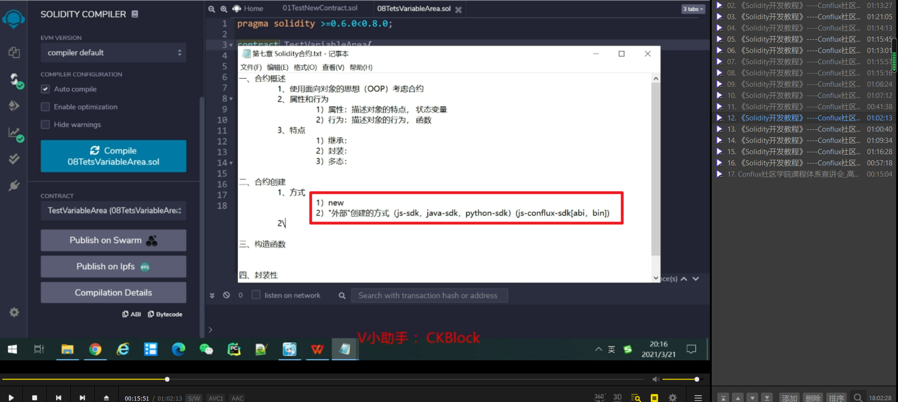
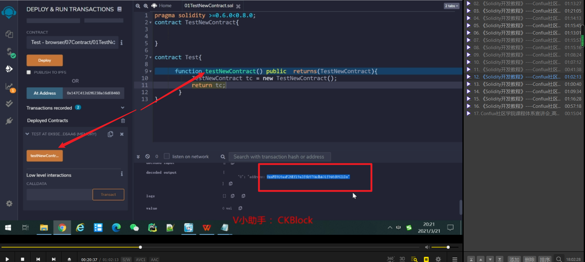
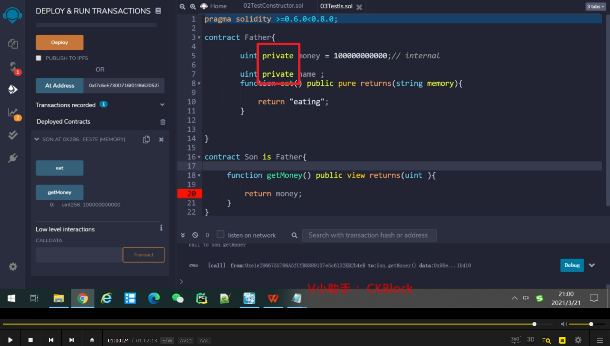

合约创建的两种方式，目前只学new方式。       

eee，创建合约本身尽量不要写在合约体里面，尽量写在函数中。

      
此函数返回一个合约地址

      
一个范例。

直接.状态变量不能使用，但加上（）就能正常调用，使用了age隐藏的getter函数。       
solidity中不建议大量使用public修饰状态变量，防止到处都能修改状态变量，并浪费gas。

如果未使用public，则需保存合约地址，然后点at address，就能获得值。（此例子由于没有getage，所以只能获得getname值）。

0.5以后的无参、有参构造函数。每个合约只能有一个构造函数。

使用了构造函数的智能合约范例，让只有合约发起者才能修改数据。

external不能修饰状态变量。

继承可以让子合约拥有父合约一样的数据，即使是internal的数据也能使用。        

加了private后则继承失效。
