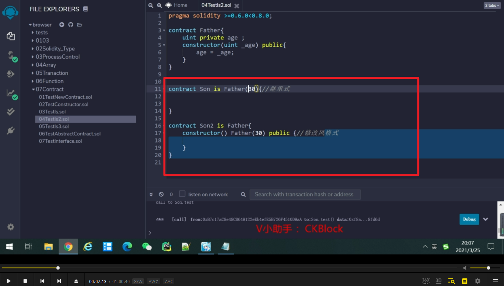
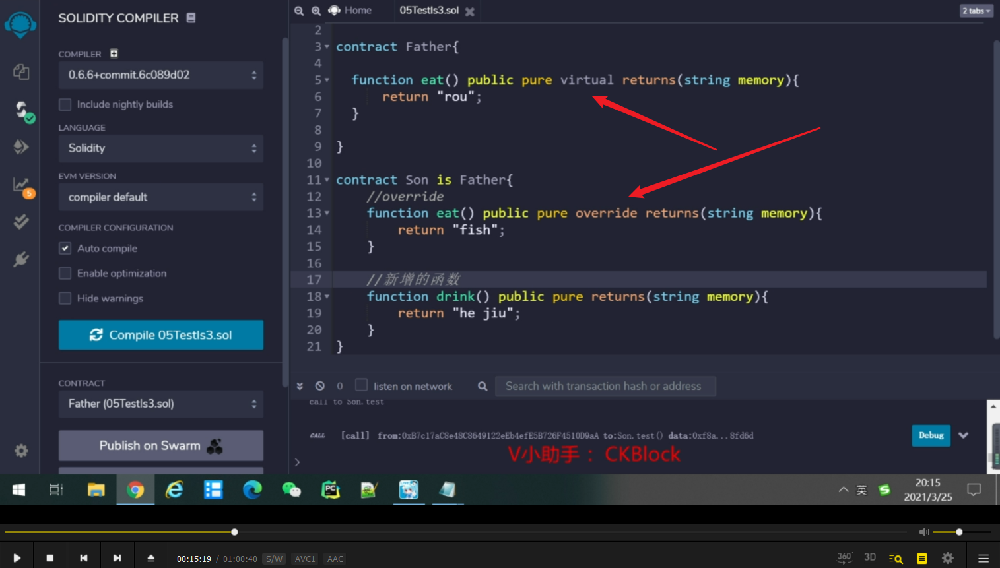
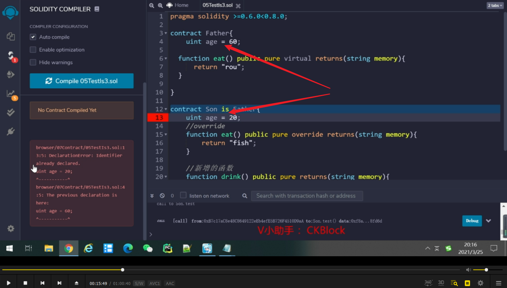
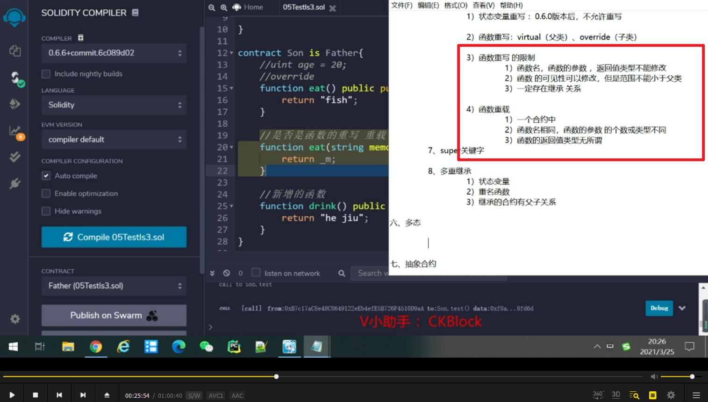
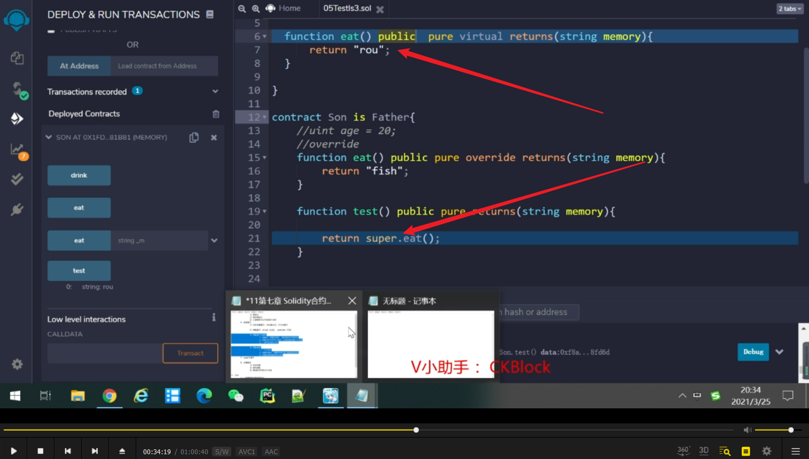
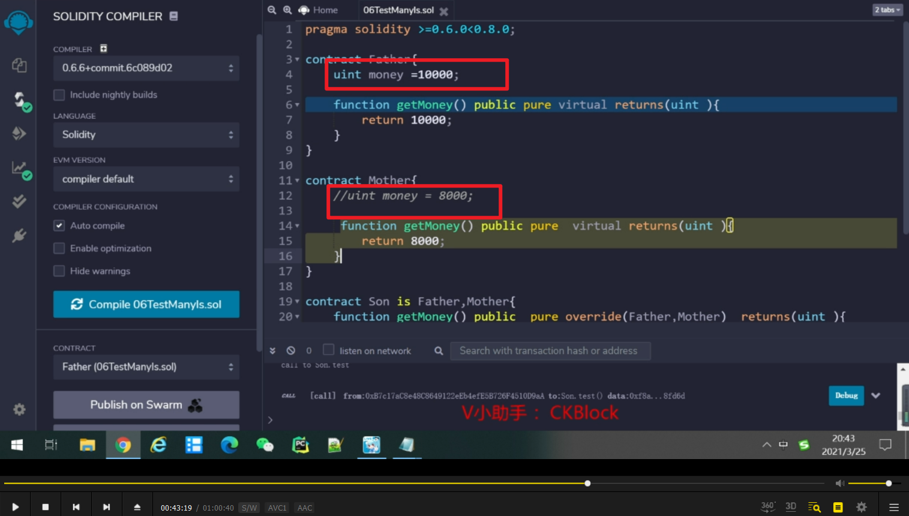
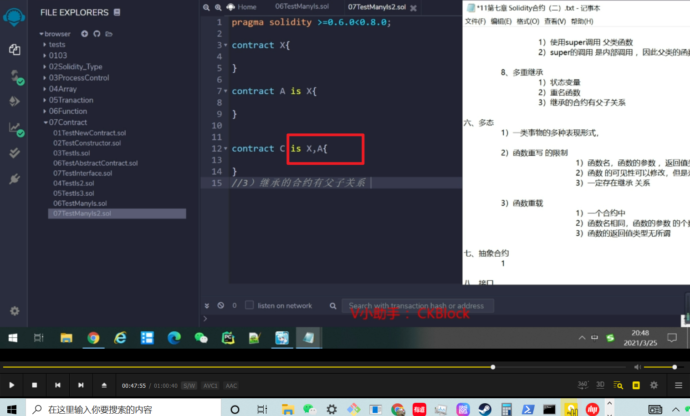
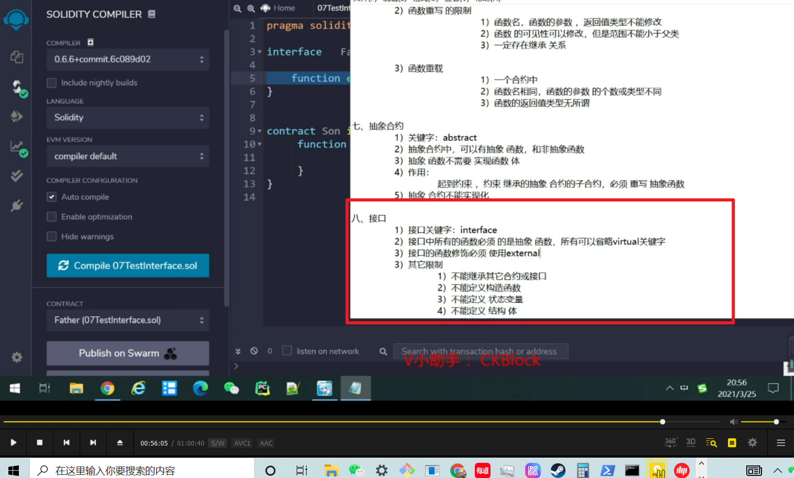
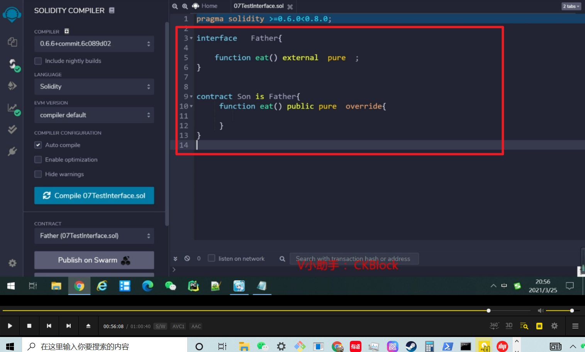

两种子合约给父合约的构造函数传值的方式。

重写，需加关键字。

0.6后，状态变量不能被重写。

函数重载，重写区别。

子类重写了，在子类调用起作用的是重写后的。

如果要调用父类，则需要增加super，并将父类改为public。因为super的调用是内部调用，父类函数不能使用external修饰。

多重继承不能有同名的状态变量。

多重继承可以有同名的函数，但继承时需要注明。

继承同时使用两个父合约的数据。

被继承的两个合约也有继承关系，则爷合约写在最左面。

抽象合约

抽象合约实例，子类必须强制重写。 

接口介绍。

接口实例。

接口作用，类似抽象合约，起到更强的约束作用。