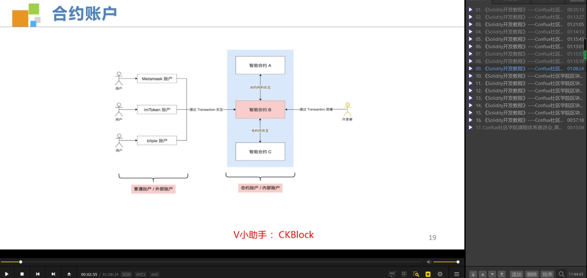
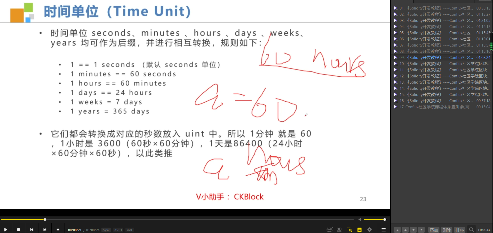
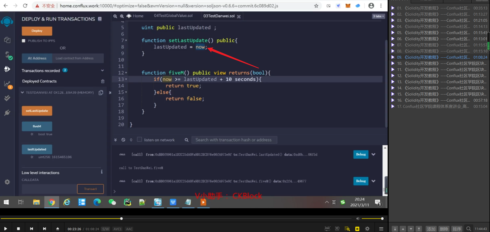
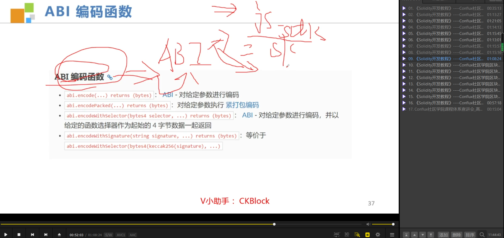

wei b money，finney pow，szabo 智能合约。

测试时间是否超出的合约，now是全局变量或称内置对象（和msg.value一样）。

3
全局变量，内置对象列表。

5种获取区块信息的方法。第一个方法无法获取当前块的hash，所以只能减一获取上个区块的hash。

数学和密码学函数，暂不需要学习。

abi编码函数，暂不需要学习。

错误，异常处理函数，暂不需要学习。

只有合约发起人可以更改money的小实例。

更正规的写法，利用构造函数和错误处理（如果合约调用者不是合约发起者会报错）。