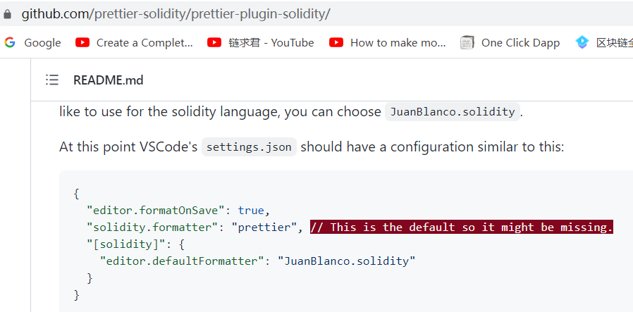

solidity vscode 格式化，需要添加这段到 settings.json。

```
  "editor.formatOnSave": true,
  "solidity.formatter": "prettier", // This is the default so it might be missing.
  "[solidity]": {
    "editor.defaultFormatter": "JuanBlanco.solidity"
  }

```

sol 文件里出现 import 报错，将 solidity 插件降到 0.0135。直接降可能失败，下载单独的文件，再将其拖入 vscode 的插件栏来安装。
