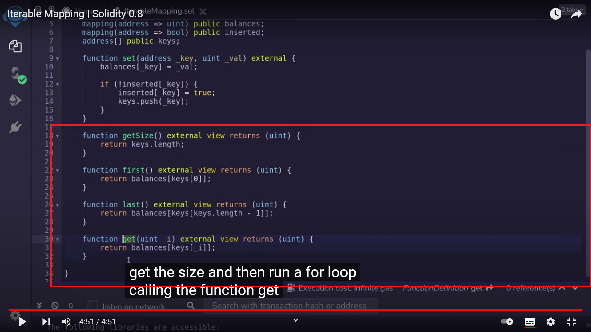

  
无法遍历 mapping，除非我们跟踪这个 mapping 的所有 keys。此教程就是教如何遍历，就是说可以知道 mapping 的大小，并建立循环得到 mapping 所有的数据  
为了跟踪和获得第一个 mapping 的所有元素，新增了第二个 mapping，跟踪某个 key 是否已经插入。当在第一个 mapping 里插入数据时，第二个 mapping 的相同 address 会被设置为 true。  
然后还要把所有已插入的 keys 放入一个 array 中。

  
此 function 用于设置 mapping balances 的 balance（即 uint）

  
后面的很好理解了，lll
