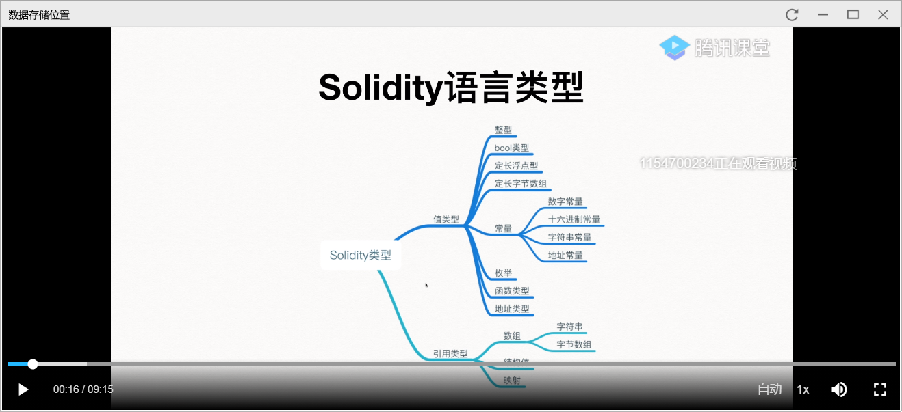

之前的课讲完了值类型，现在讲引用类型。

引用类型的复制有两种方式。一是直接创建b的引用，但引用a的内容。另一种是创建a的拷贝，然后把b指向a的拷贝。具体哪种情况要根据a和b的存储位置。

以太坊有storage和memory两种存储位置。存储在storage的内容会永久的保存在区块链中。而memory中的会随着交易的结束而消失。

1，状态变量是合约里定义的不属于任何函数的变量，如这里的a。      
2，局部变量是函数里定义的变量，如果它是复杂类型就存在storage中（简单类型就在memory中，如3）。

如图

此教程太简略，很多不懂，暂时换为其它教程。