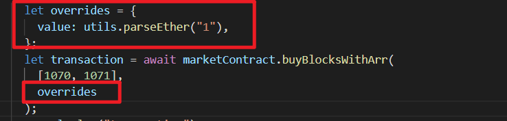

## 转到指定的 metamask 网络

https://ethereum.stackexchange.com/questions/117156/how-to-ask-the-metamask-user-to-switch-its-network  
  
不用核实是否在指定网络，因为如果已经在指定网络，则不会再出现对话框。

## 获取当前账户地址

  
const address = await signer.getAddress();

## 调用需要转账的 function 的方法。

  
加入一个 overrides，注意是{}包围的，且数字是字符串形式。        
