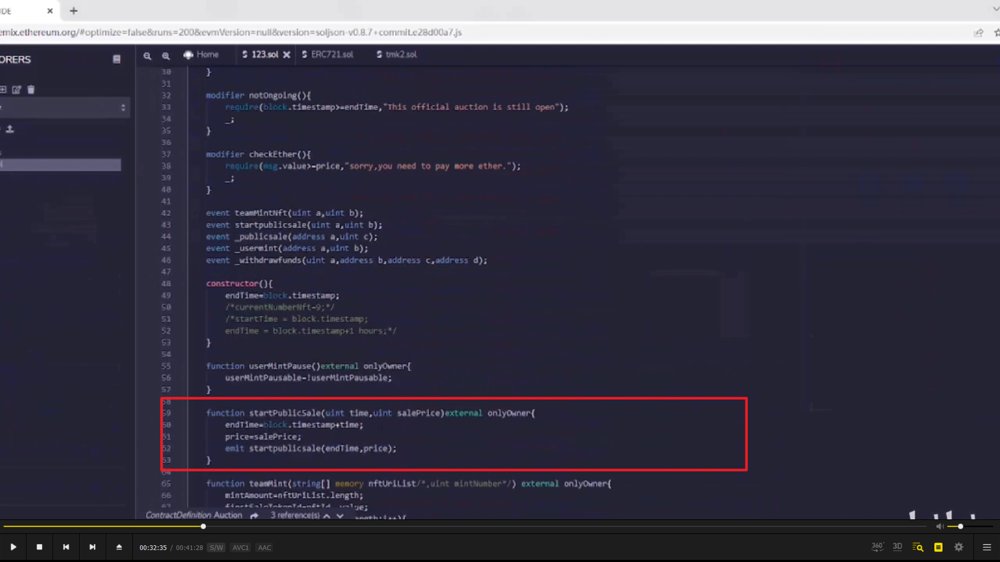
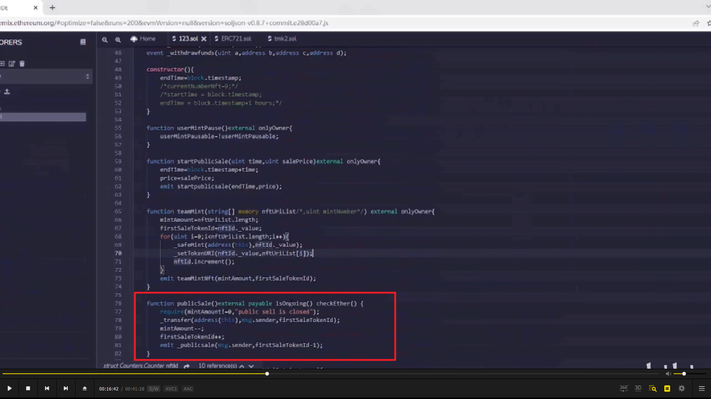
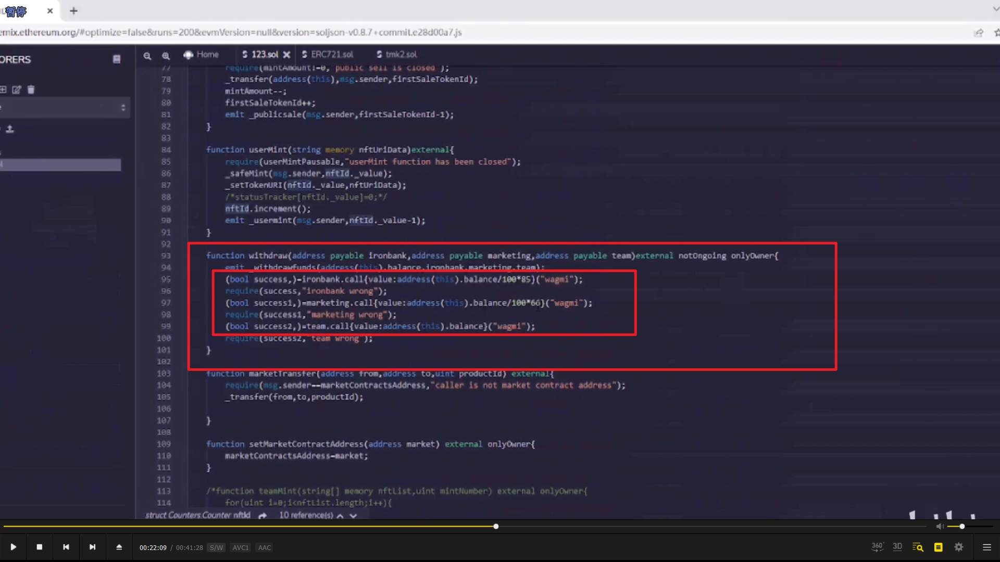
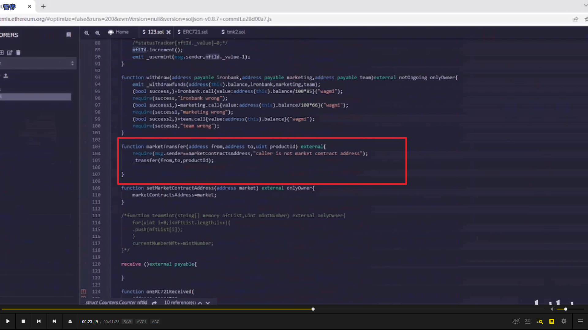
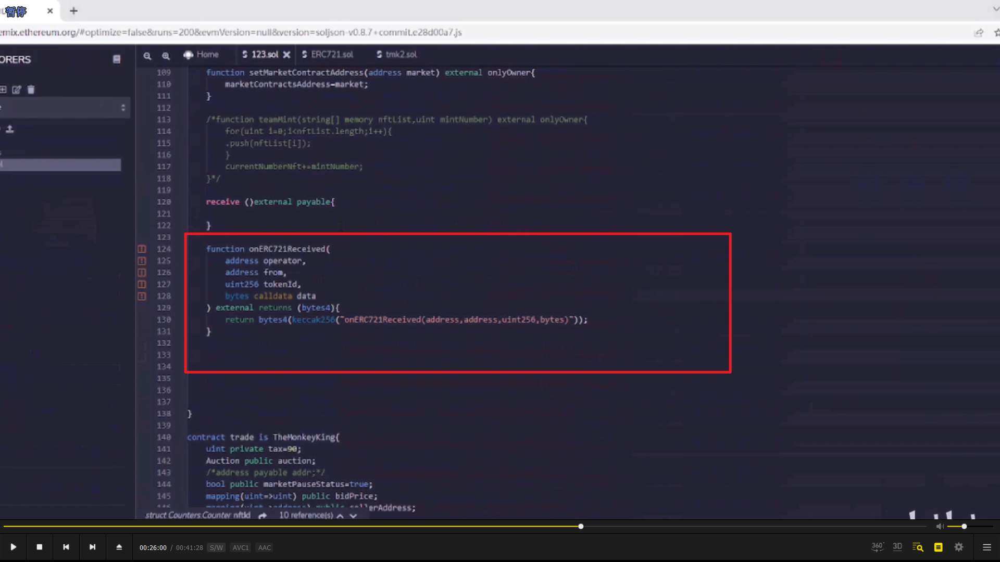
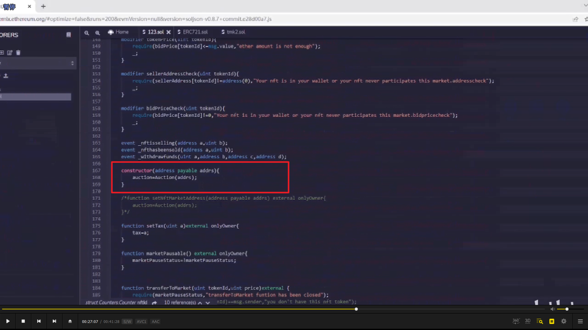

  
tmk2.sol 是依赖，只修改了这两处

  
让 usermint function 暂停。

  
time 是结束时间，按秒计算

  
  
publicSale 函数有修饰符，isongoing，它设定了拍卖时间限定

  
分别给 3 个地址发币，15%\*66%=10%。

  
用于后面的 trade 合约调用。

  
没有这个 function，别人就不能给合约转以太。

### 下面是 trade 合约

  
先实例化 auction 合约。

  
把 nft 发到 trade 合约里。当映射值为 0 时代表的是在钱包的状态。

  
购买市场上正在出售的东西的方法，这里有个防止重入攻击的设置。
