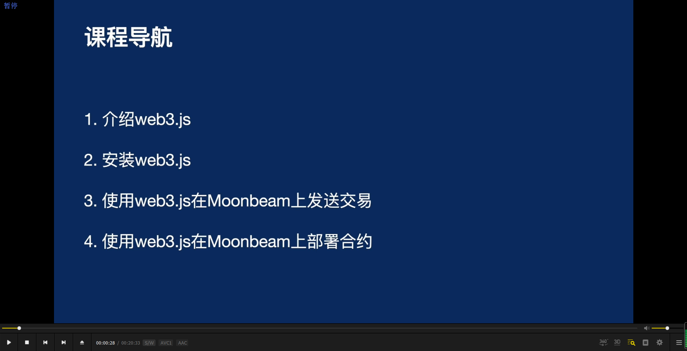
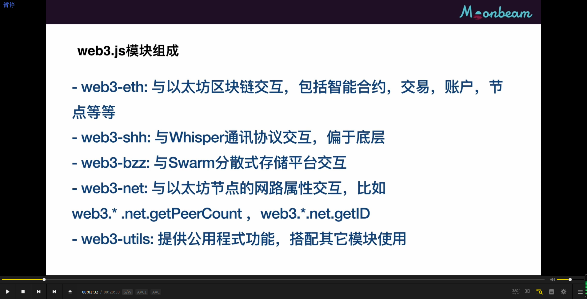
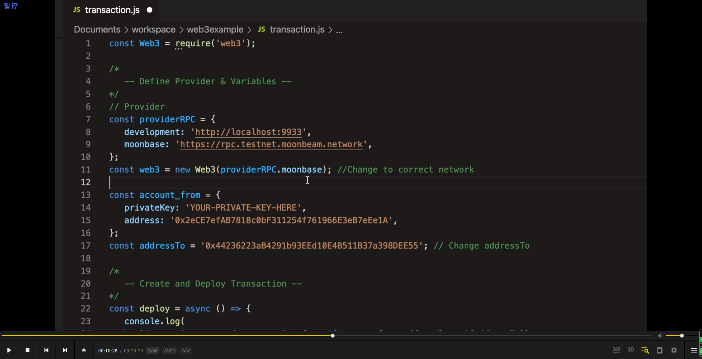

  
初始化 web3 项目。      
mkdir web3example       
cd web3example      
npm init -y     
npm install web3        

      
此时间之前为使用web3脚本在本地测试网上发送交易。        

      
此时间之前为在moonbase测试网上发送交易。

结尾之前是用web3部署智能合约。