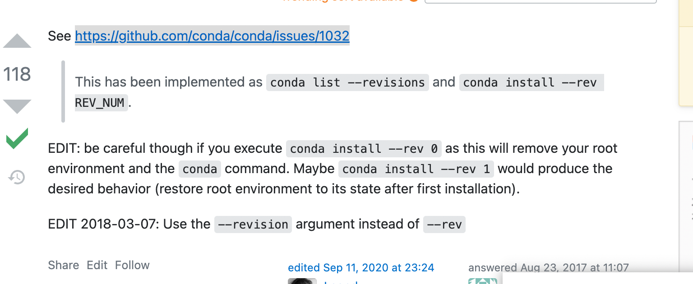

## conda 安装 binance(以及其它非主流依赖)，且安装到指定编译器分支

  
https://stackoverflow.com/questions/70957311/how-can-i-install-python-binance-package-in-pycahrm-i-am-using-the-conda-inter  
一些非主流依赖直接 conda install 不行，需现在这里搜索：https://anaconda.org/search?q=python-binance，知道来自conda-forge包，所以conda install -c conda-forge python-binance 或如 conda install -c rodgomesc pip-ccxt

## pycharm 新环境选择 base 分支

在 anaconda，envirment 中移到 base 处，显示其路径/opt/anaconda3。  
pycharm 新环境中 location 选择 /opt/anaconda3/bin/python3  
conda excute 默认选择 /opt/anaconda3/bin/conda

add，以上为安装 anaconda 时选择为所有用户安装时的路径，如安装时一直默认选项，即为单个用户安装，则路径不同。

## pycharm 选择 anaconda 中的虚拟环境。

file，new project，previously configured interpreter。三个点符号，conda envirment，conda executable 里填写 where conda 后输出的路径。interpreter 里填写鼠标放在 anaconda 环境时显示的路径并结尾加/bin/python3.??。或者 conda activate 转到指定环境后再 where python3 获取到路径并将最终 3 改为 3.？？（暂不确定是否选 3 就行还是需要 3.？？）

## 命令行切换到指定 anaconda 虚拟环境

conda activate ???

## anaconda 恢复到以前的版本



https://stackoverflow.com/questions/41914139/how-to-reset-anaconda-root-environment

conda list --revisions  
conda install --revision REV_NUM

## 创建并激活新虚拟环境

可以通过 anaconda 桌面创建，但最好用下面命令行事：  
conda create --name py10 python=3.10  
conda activate py10

## python3.10 环境安装不了 python-binance 的解决方法

常规安装方法：conda install -c conda-forge python-binance 可能遇到报错

```
conda install -c conda-forge python-binance
Collecting package metadata (current_repodata.json): done
Solving environment: failed with initial frozen solve. Retrying with flexible solve.
Solving environment: failed with repodata from current_repodata.json, will retry with next repodata source.
Collecting package metadata (repodata.json): done
Solving environment: failed with initial frozen solve. Retrying with flexible solve.
Solving environment: |
Found conflicts! Looking for incompatible packages.
This can take several minutes.  Press CTRL-C to abort.
failed

UnsatisfiableError: The following specifications were found to be incompatible with each other:

Output in format: Requested package -> Available versions

```

尝试这些方法都无法解决：https://exerror.com/solving-environment-failed-with-initial-frozen-solve-retrying-with-flexible-solve/

最后使用此理解方法有效：https://github.com/sammchardy/python-binance/issues/508  


add，可能是因为 python-binance，不支持 3.10，只支持 5，6，7

add，用 3.7 又会出现 numpy 错误，而且即使用 3.7 登陆 jupyter，sys.version 仍显示 3.10，可能是因为 3.7 时 jupyter 还未支持的原因。太复杂，暂停使用 jupyter，尝试 pycharm

## jupyter 使用 anaconda 指定环境流程

见 jupyter.md
