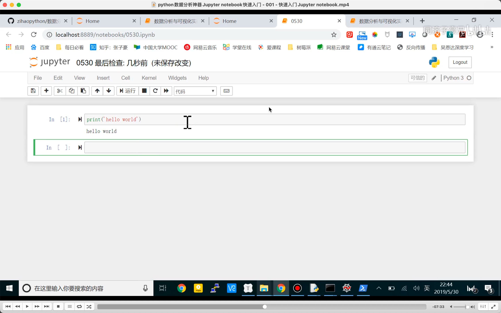

## python 数据分析神器 Jupyter notebook 快速入门 https://www.bilibili.com/video/BV1Q4411H7fJ

基于代码区块，可以和文档混写，查看中间变量，调用魔法函数等优点。对于数据分析等是最好的 ide。

内核为 ipython，所以显示 In []

  
绿色模式，编辑模式。 shift enter 运行当前代码。 按 esc 到命令模式
还有蓝色模式，命令模式，按 x 剪切命令，z 恢复命令。 按回车到编辑模式。  
在左侧按 m 还能进入 markdown 模式。  
按 h 可以看到所有快捷键。  
选中？，按 b 在当前代码块下方创建代码块，  
a，在当前代码块上方创建代码块  
ctl enter 只运行当前代码块。  
clt enter（opt enter）运行当前并跳到下一个。  
d，删除掉当前代码块  
shift v，粘贴到上方  
v，粘贴到当前。  
l 给代码标行数。  
c，复制。

## Jupyter 使用详解 https://zhuanlan.zhihu.com/p/441668517

便捷获取配置文件所在路径的命令：jupyter notebook --generate-config

修改默认启动文件夹：code /Users/accountname/.jupyter/jupyter_notebook_config.py，然后 c.NotebookApp.notebook_dir = '' 引号里输入路径。
