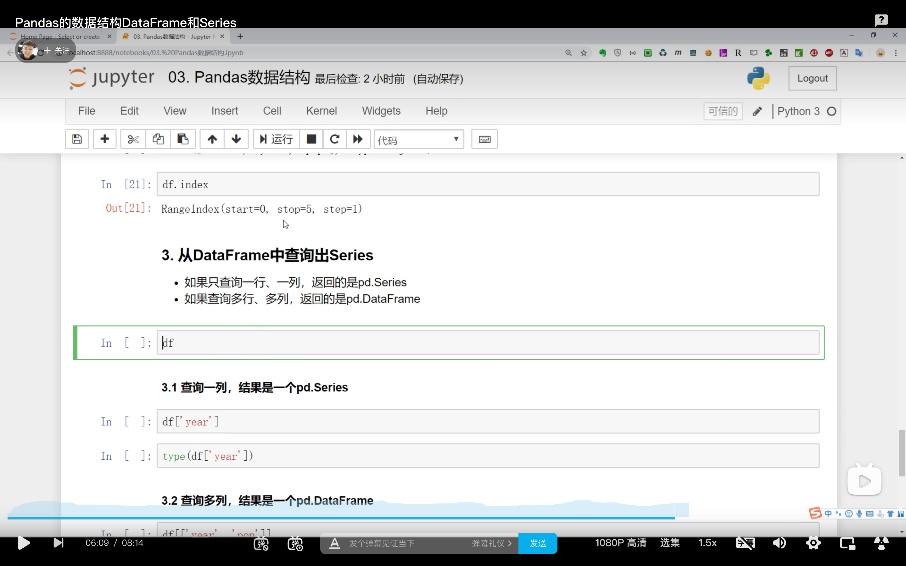

  
dataframe 结构  
要数据查询 pandas 其实就是对 columns 查询列，index 查询行。

  
一列或一行都是一个 series 对象。他是一个一维数据，代表一行或一列。如果在 dataframe 中查询出一个区块，区块仍是二维表格的话，那么结果仍是 dataframe。如果是一列或一行就是 series。为什么这样做？因为一维数据类似 python 里的字典，查询起来要快速很多。

  
series 相关操作演示  
  
获取 series 中的值，用中括号加 index 实现。

  
dataframe 相关操作

  
dataframe 中查询数据

  
查询行用 loc。
