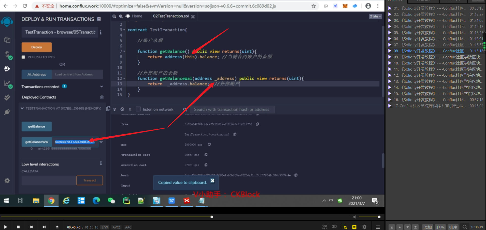
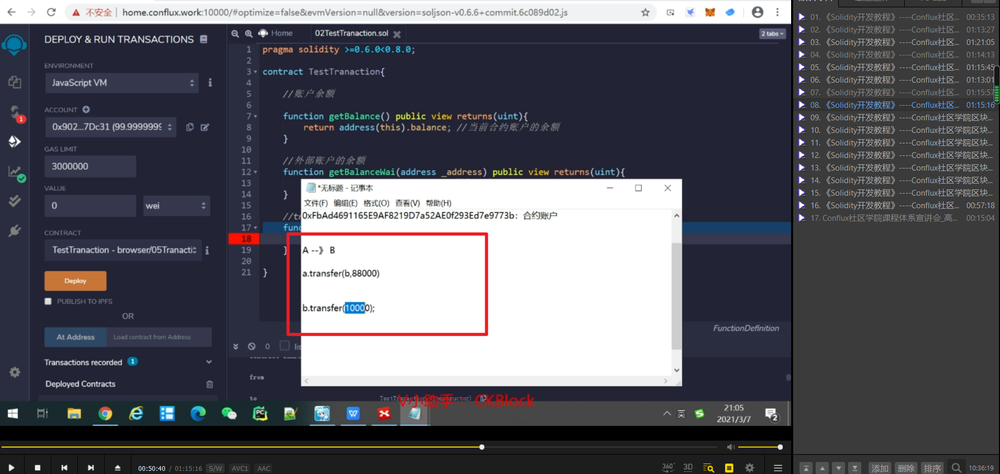
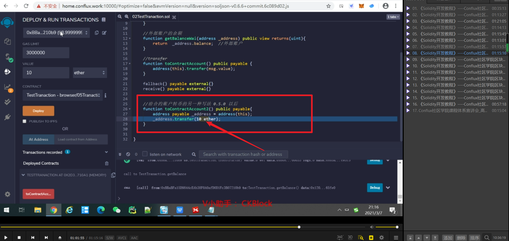

this代表合约账户，如果想查外部账户余额则自己设定。

a给b转钱，不用写a，因为谁调用合约，谁就是a。

msg.value代表外部传入的币数。后面加入两个回退函数才能成功转账，回退函数以后介绍。

另一种写法，不用写回退函数。只有0.5以后才能用，因为0.5以前没有payable。另外msg.value处也可以直接写为固定的数值。

transfer数值不一时不能交易成功，send数值不一时能交易成功，只是会给出报错。

向外部账号转（send），如果定目标10个，但第一次只转5个，则发送方减少5个，接收方不增加5个。继续转5个，接收方才会增加10个。两次交易都返回false。       
send比较复杂，初期建议只用transfer。