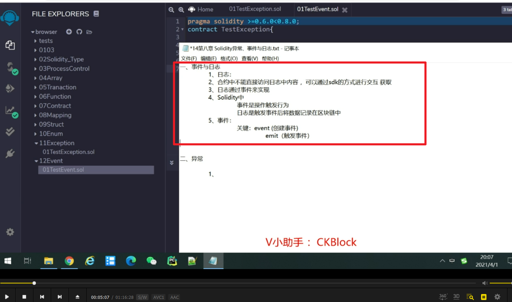
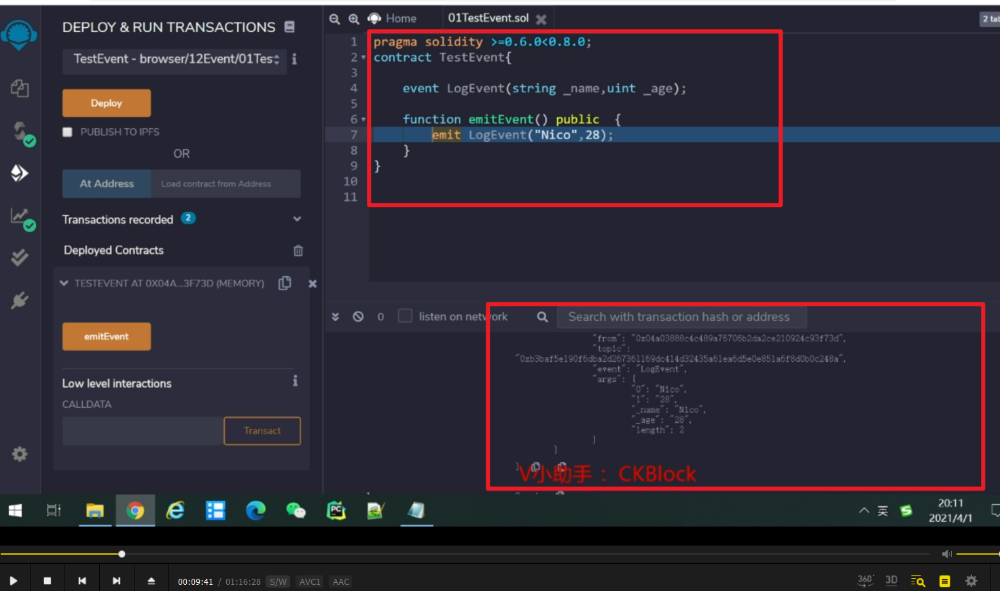
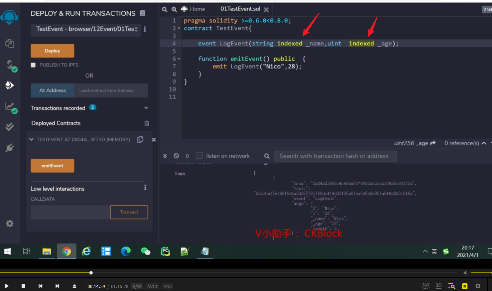
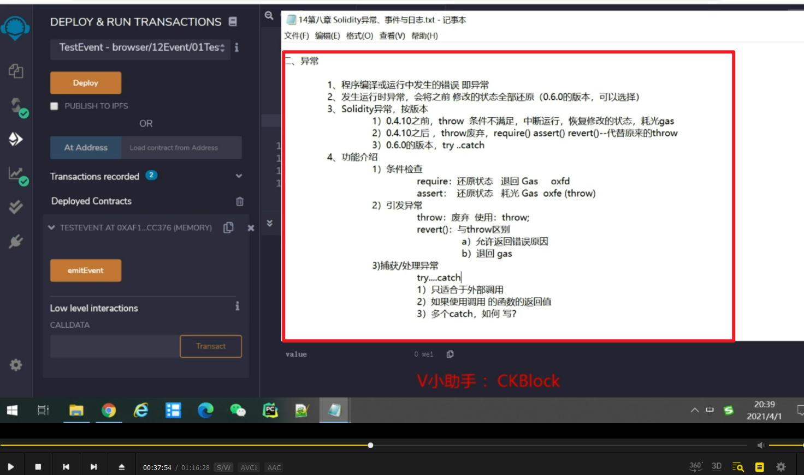
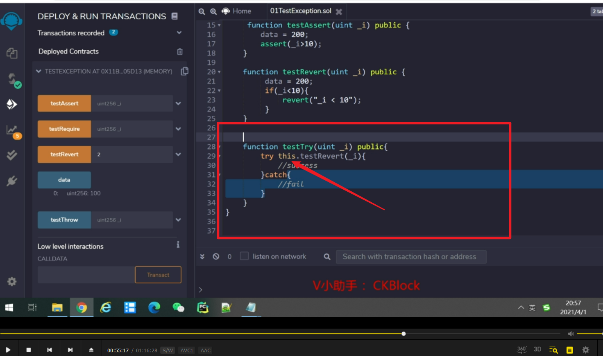

事件与日志简介

触发事件属于修改，所以不能用pure，也不能用view，只有去掉。

日志范例。

事件签名自动生成

对参数进行签名，需自己手动添加

签名原理，keccak-256，需要时再来学习

异常简介。

异常实例，require大于10，但输入2，所以触发异常。data=200的修改被还原。

测试assert，与require一样，但会耗光所以gas。

revert，抛出异常。require也可以加提示信息（但不是抛出异常），但assert不行。

try catch 捕获异常。

捕获异常并搭配事件。

使用调用函数的返回值（截图不全，需要时看视频）

try带两个catch，需要时再看视频。