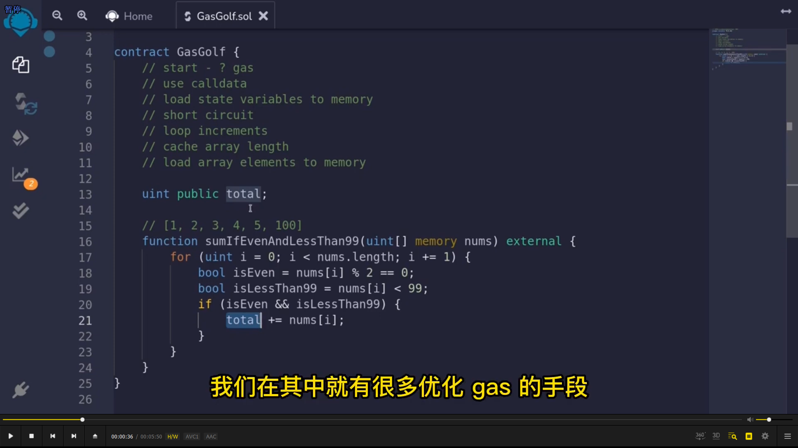
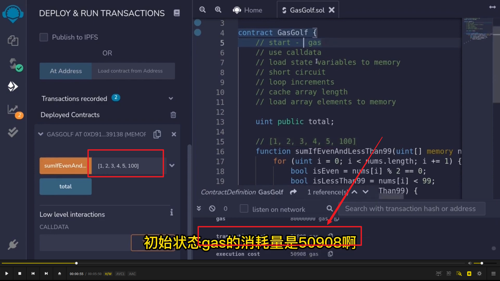
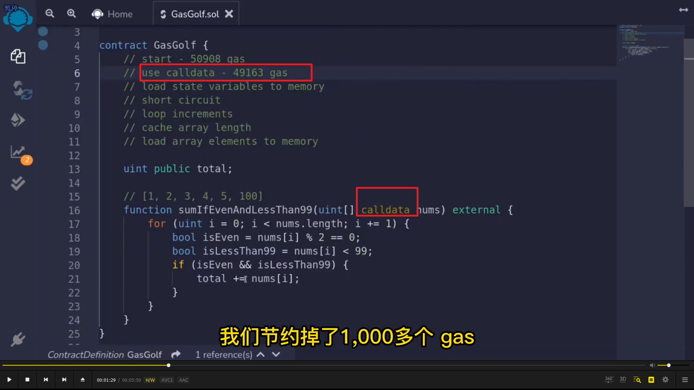
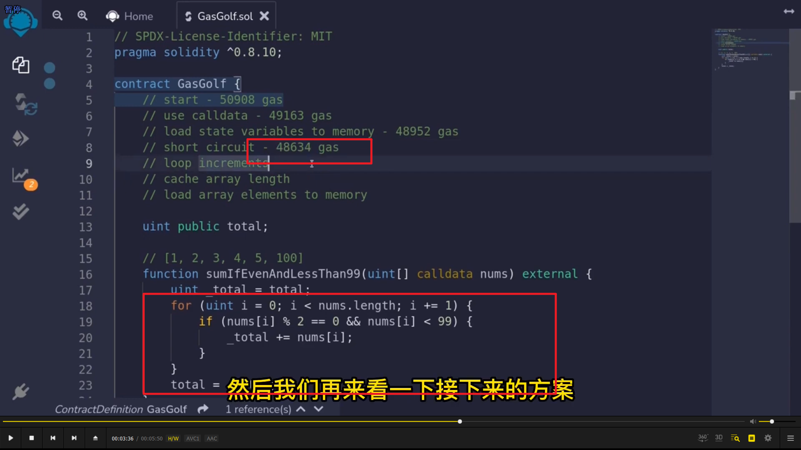
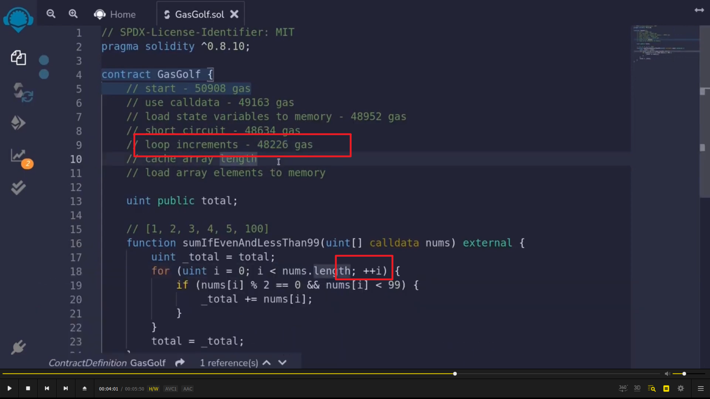
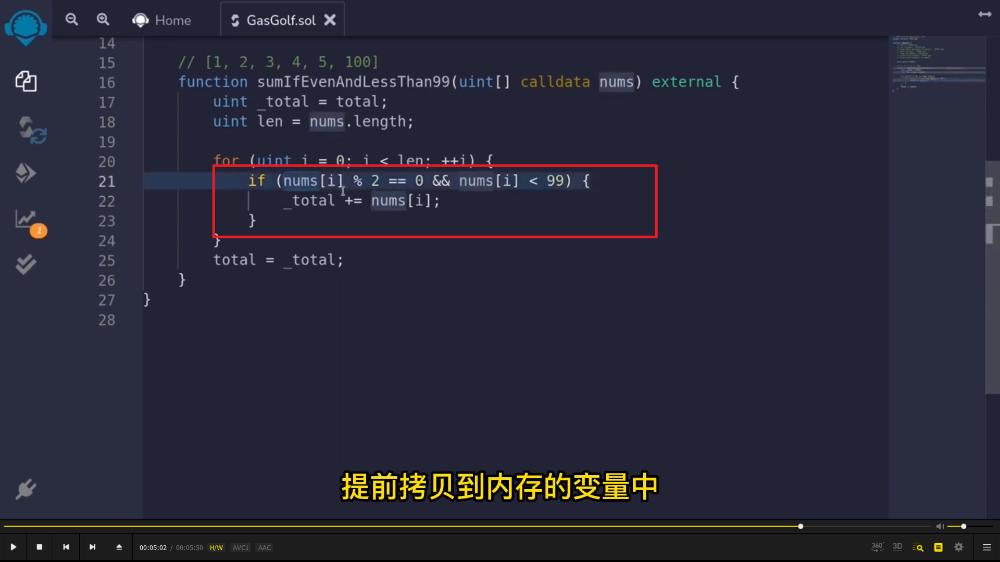

  
gas 优化的原始方法。

  
这里可以看到 gas 消耗

  
memory 变成 calldata，节约 gas。

  
循环中的状态变量变为局部变量，节约。

  
  
短路，将布尔值判断和 if 合并。

  
 i++ 换成 ++i；

  
循环长度存储为局部变量

  
      
数组元素提前拷贝到内存变量中。就不用多次读取数组下标为 i 的数组元素了。
