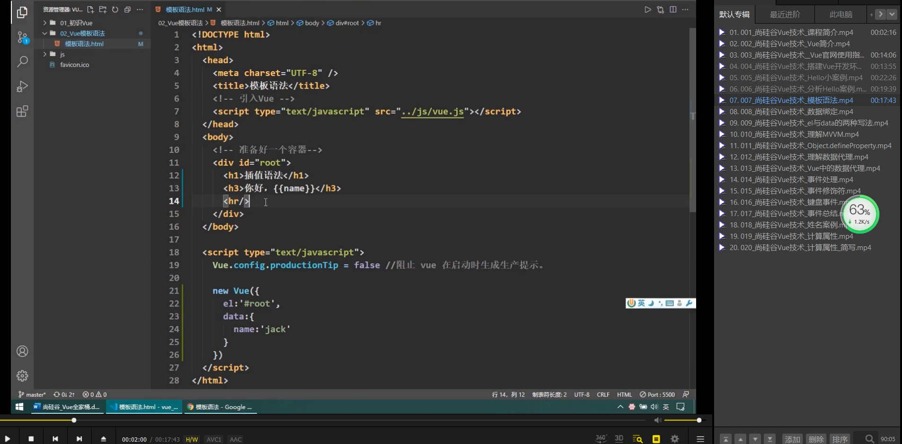
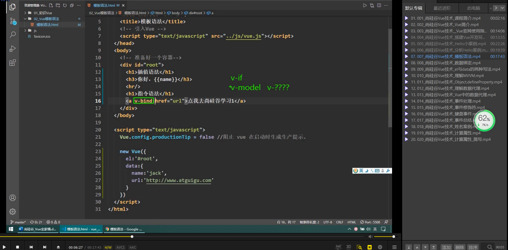
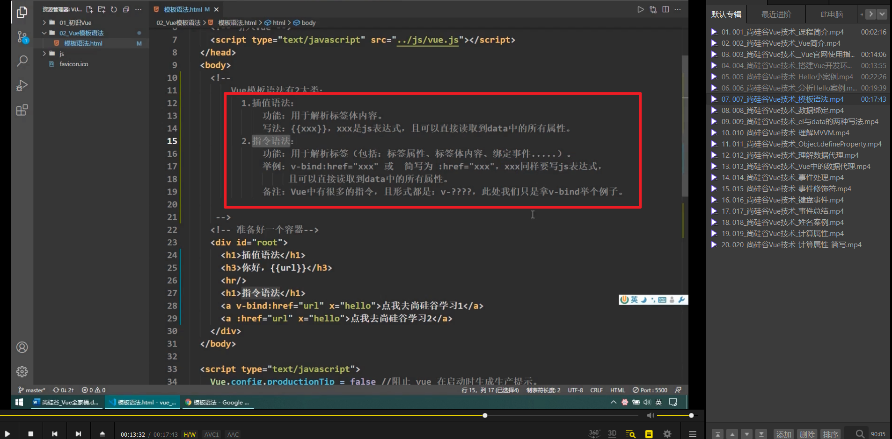
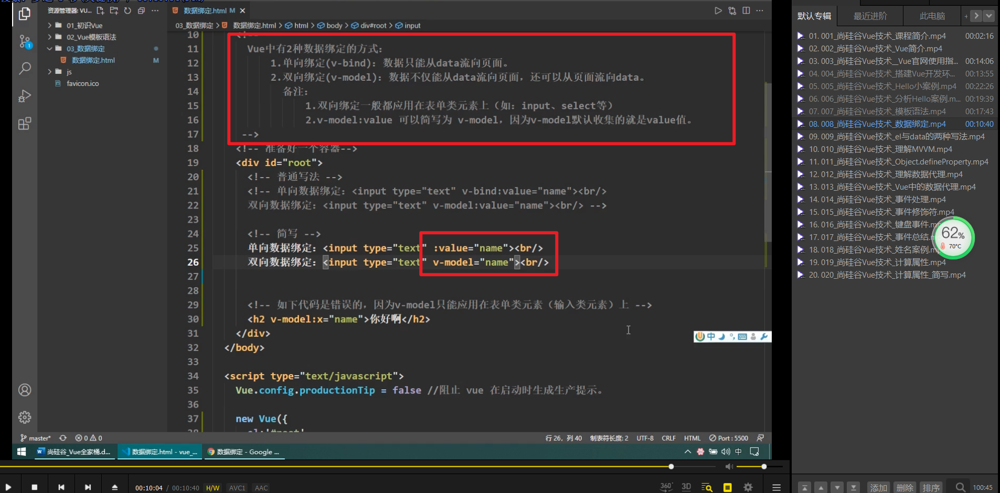
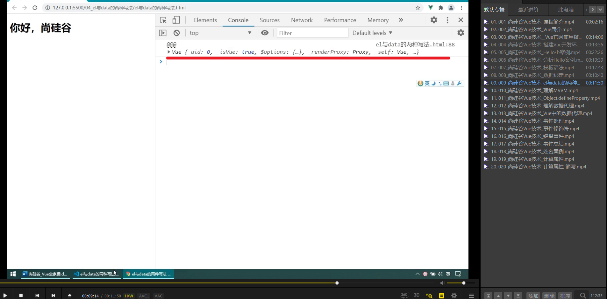
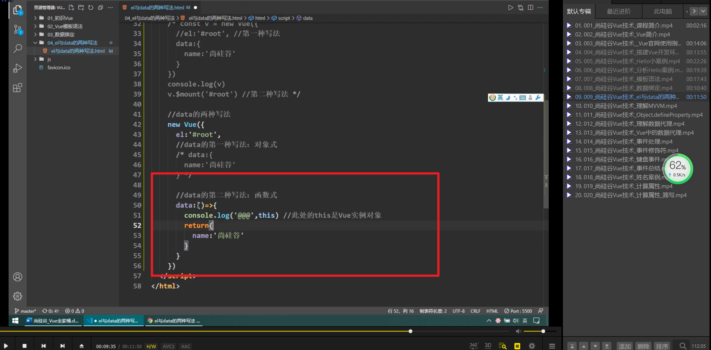
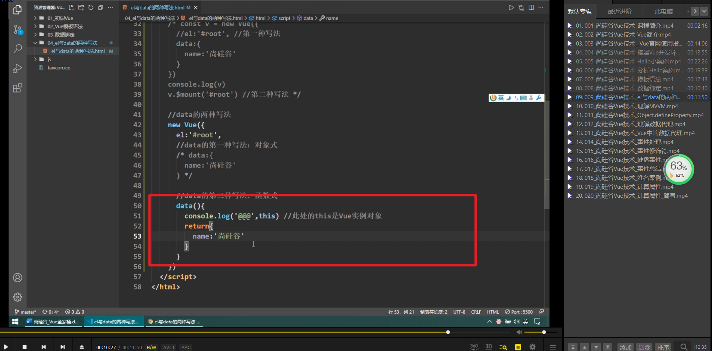

  
插值语法

  
指令语法。v-bind，v-if 等就是指令。会把引号里当 js 表达示执行。

  
指令语法，插值语法总结。        

v-bind v-model 总结和简写。

      
第二种vue启动方式，不写el。具体较复杂，看视频。

优点是更灵活，如这里可以等1秒再启动vue。        

data的两种写法。this是vue

      
如果写法改变为箭头函数，则this变为全局变量window。

所以只能用第一种写法，但可省略为如图。