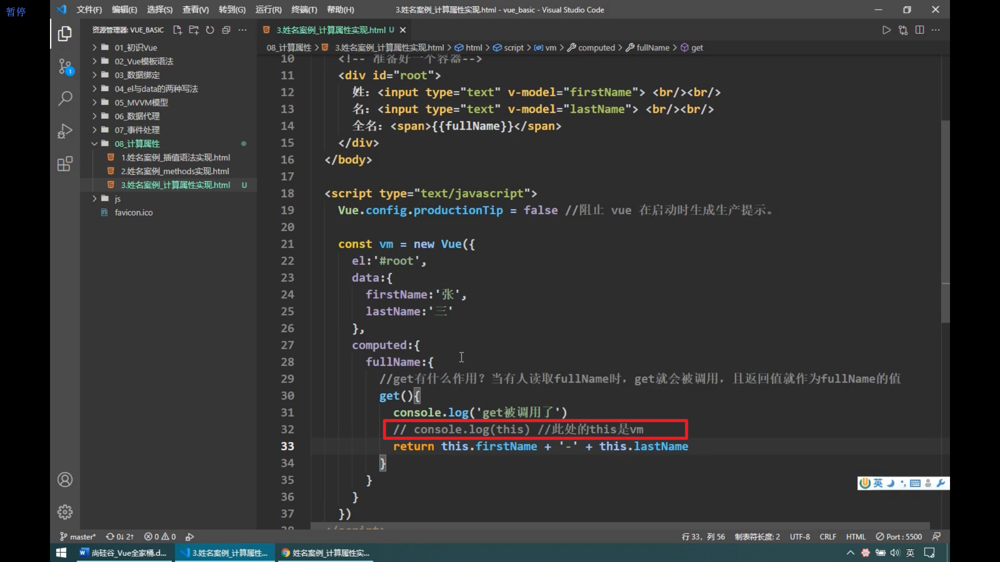
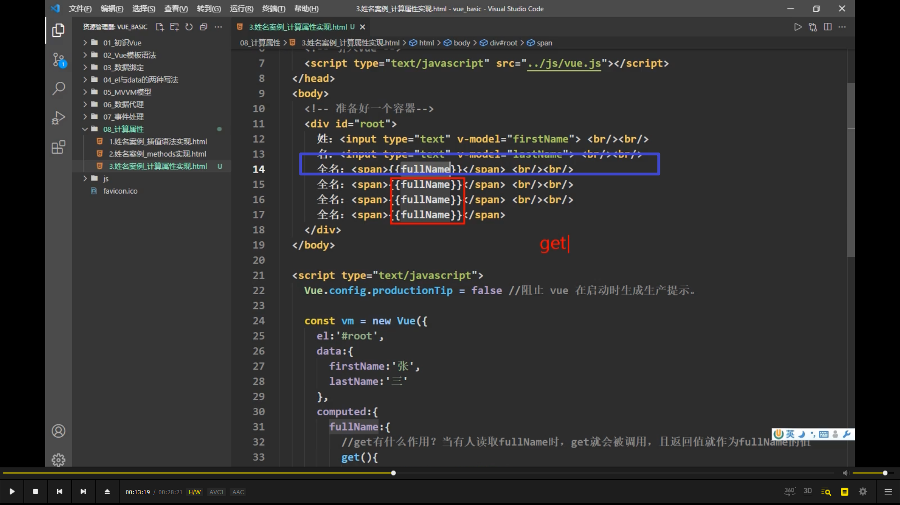
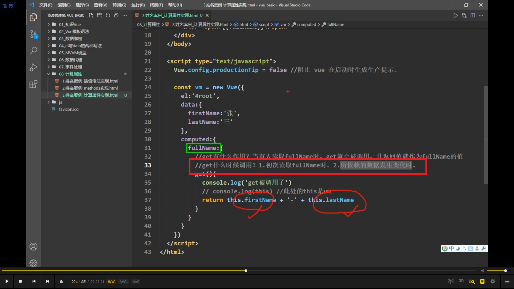

  
计算属性就是拿着已有的属性（data 里的）去加工计算，生成的全新属性就是计算属性。但不能放在 data 里，要放在 computed 里。因为计算属性可能较复杂，所以需要配置为一个对象。对象里写 get 函数，只要有人读取计算属性，get 就会调用，返回值作为计算属性的值。

vue 里将 get 里的 this 指向了 vue 实例 vm。

  
读取第一次就会有缓存，此后三次直接从缓存读取。methods 没有缓存，则每次都会读取。

  
所以有两种时机重新读取数据。

  
当计算属性被修改时，set 调用。
