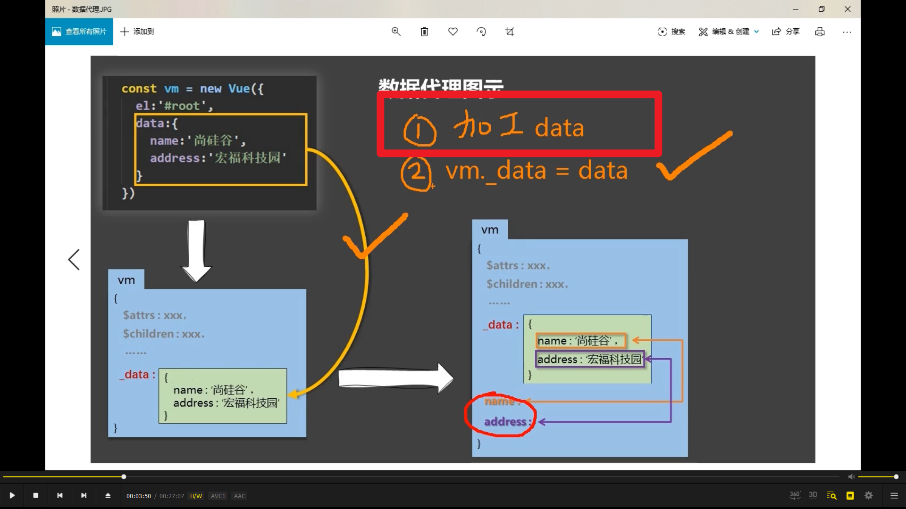
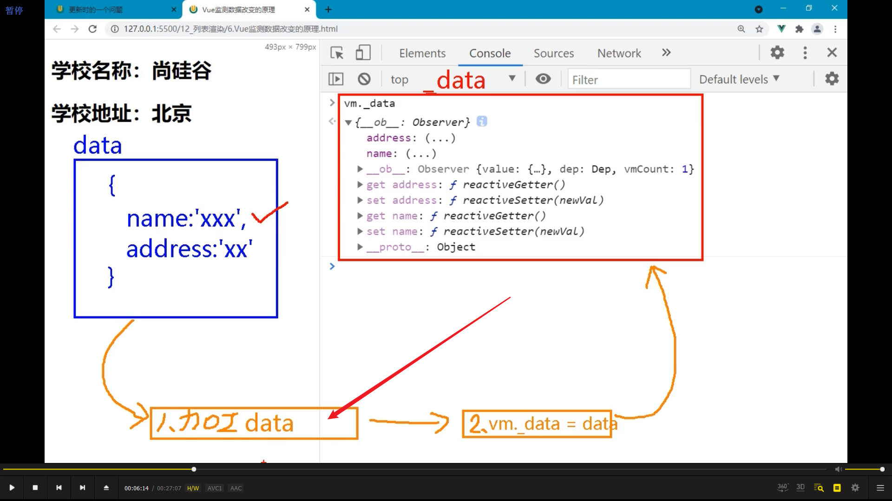
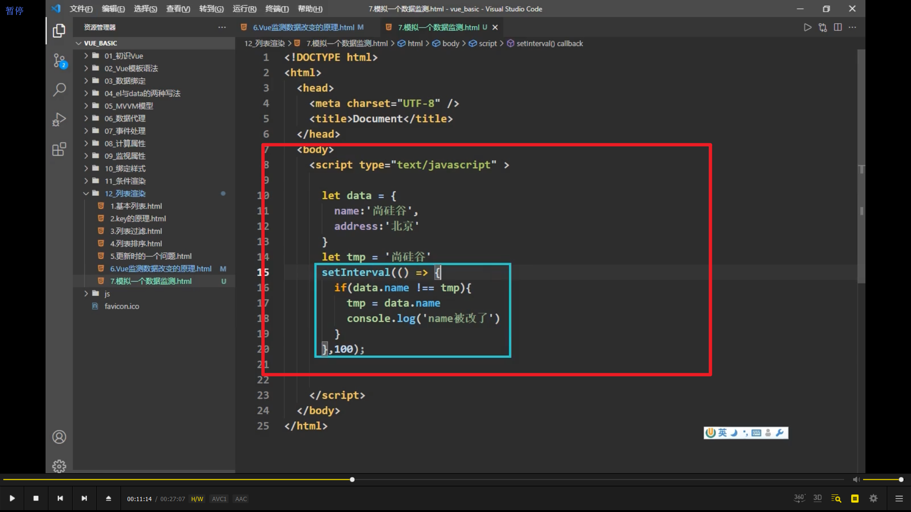

先研究 vue 是怎么监测对象改变的

  
\_data 其实并不完全等于 data，因为做了些加工。

  
加工 data 的目的是能做响应式，即数据变了页面也跟着变

改了 name 就会引起 setter 的调用，它就能重新解析模板，就能生成虚拟 dom，然后新旧 dom 对比，更新页面

  
硬写监视器的方法，但不合理      

      
第二种硬写方法，会陷入死循环
