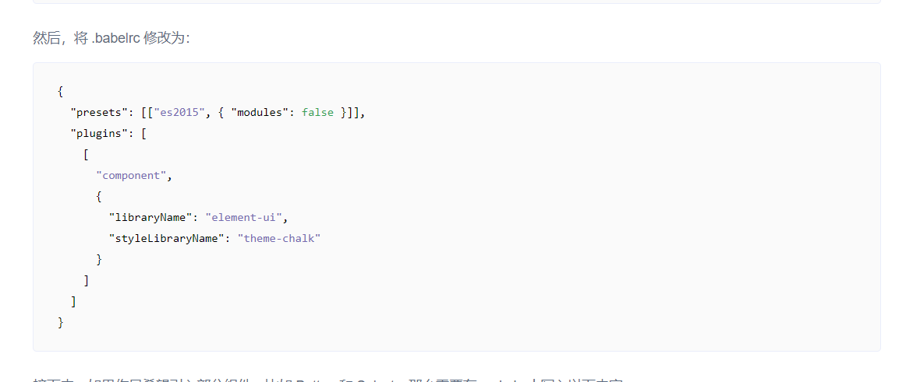

elementui 环境搭建

npm i element-ui -S 后按官方教程搭建环境：https://element.eleme.cn/#/zh-CN/component/quickstart 但有一些错误的地方。

  
 现在没有.babelrc 只有 babel.config.js

npm i @babel/preset-env -D 且 修改 babel.config.js 为：

```
module.exports = {
  presets: [
    '@vue/cli-plugin-babel/preset',
    ["@babel/preset-env", { "modules": false }]
  ],
  "plugins": [
    [
      "component",
      {
        "libraryName": "element-ui",
        "styleLibraryName": "theme-chalk"
      }
    ]
  ]
}
```

参考此文章：https://blog.csdn.net/zy21131437/article/details/108029284  


按照官方指引即可成功引入 button 等组件，但还有 less 安装报错问题未解决
