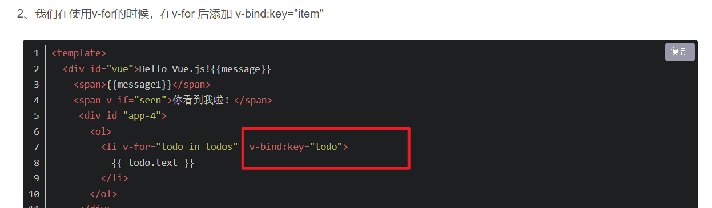
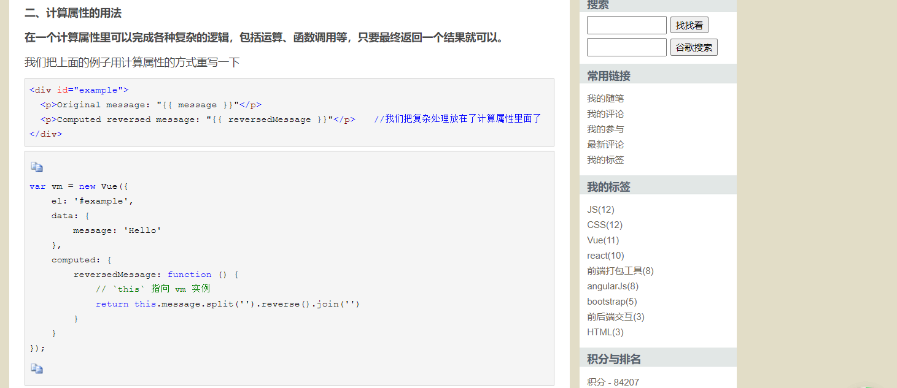

### 列表循环时报错信息：Elements in iteration expect to have 'v-bind:key' directives

  
1、Vue 2.2.0+的版本里，当在组件中使用 v-for 时，key 是必须的。

我们可以更改 vetur 配置 ：vscode 文件->首选项->设置->搜索 vetur.validation.Template，将这一项去掉就可以了

  
2、我们在使用 v-for 的时候，在 v-for 后添加 v-bind:key="item"

### vue 刷新页面的方法

  
https://www.cnblogs.com/yinn/p/9056731.html  
注意，还需要在 app.vue 的 data 中设置 isRouterAlive

  

此外，如果是 dapp，由于存在延迟，还需设置一个定时器，参考教程https://www.cnblogs.com/qwer123dsada/p/14636050.html

### v-for 循环获取 index

https://www.jianshu.com/p/4005aeea0ea1  
注意三个地方都写 index，而不是不写或者写 this.index

### computed 计算属性极简实例

  
https://www.cnblogs.com/chaixiaozhi/p/8688820.html
