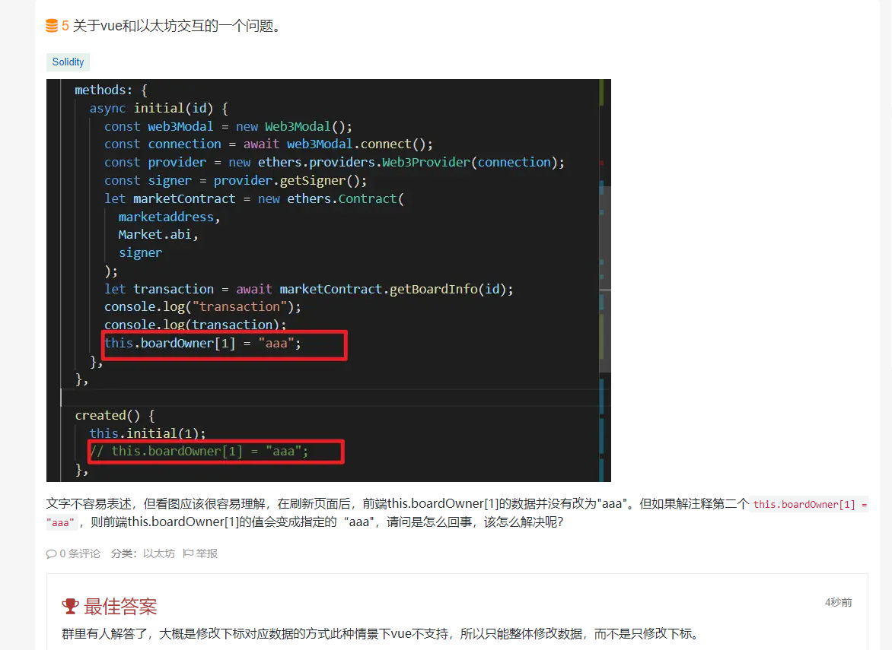
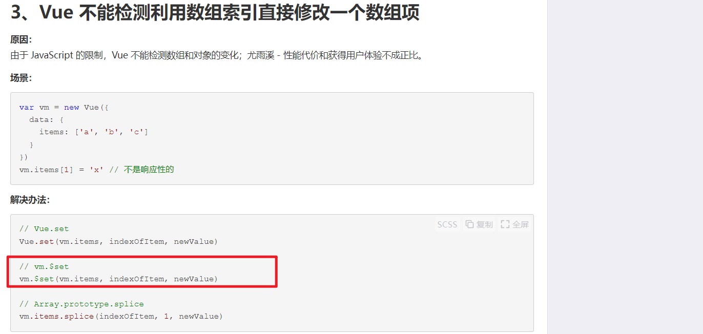
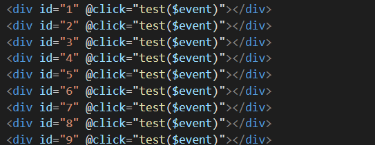
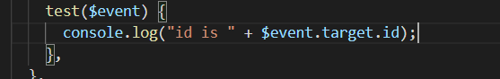
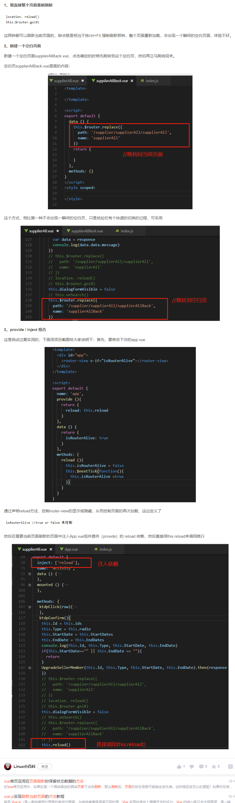

### vue 有时不支持修改数组下标对应数据的方式，只能整体修改数组

https://learnblockchain.cn/question/3518  

add(https://www.cnblogs.com/lixiyong/p/15799784.html，大概此文中第三种错误，如代码中未写var vm = new Vue，则用 this 代替此例中的 vm 即可)

### vue 通过同样方法点击不同 id，console.log 不同 id 的方法。

  

### vue刷新页面的方法
https://blog.csdn.net/yaxuan88521/article/details/123307992     
      