### vue 有时不支持修改数组下标对应数据的方式，只能整体修改数组

https://learnblockchain.cn/question/3518  


add(https://www.cnblogs.com/lixiyong/p/15799784.html，大概此文中第三种错误，如代码中未写var vm = new Vue，则用 this 代替此例中的 vm 即可)

### vue 通过同样方法点击不同 id，console.log 不同 id 的方法。

  


### vue 刷新页面的方法

https://blog.csdn.net/yaxuan88521/article/details/123307992  


### vue2 切换中英文显示

参考视频：https://www.bilibili.com/video/BV18i4y1w7gG  
代码可见 blocks 应用对应提交。

在 vue 使用 vue-i18n 的时候发现支付直接安装 npm i vue-i18n 的时候报错，因为他默认安装的是最新的版本，所有适合 vue3 不适合 vue2 的项目。  
1，npm i vue-i18n@8.27.0 -D

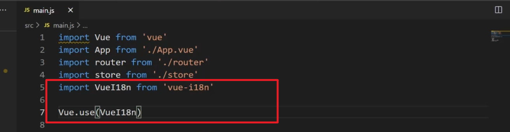
2， import and use in main.js

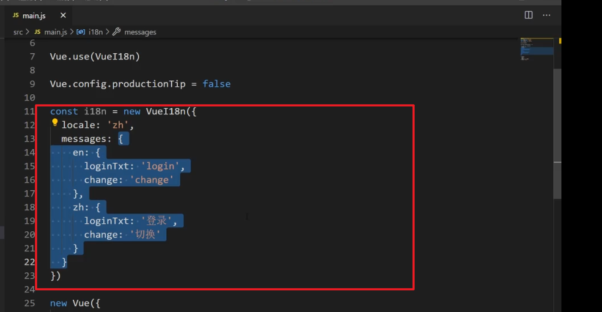  
3, 创建实例。locale 代表默认语言

  
4，挂载到 vue 实例中，由于键值对一样，可以直接写一个 i18n。

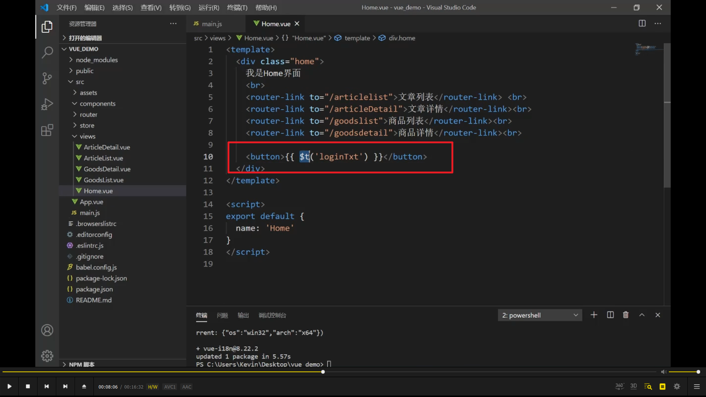  
5，可以直接使用了，$t 是 i18n 给 vue 挂载的一个属性。

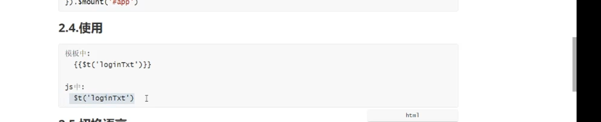  
6，注意模板和 js 中不同写法。  
add,注意 js 写法中，$t 前还需加 this。

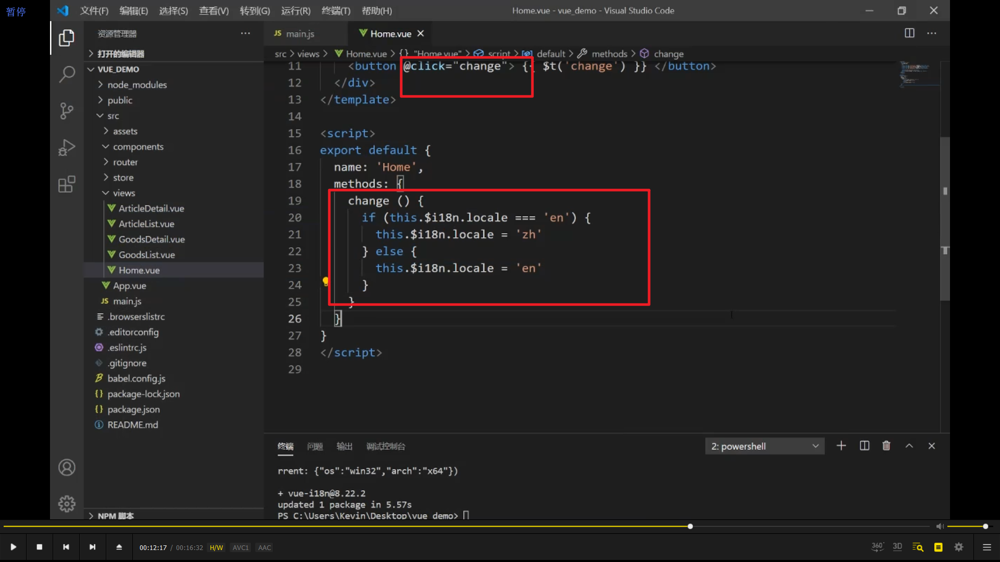
7，按钮切换语言。

  
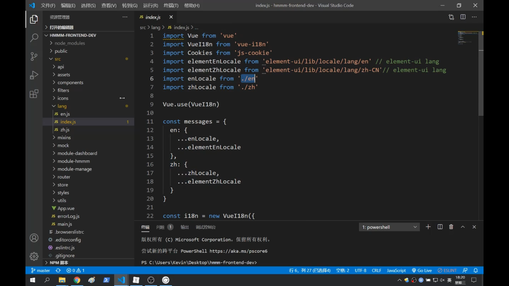  
  
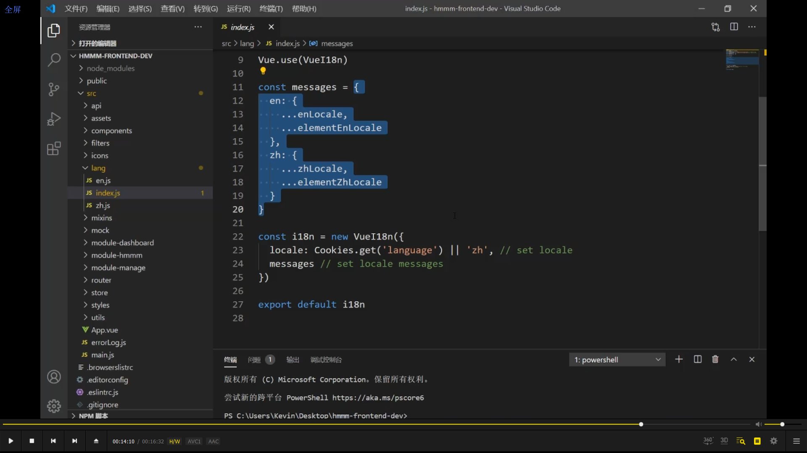  
1，细分的处理方法，新建 lang 文件夹。index.js 里最终暴露出 i18n 对象。

  
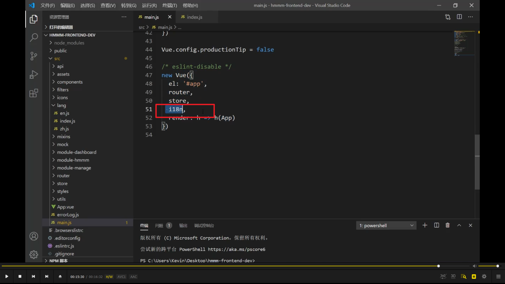  

2，main.js 里引入并用到 vue 实例中。

以上所有代码无法缓存设置，缓存设置的方法在新增加的提交上显示，使用 localstorage 替代 cookies。

### 移入移出事件，mouseover 和 mouseout， mouseenter 和 mouseleave

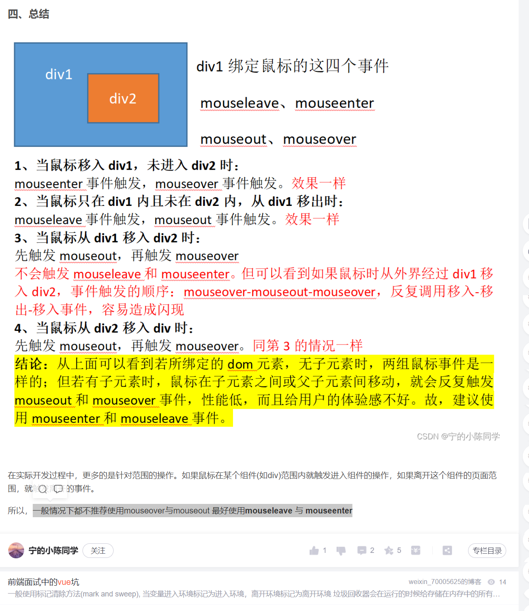  
https://blog.csdn.net/weixin_43899065/article/details/117675803
一般情况下都不推荐使用 mouseover 与 mouseout 最好使用 mouseleave 与 mouseenter，因为不冒泡。

### 浏览器控制台 console.log vue data 中的数据

https://blog.csdn.net/qq_40649432/article/details/116589017  
  
注意第二种方法需要加入 mounted() {window.Vue = this;},

### vue 引入 iconfont 图标

https://www.jianshu.com/p/99e3fe476138  
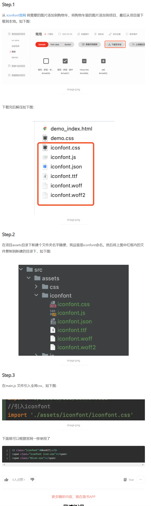  
官网使用帮助里可看到，单色最好选 font class，多色就选 symbol，但有些浏览器不支持。

### 按照条件设置 class 或 style


```
<div :class="`fonts ${read && 'isread'}`">123</div>
```

使用``在里面进行判断,默认都拥有 fonts 的样式，如果 read 为 true 则显示 isread 的样式，如果为 false 则不显示

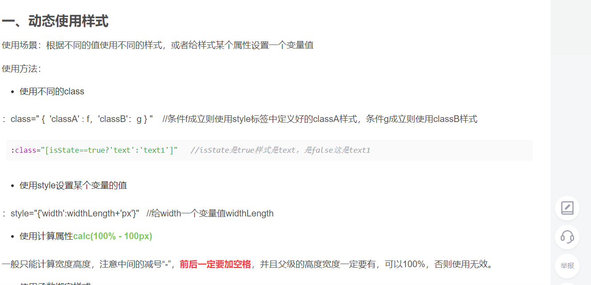  
https://blog.csdn.net/happy81997/article/details/103582699


style 的案例。

### vue css 使用 data 中的变量

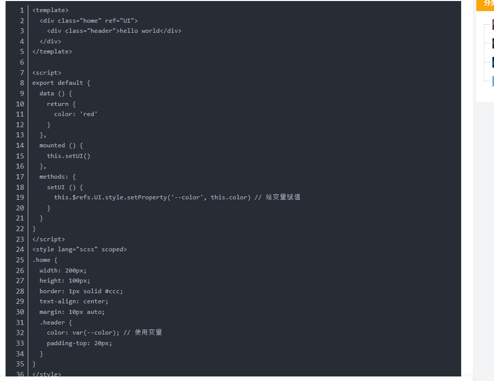  
https://blog.csdn.net/qq_37899622/article/details/120546933  
实际使用中，可以不单独写 data color 和 methods setUI，直接使用 this.$refs.UI.style.setProperty('--color', this.color) ，this.color 换成具体数值就行  
add，有些情况下似乎无效，暂未找出原因。

### 误区，行内样式不应该驼峰命名，而是应该横线命名，vscode 保存时可能将大写转为小写导致出错


### 同一个方法传不同参数

  
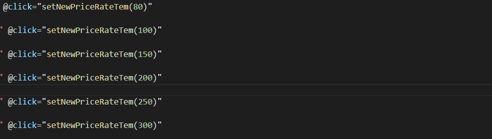
