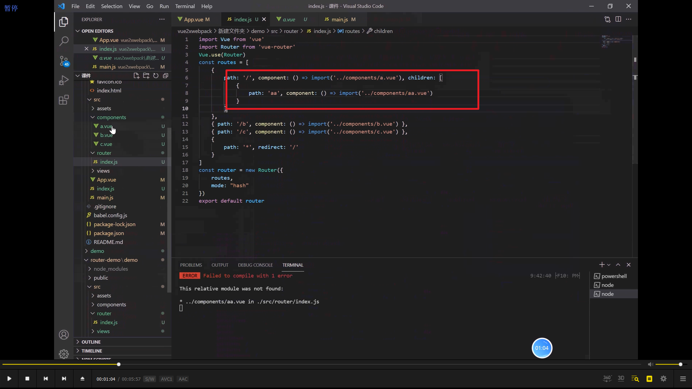
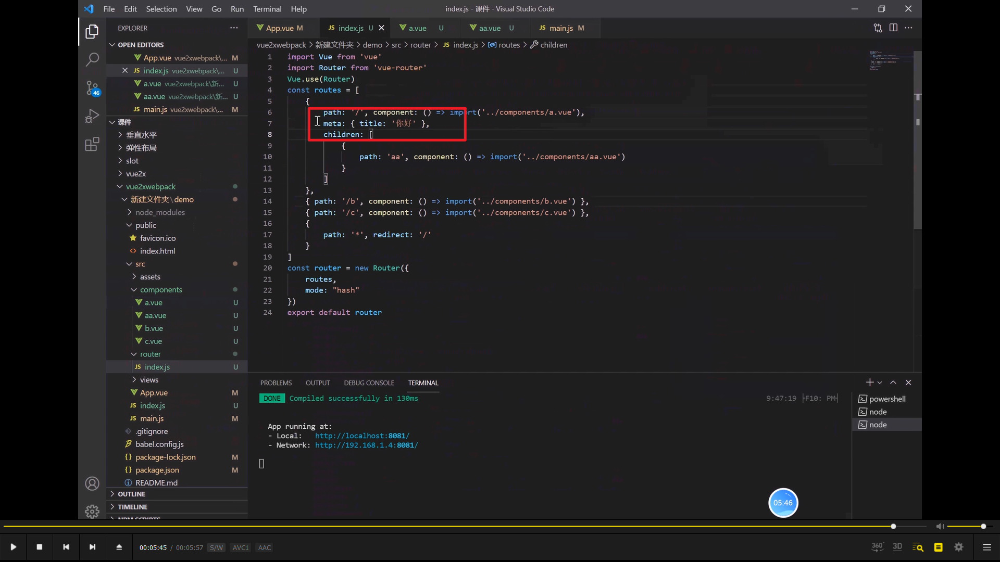
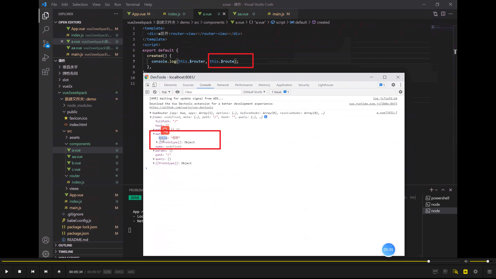
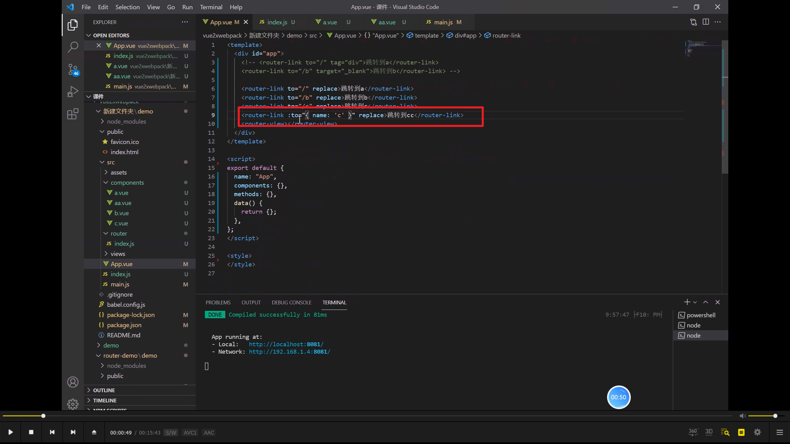
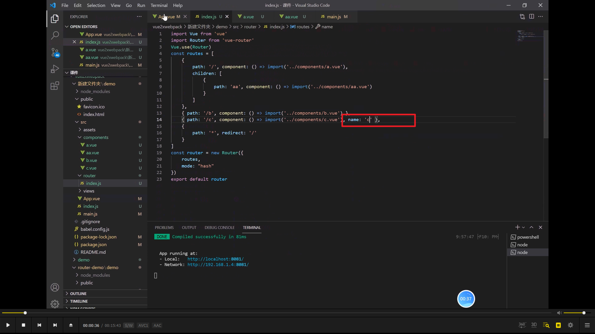
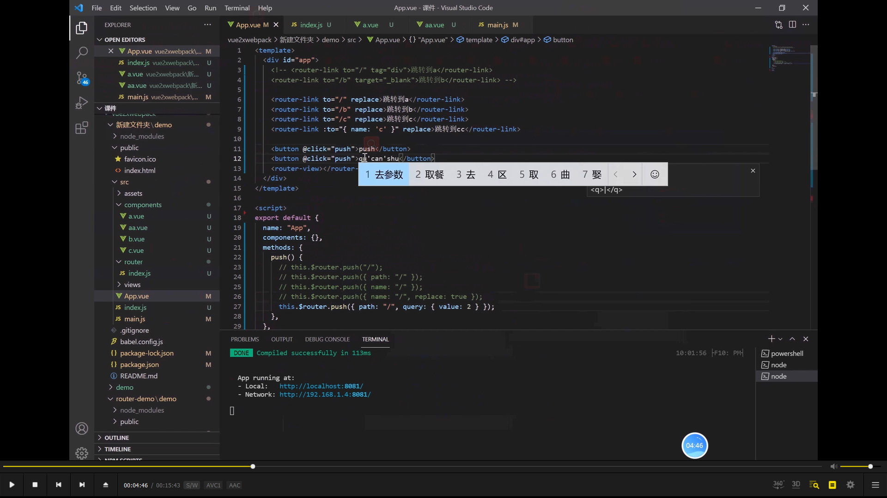

npm install --legacy-peer-deps vue-router@3.5.2 -D

### 02

  
重定向未定义的路由

  
mode:history 可以隐藏井号#

### 03

  
子路由

  
  
路由里可以输入数据并利用，教程里最后删掉了

### 04

  
router-link 路由跳转，其本质是 a 标签，所以 tag="div"可以改变为块级元素。\_blank 新增页面，replace 取消历史记录

### 05

  
  
name 方式跳转

  
还有很多方式，现在用不到，以后再学

### 06

以后再学
