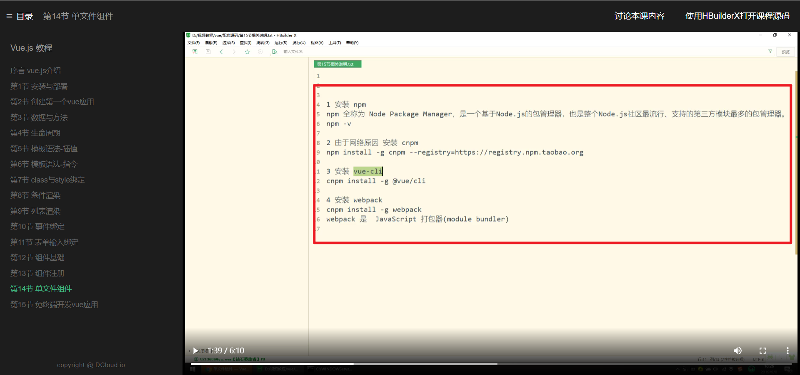
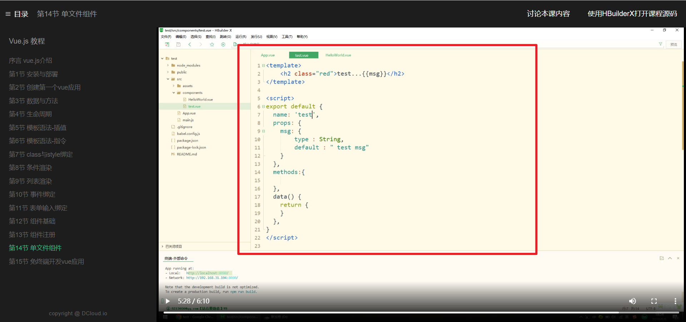
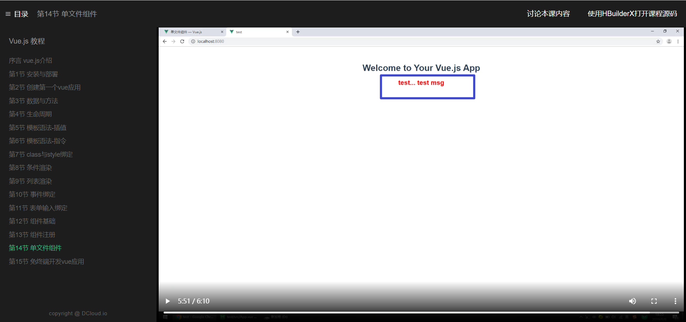

  
准备工作。

  
vue ui 可打开 vue cli 的图形化管理界面，通过 create 创建新项目 test。

      
public是打包后用于部署到生产环境的目录。src是开发目录。里面的components是项目的组件目录。app.vue是这个项目的入口文件，完成项目引入工作

      
import可以引入组件。        

通过components属性局部注册并使用helloworld这个组件。

helloworld.vue被称为单文件组件。

      

自定义组件范例test.vue

      
      
引入并使用单文件组件test.vue