## 221014

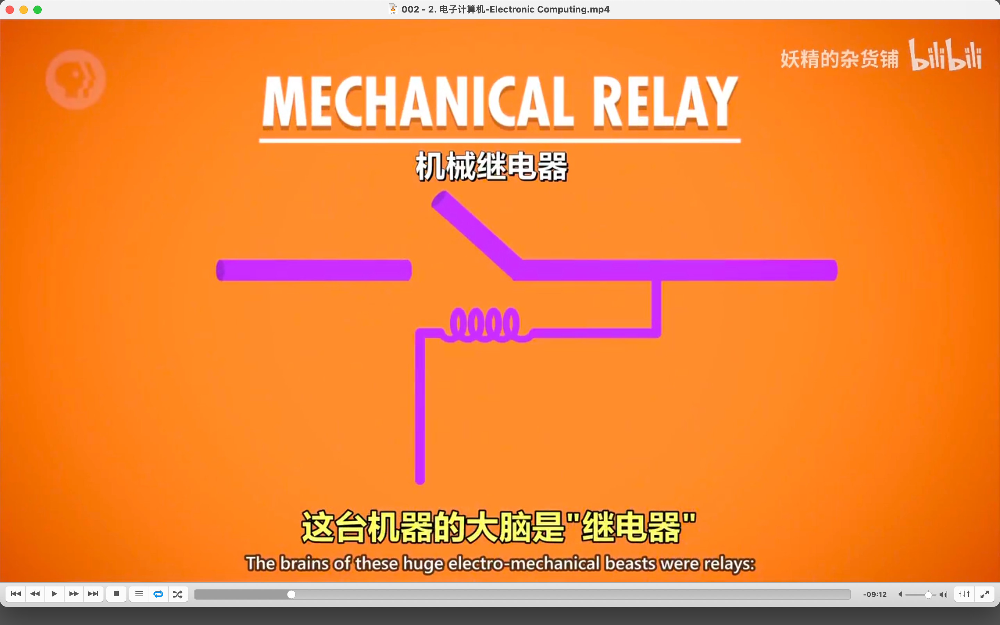</img>  
--=  
</img>  
继电器 relays

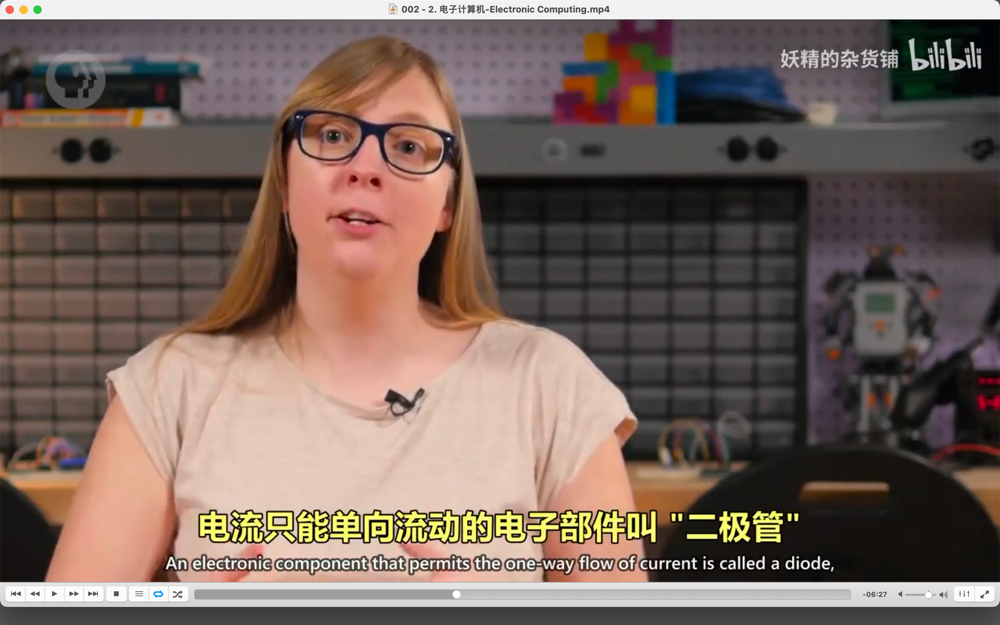</img>  
二极管 diode

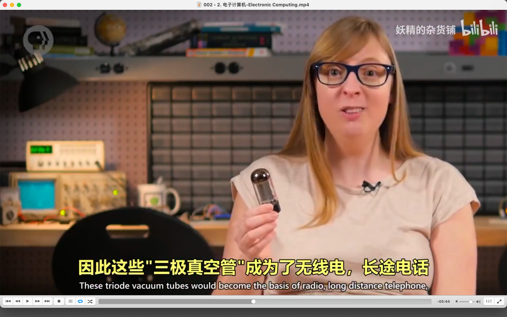</img>  
三级真空管

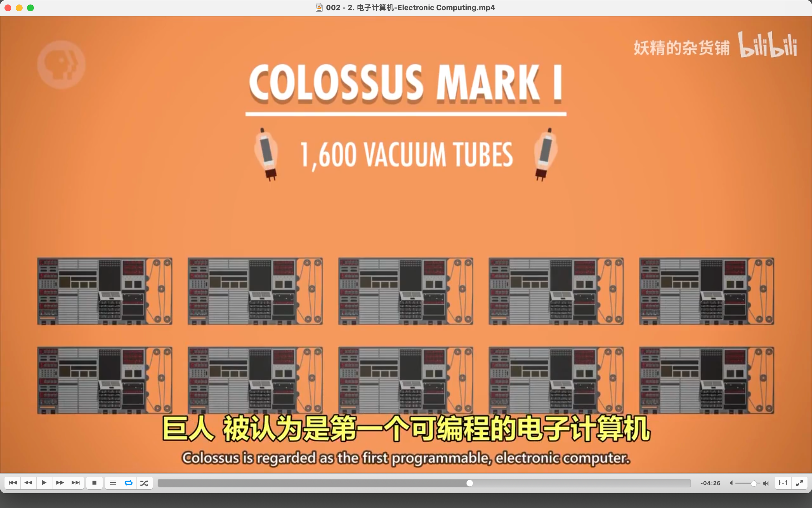</img>  
--=  
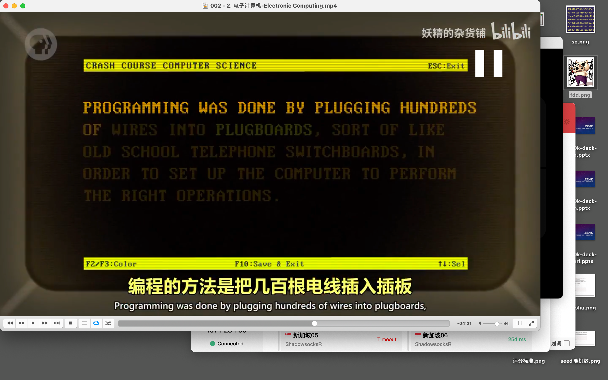</img>  
第一个可编程计算机

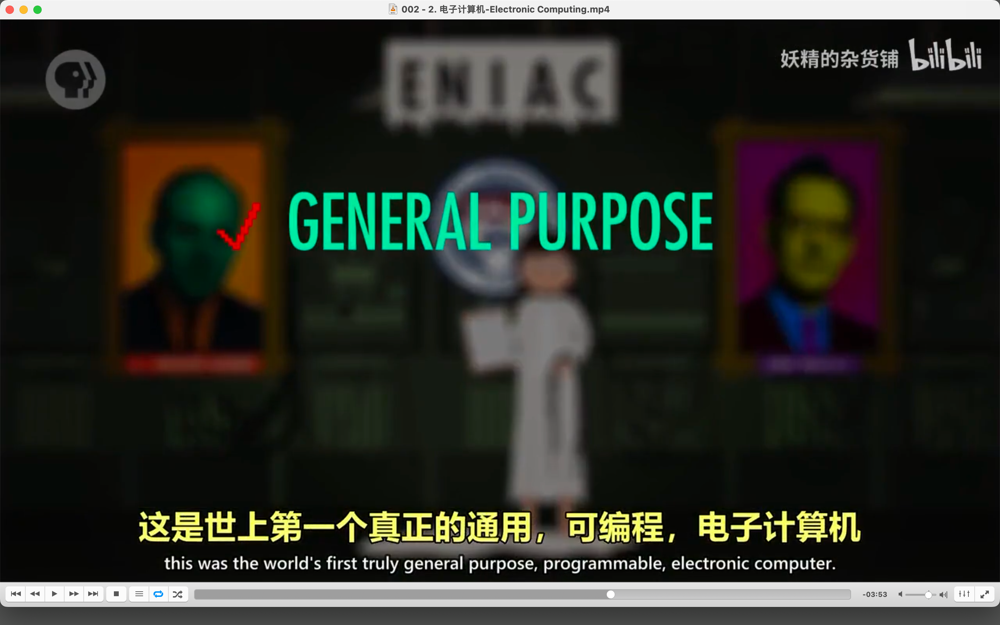</img>  
eniac

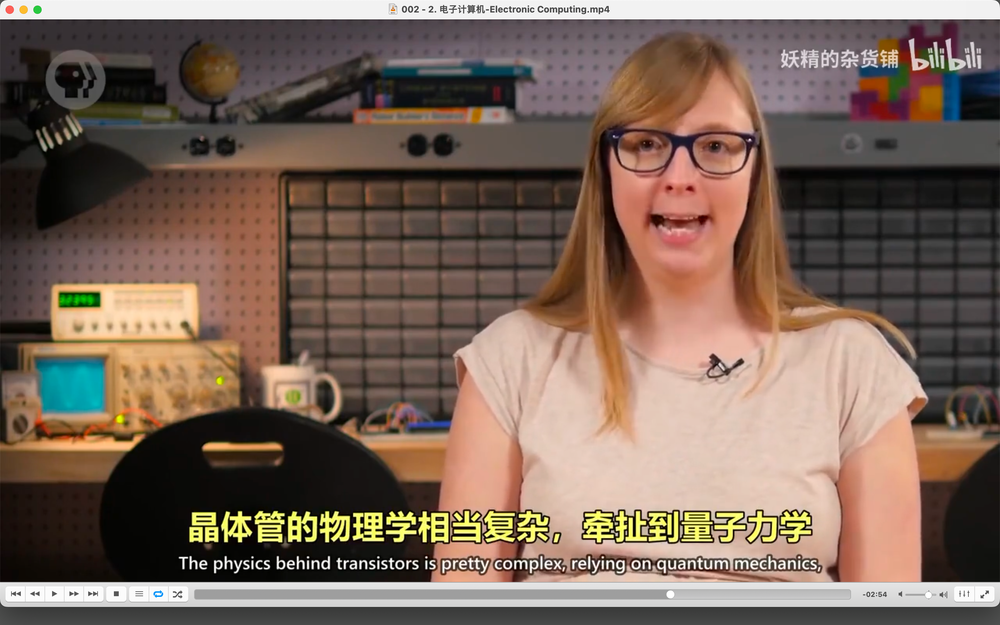</img>  
晶体管 ooov

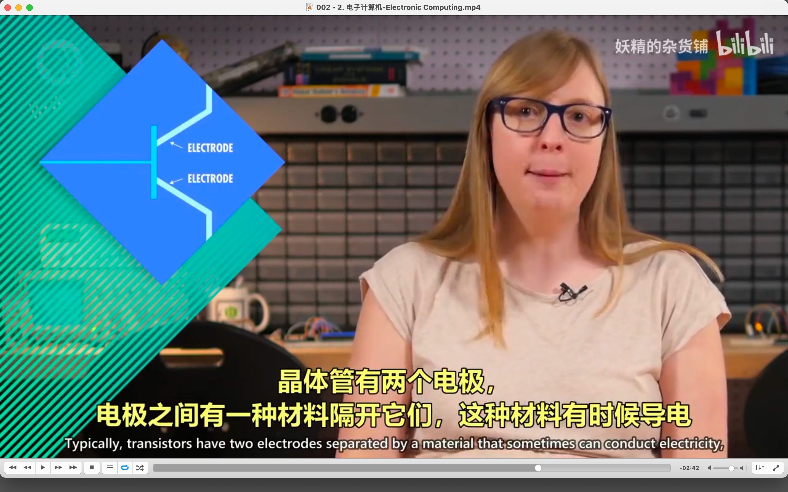</img>  
--=  
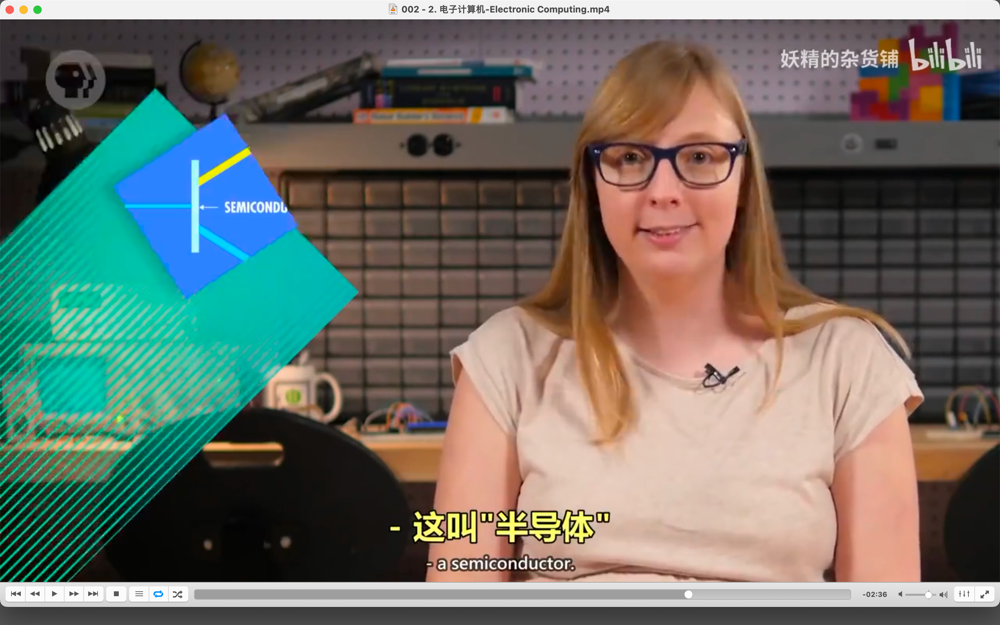</img>  
半导体 semiconductor，有时导电，有时不导电 ooov

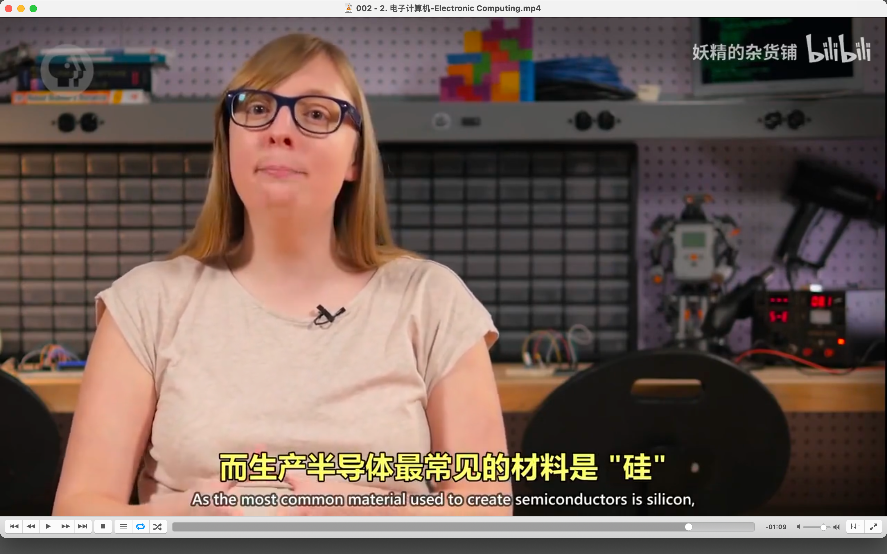</img>  
半导体材料硅

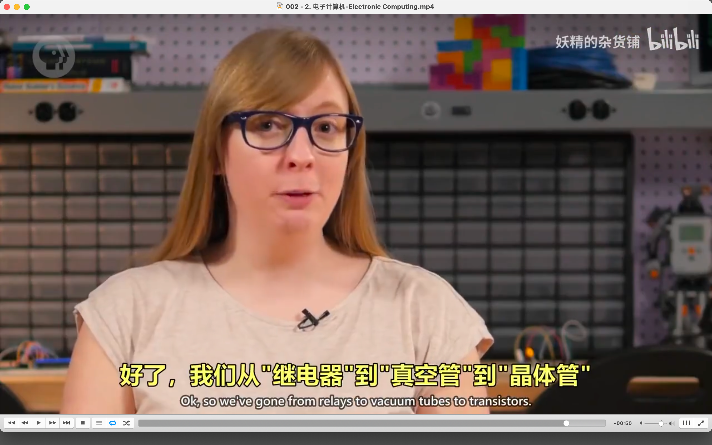</img>  
继电器，真空管，晶体管
