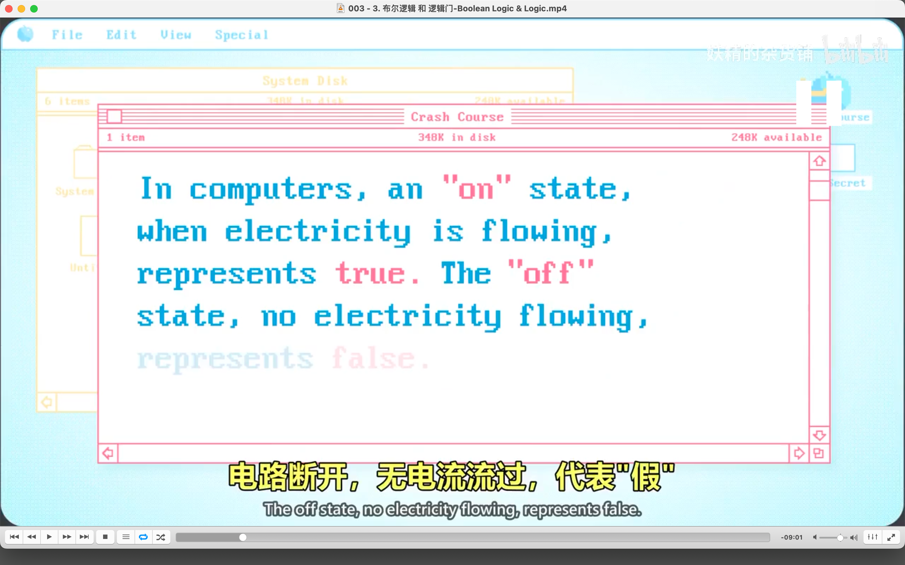
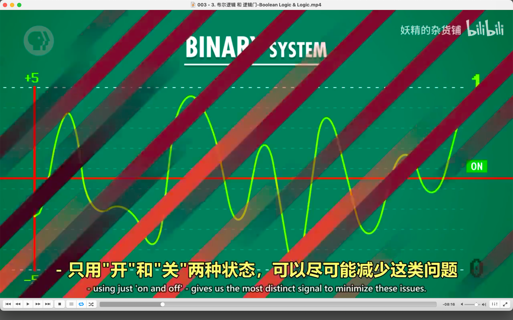
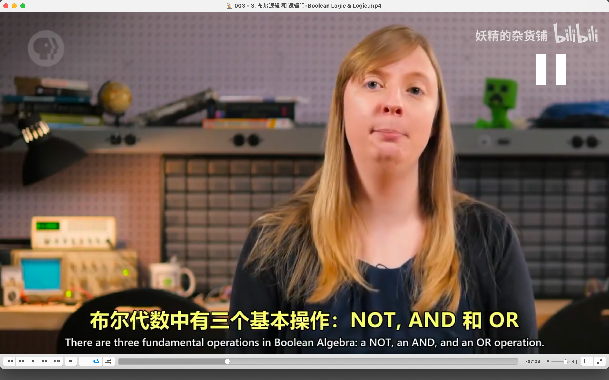
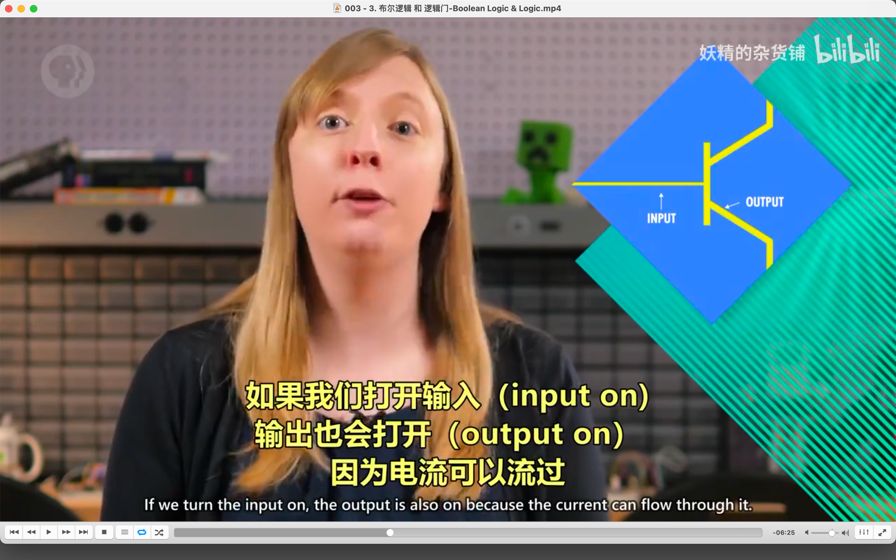
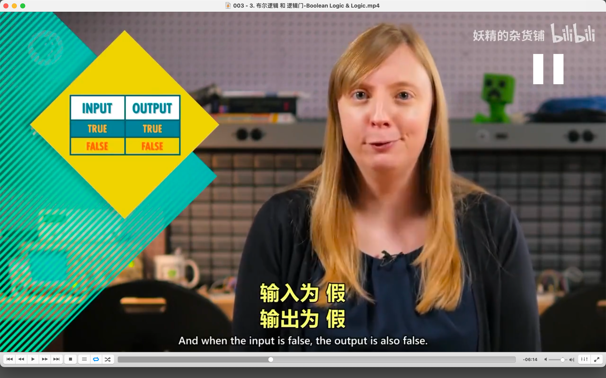
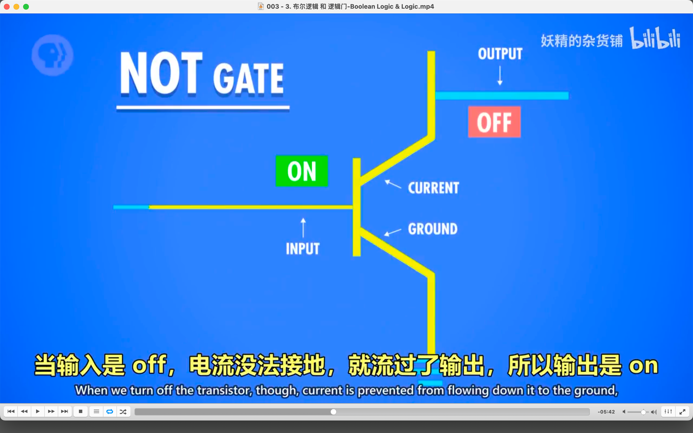
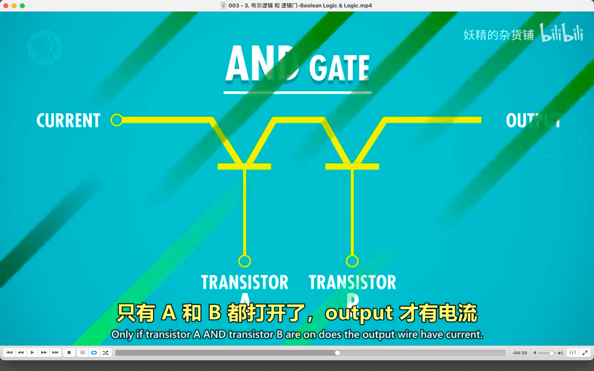
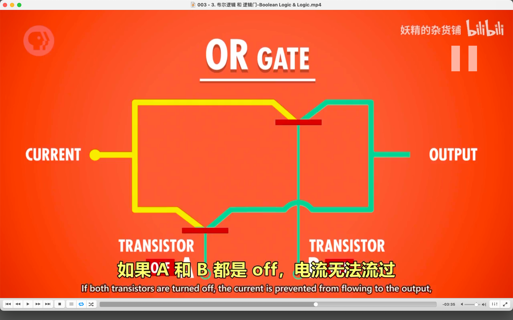
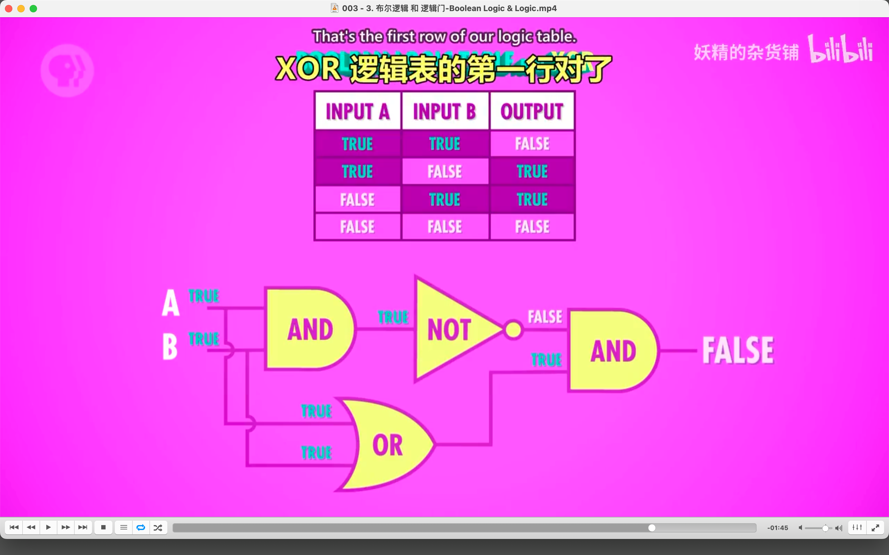

## 221014

</img>  
二进制

</img>  
二进制能降低环境干扰

</img>  
布尔

</img>  
not and or

</img>  
--=  
</img>  
ooov

</img>  
input on，output off，跟 not 操作一样了

</img>  
and gate

</img>  
or gate

</img>  
xor，类似or，但当两个输入都是true时，返回false

</img>  
xor gate

