## 221017

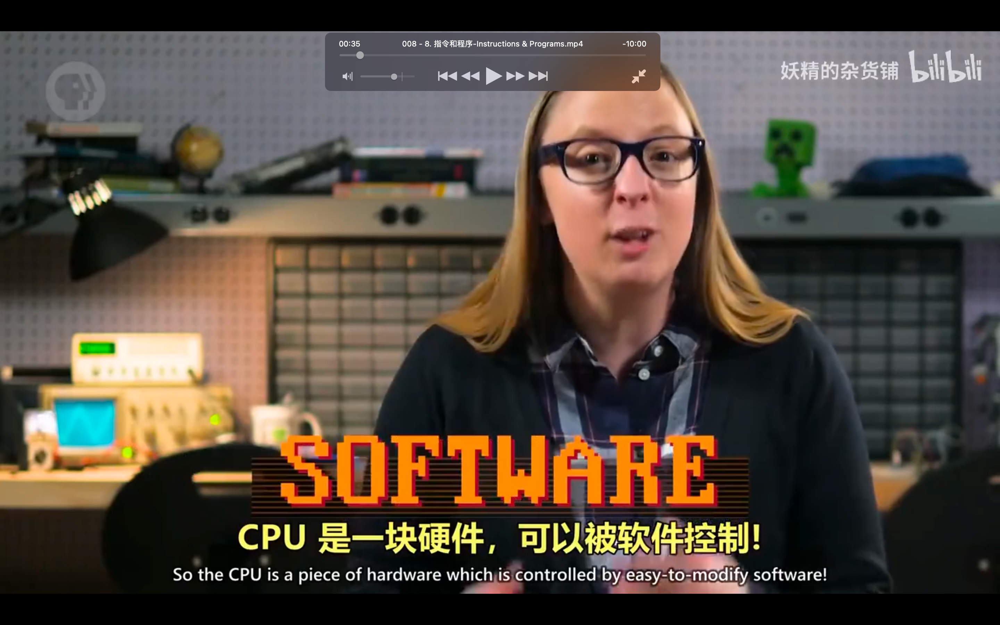</img>  
cpu 之所以强大，是因为它可编程。写入不同指令，执行不同任务。它是一块硬件，但能被软件控制。

</img>  
这里复习了上节课的 load a 指令。

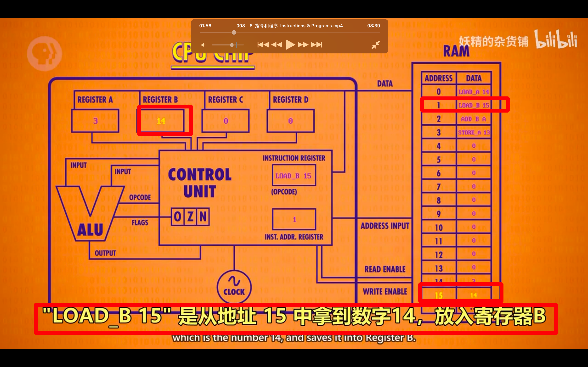</img>  
aaap  
注意地址里只有前 4 个是执行指令的，后面的都只是存储数据？？？？

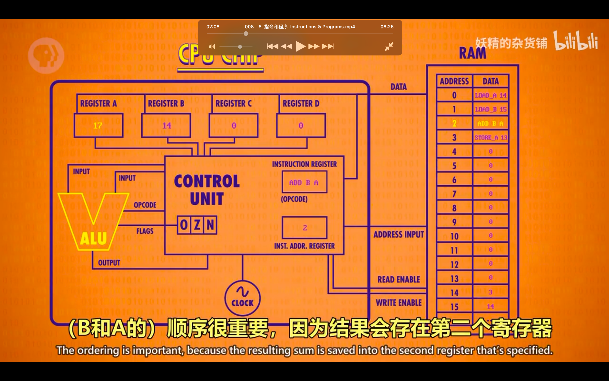</img>  
add b a 指令

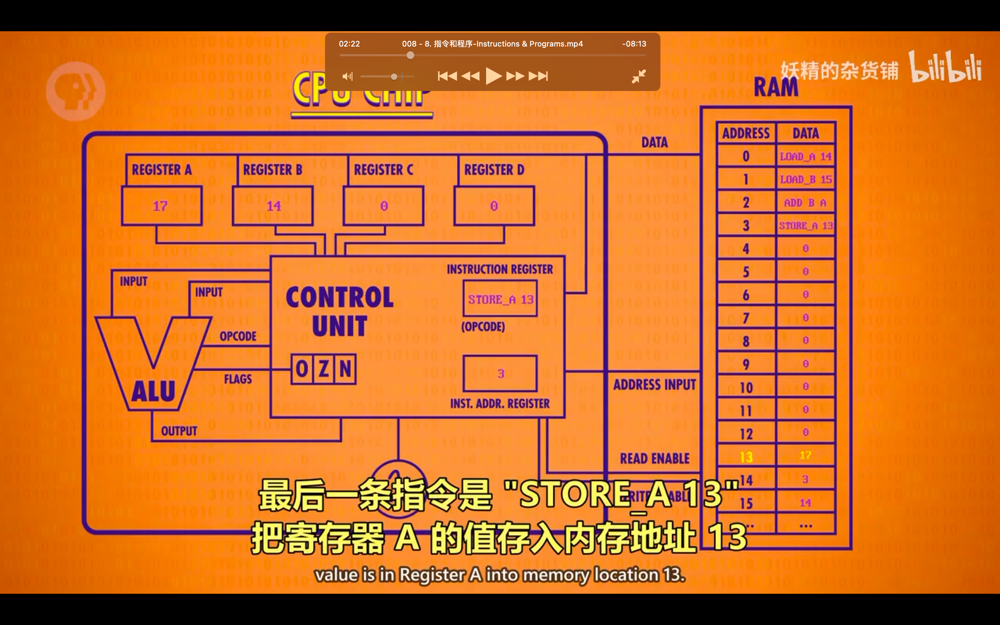</img>  
store a

## 221018

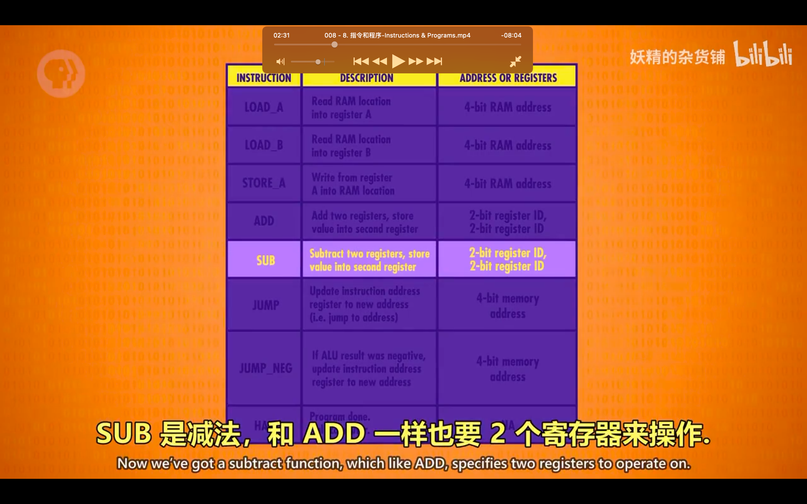</img>  
加入更多的 instruction  
jump halt 等

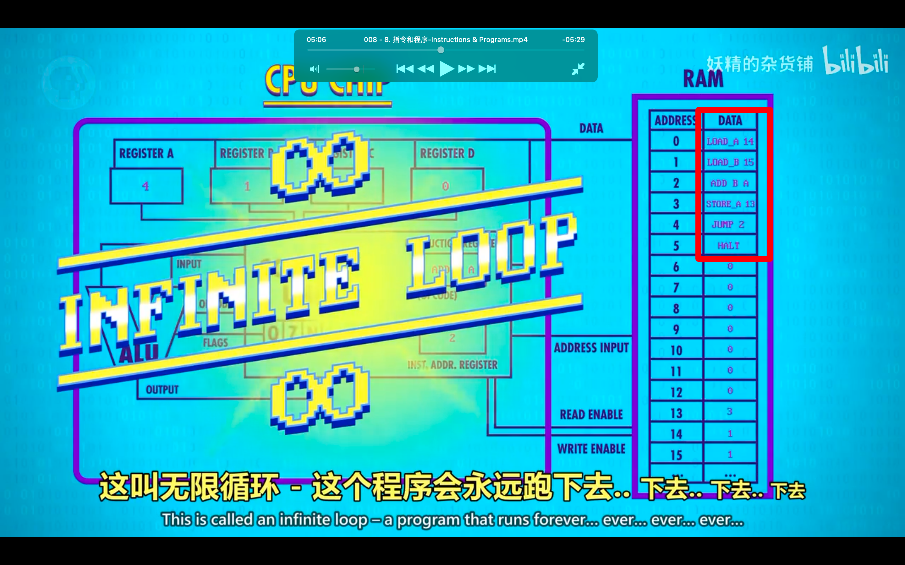</img>  
通过这些指令，做了个每次都加 1 的无限循环程序

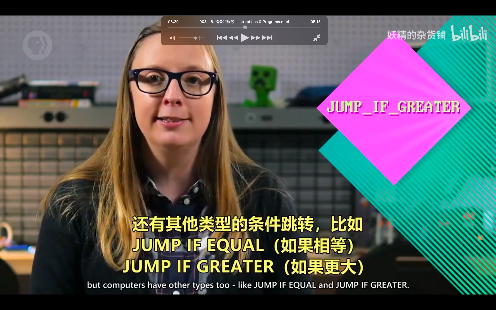</img>  
为了限制无限循环，需要设置限定条件的 jump，如 jump negative，jump if equal，jump if greater

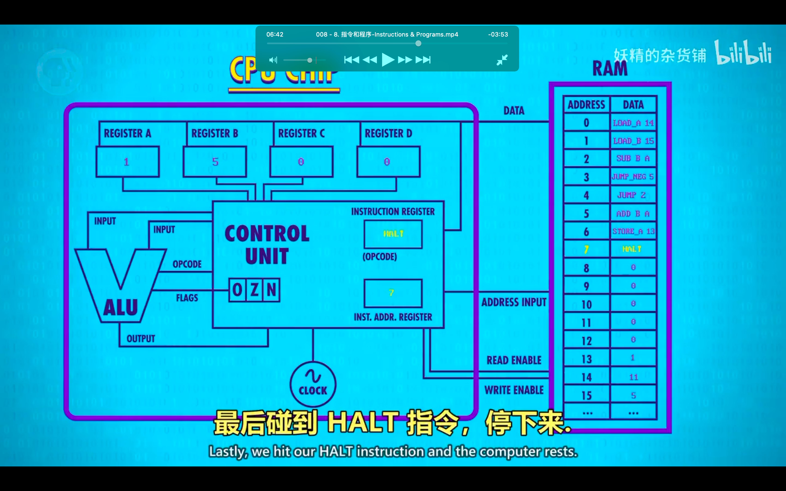</img>  
加了限定条件的 jump，完成有限循环

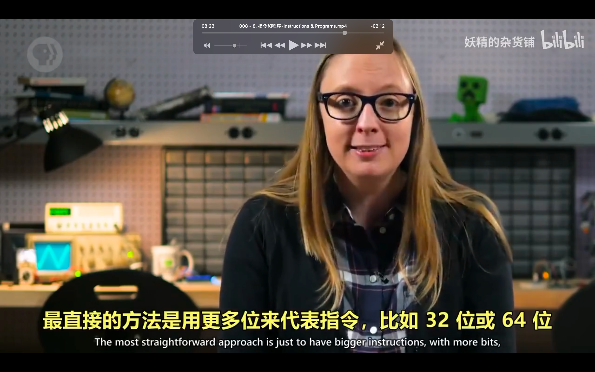</img>  
之前例子的指令是 4 位，最多只能代表 16 个指令，为了代表更多指令，以及操作更多地址，最直接的方法是增加位数到 32 位或 64 位，这叫指令长度

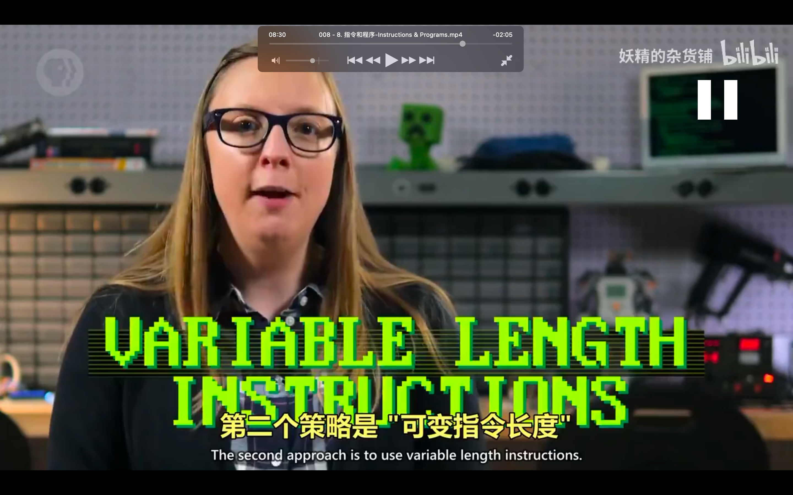</img>  
第二个策略 ooov

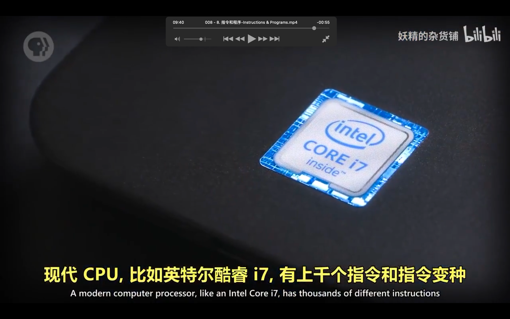</img>  
以上只是原理讲解，现在 cpu 要复杂很多，下节课讲解
