## 221018

</img>  
目前普通的电脑可能有 1 秒 10 亿条指令的性能

</img>  
aaap

</img>  
上级最后的例子其实是一个做除法的程序

</img>  
上集的除法很低效，因为本质是做很多个减法。这里直接在硬件层面做除法。只是这会让 alu 变得更复杂

</img>  
--=  
</img>  
--=  
</img>  
--=  
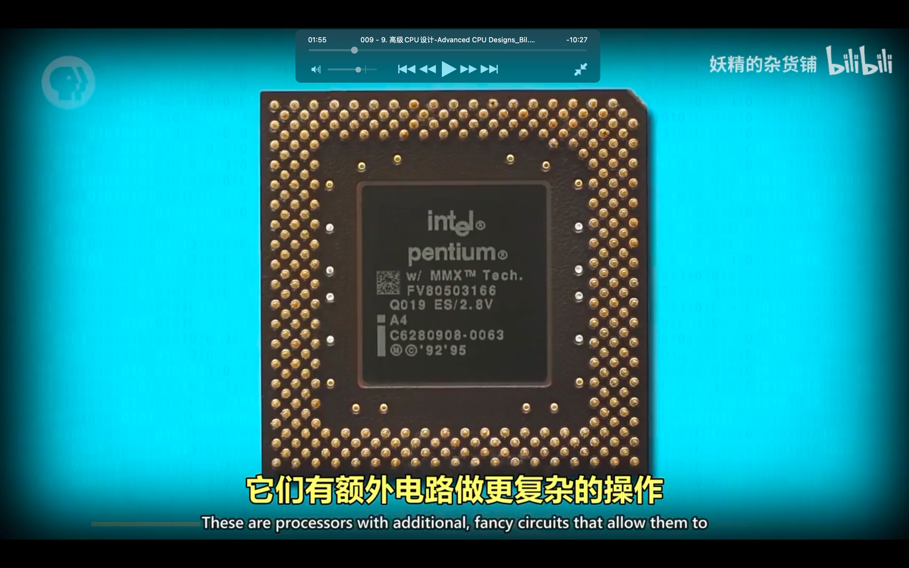</img>  
--=  
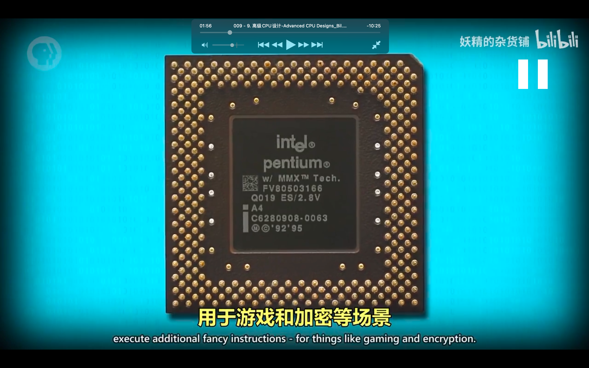</img>  
aaap

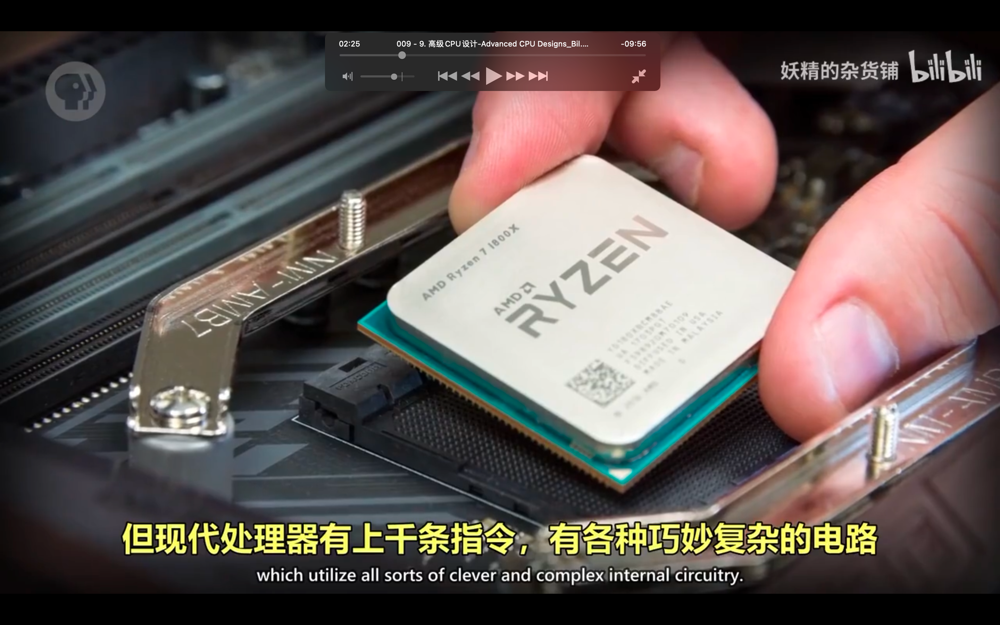</img>  
较早的 cpu 只有几十条指令，现在的可能有上千条

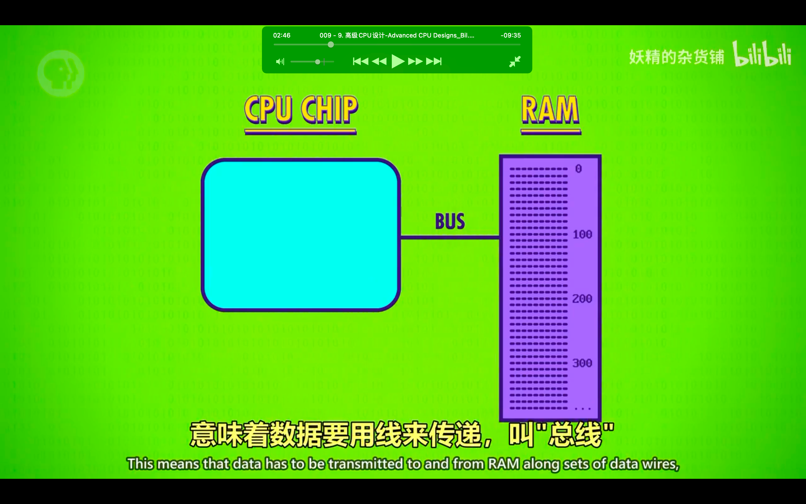</img>  
cpu 和 ram 之间传递数据的线叫总线 bus

</img>  
--=  
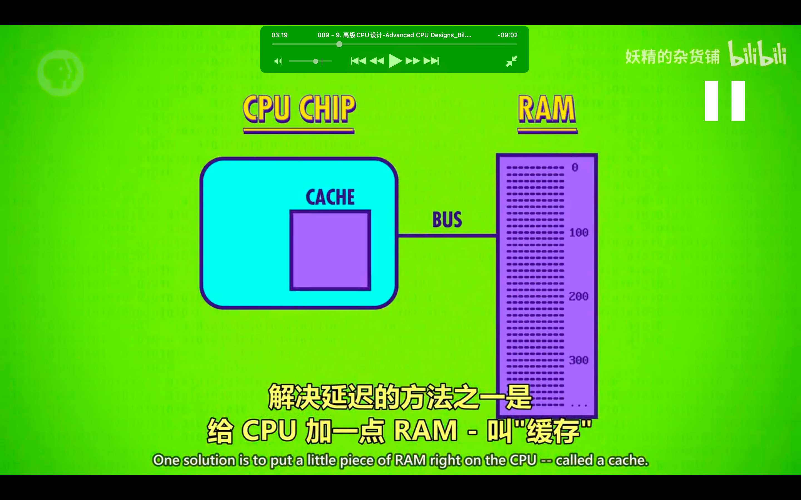</img>  
虽然电信号速度接近光速，但 cpu 的频率也非常高，为了降低延迟，可以直接在 cpu 里弄个 ram，叫做 cache

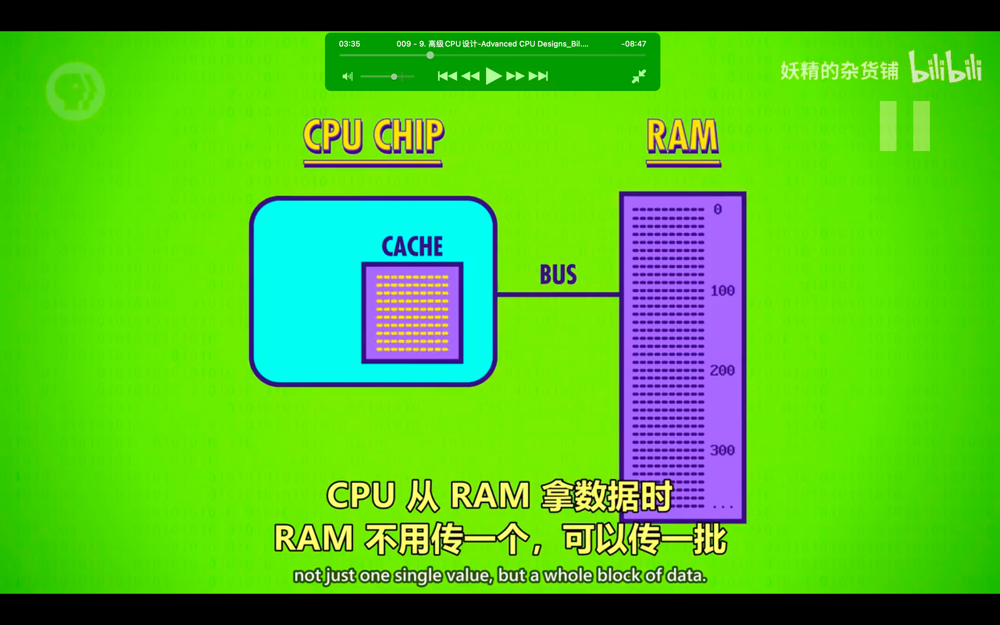</img>  
cache 实现了批量传数据

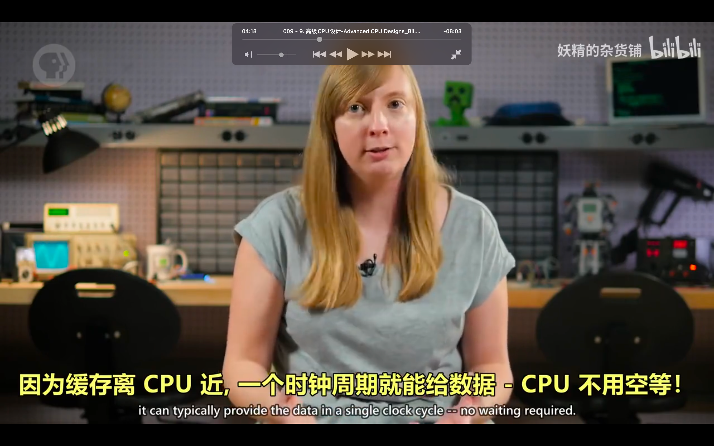</img>  
一个周期就能拿到数据，所以不用空等

</img>  
aaap

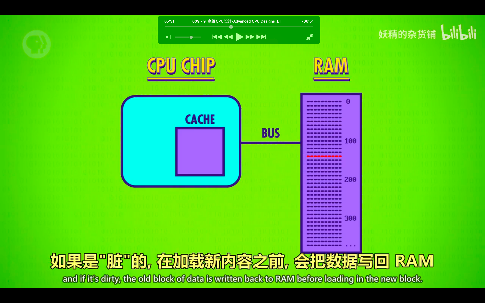</img>  
ooov  
其它关于缓存的介绍

</img>  
--=  
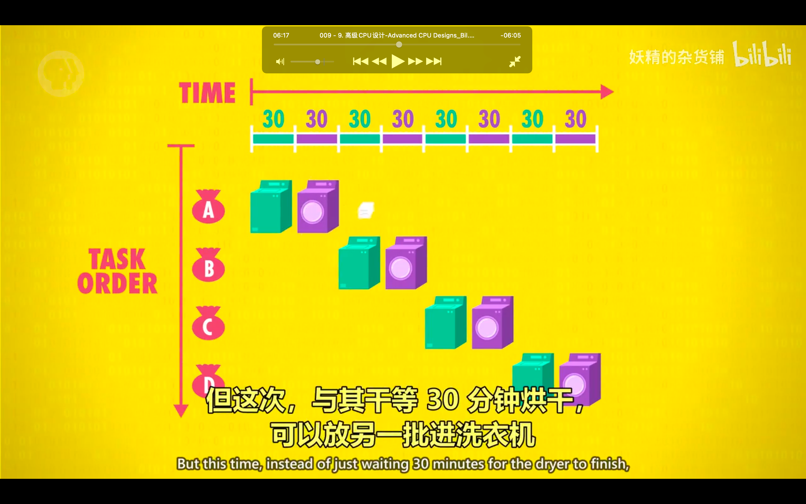</img>  
--=  
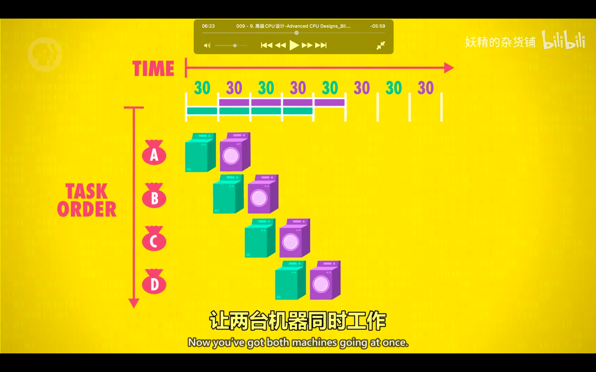</img>  
aaap  
ooov

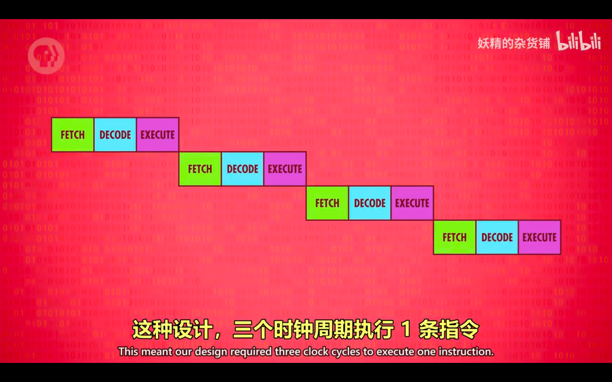</img>  
--=  
</img>  
--=  
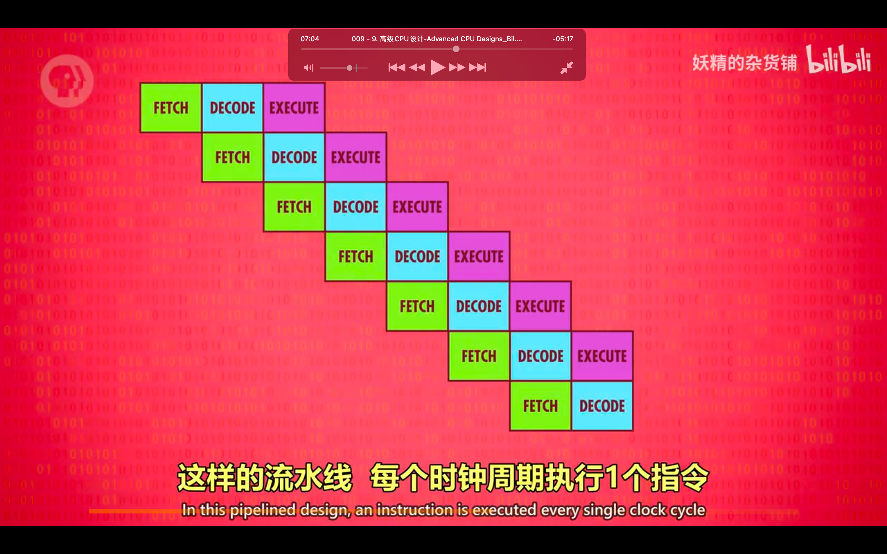</img>  
aaap

</img>  
ooov  
效率更高也更复杂的一种方式

</img>  
--=  
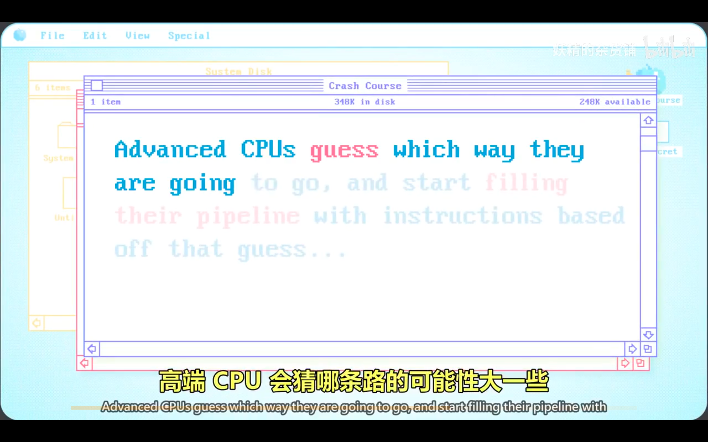</img>  
--=  
</img>
推测执行

</img>  
分支预测，超标量处理器  
aaav

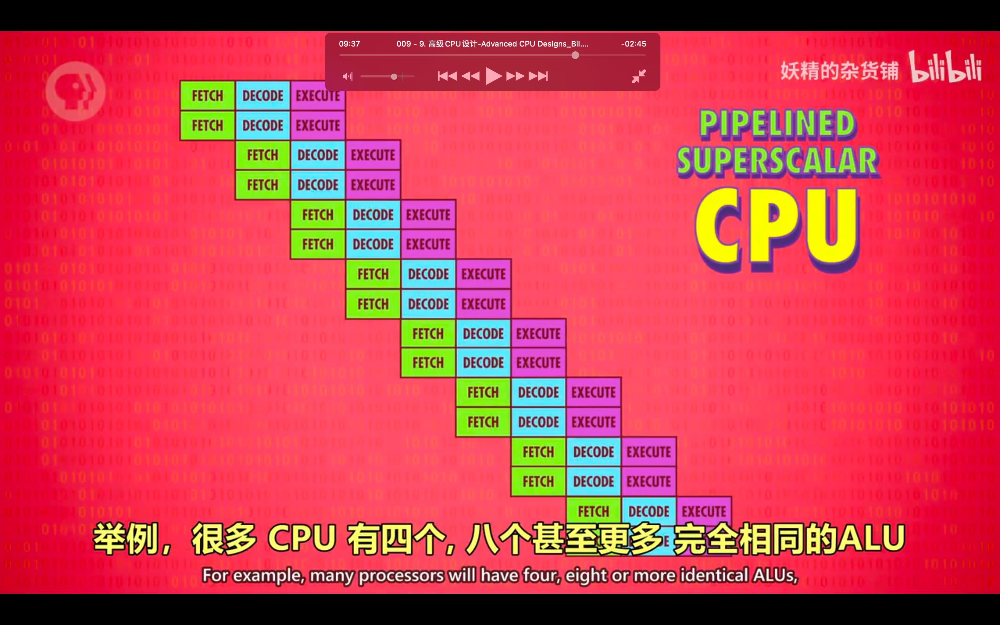</img>  
一个 cpu 有多个 alu

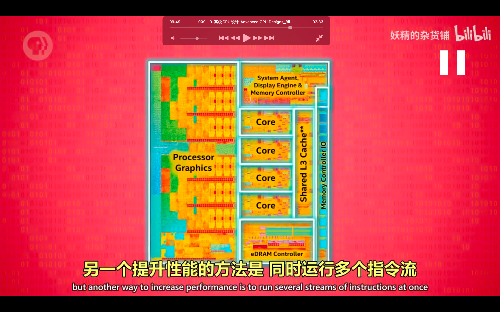</img>  
之前都是优化一个指令流的吞吐量，这里是同时运行多个指令流，即多核处理器

</img>  
多核的意思是 aaap，像是有多个 cpu，但因为它们紧密联系，可以共享一些资源，比如缓存，使得多核可以合作运算

</img>  
--=  
</img>  
aaap

</img>  
--=  
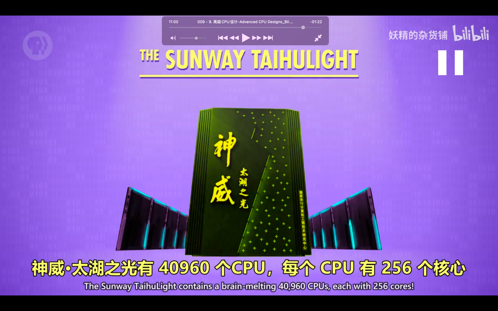</img>  
aaap
