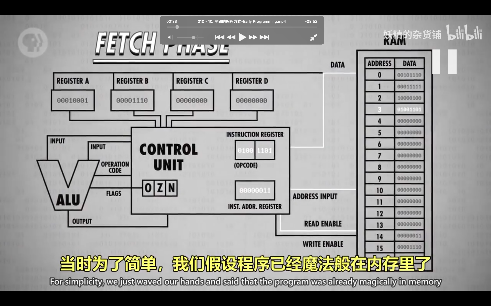
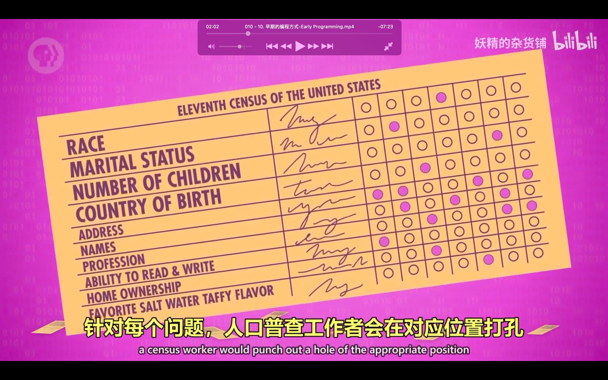
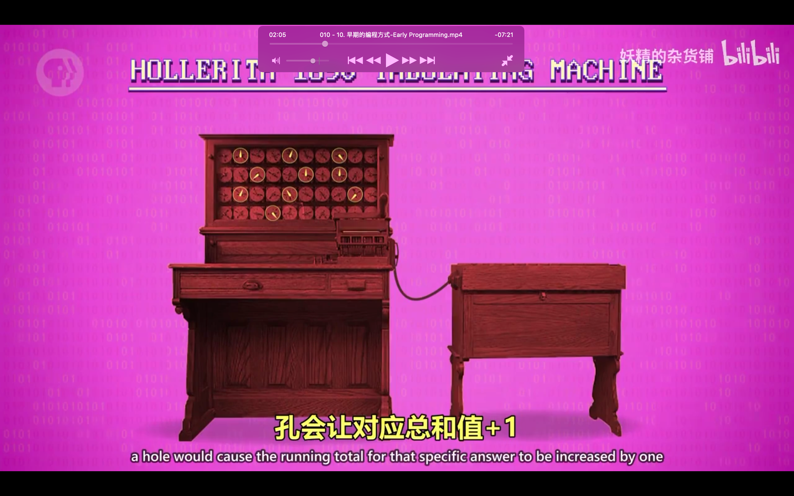
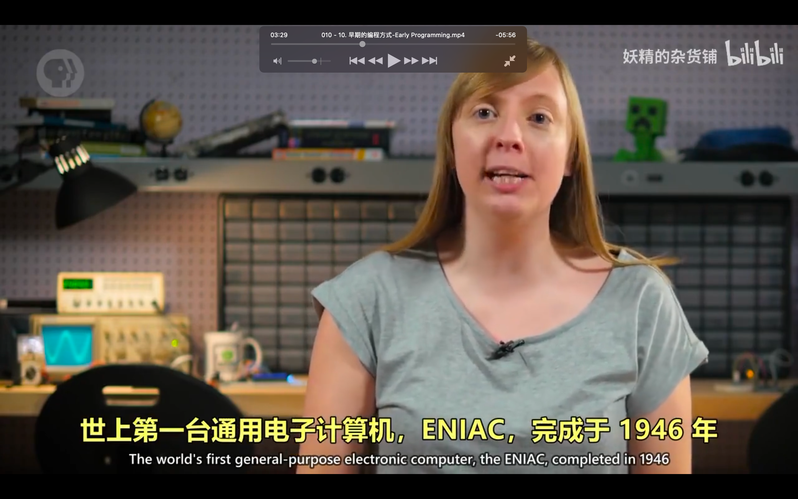
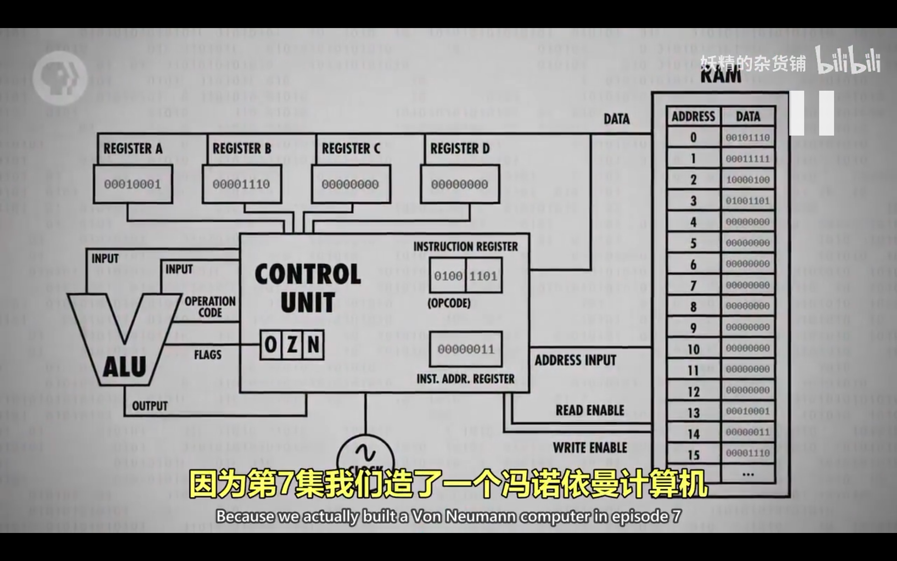
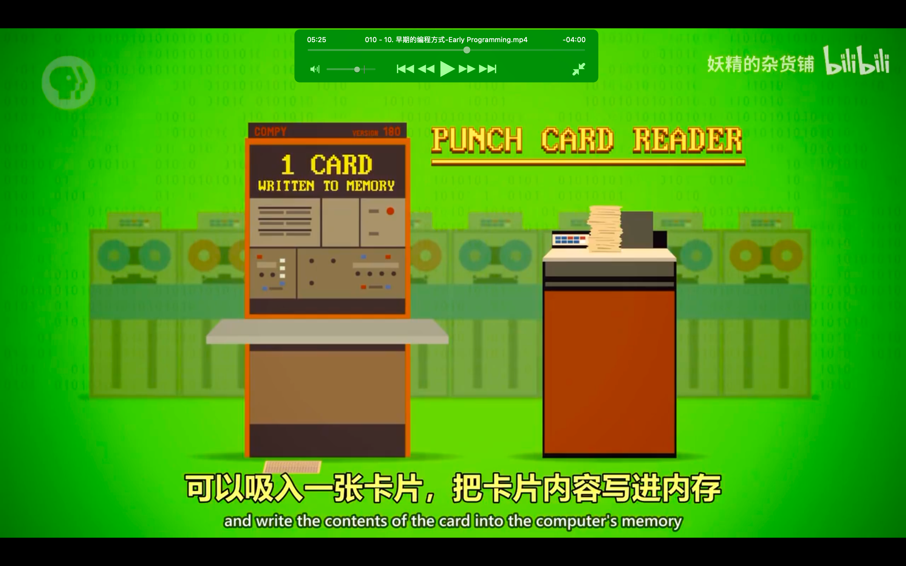
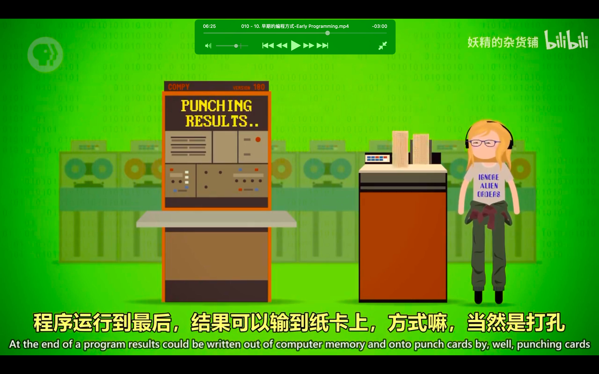
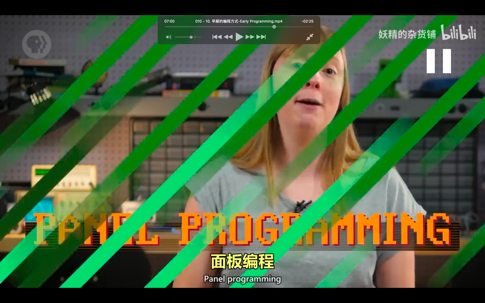

## 221019

</img>  
aaap

</img>  
--=  
</img>  
aaap

</img>  
编程出现在计算机之前，aaap

</img>  
--=  
</img>  
穿孔统计数据，汇总机，aaap

</img>  
控制面板，aaav

</img>  
第一个电子计算机 eniac

</img>  
存储程序计算机，把程序写入内存而不是插线里

</img>  
冯诺伊曼结构

</img>  
--=  
</img>  
冯诺伊曼计算机 aaap 加内存

</img>  
第 7 集就是冯诺伊曼计算机，现代计算机依然是这种模式

</img>  
早期电脑需要用卡片内容写进内存

</img>  
也可以通过打孔的方式输出内容

</img>  
面板编程，除插线板和穿孔纸卡以外另一种早期编程方式      
aaav

