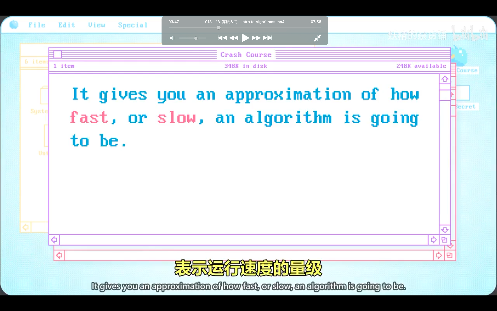

## 221020

</img>  
算法的意思是，解决问题的具体步骤，即使结果一致，有些算法会更好  
一般情况使用步骤越少越好，有时要考虑其它因素如内存等

</img>  
排序 sorting  
aaav

</img>  
--=  
</img>  
--=  
</img>  
aaap

</img>  
算法复杂度叫做大 o 表示法  
前面例子是 8 个元素，即 8\*\*2=64，如果 8 变为 80，则是 6400，  
大小增加了 10 倍，但运行时间增加了 100 倍

</img>  
归并排序  
merge sort  
aaav

</img>  
归并排序复杂度，在排序很多数据时比之前的排序方式更有优势

</img>  
经典算法问题，图搜索    
aaav

</img>  
导航就要使用到图搜索算法

