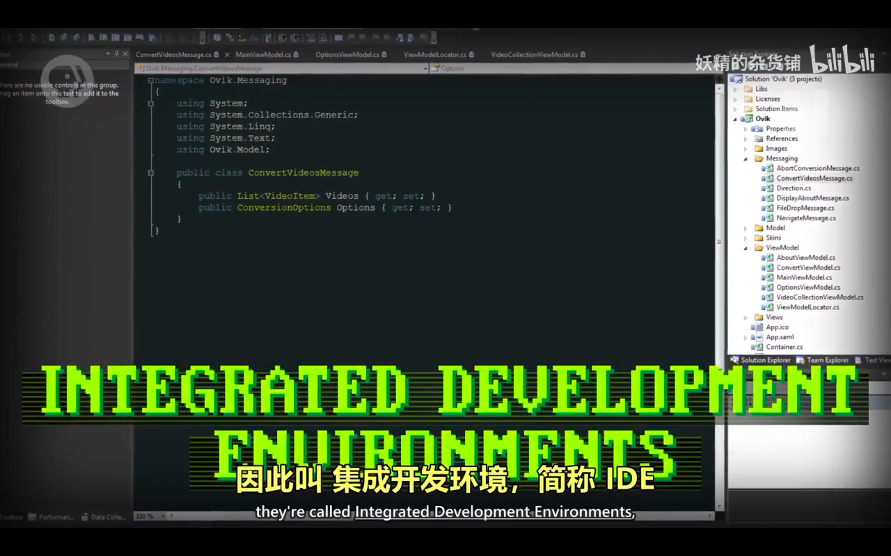

## 221022

</img>  
aaap

</img>  
office 4000 万行代码，为了写大型程序，用各种工具和方法，所以诞生了软件工程

</img>  
aaap，不用关心整个项目，关心自己的函数就行

</img>  
打包成函数还不够，4000 万行代码会有几十万个函数，aaap

</img>  
从对象，子对象一步一步找到函数

</img>  
--=  
</img>  
api

</img>  
公有，私有函数

</img>  
面向对象的核心

</img>  
ide

</img>  
beta 版指未完全测试通过

</img>  
alpha 版，通常只在公司内部用
