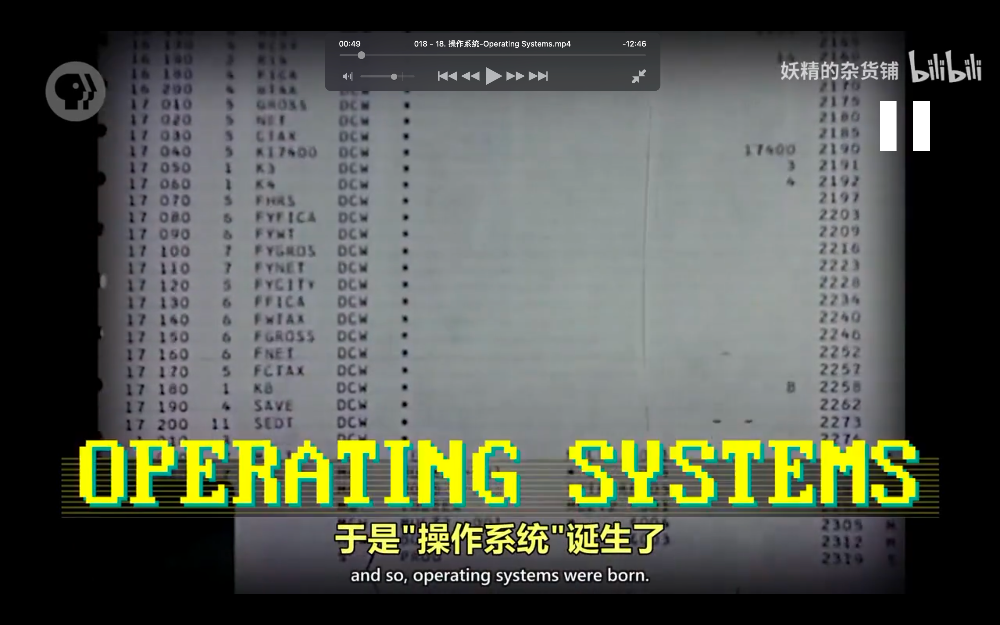
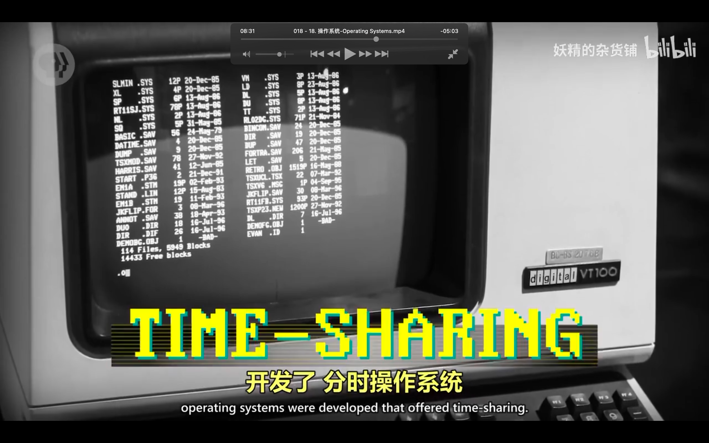

## 221023

</img>  
目录

</img>  
--=  
</img>  
早期编程

</img>  
--=  
</img>  
--=  
</img>  
aaap

</img>  
操作系统其实也是硬件 aaap

</img>  
批处理 aaav

</img>  
多任务处理 aaav

</img>  
虚拟内存 aaav

</img>  
分时操作系统 aaav

</img>  
aaap unix 系统  
aaav
