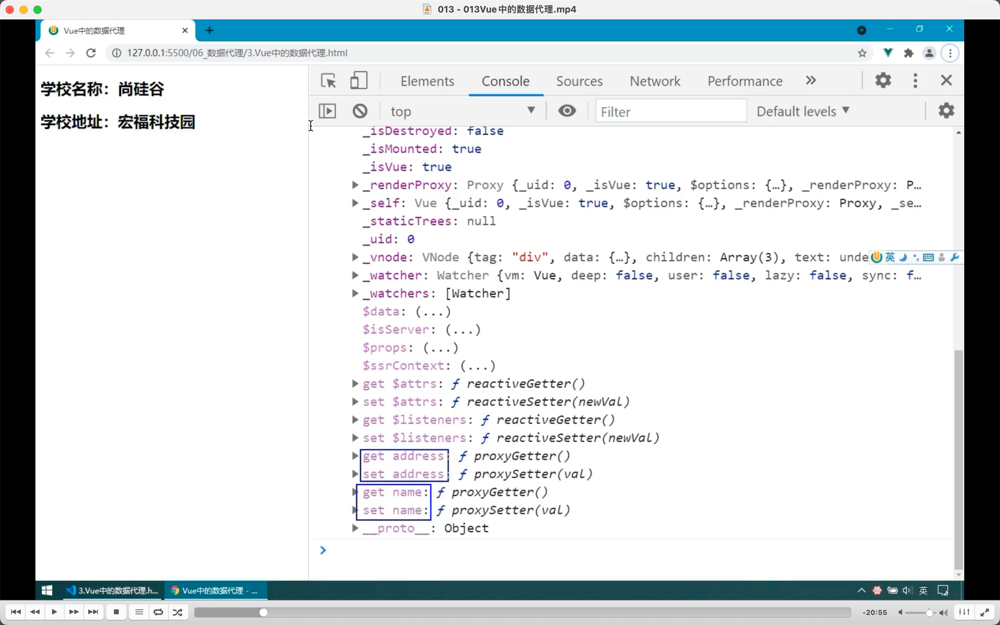
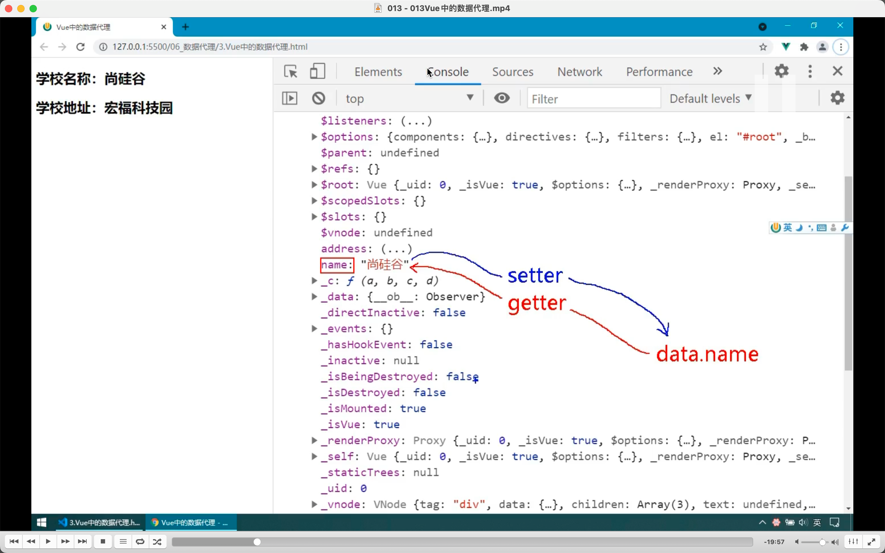
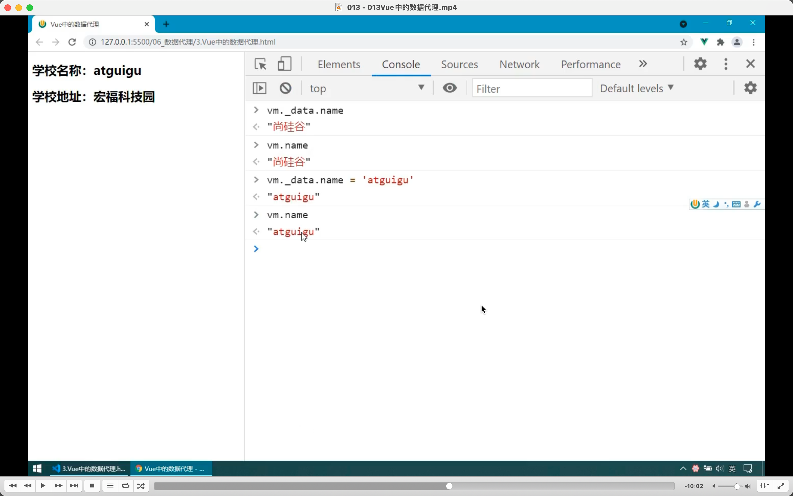
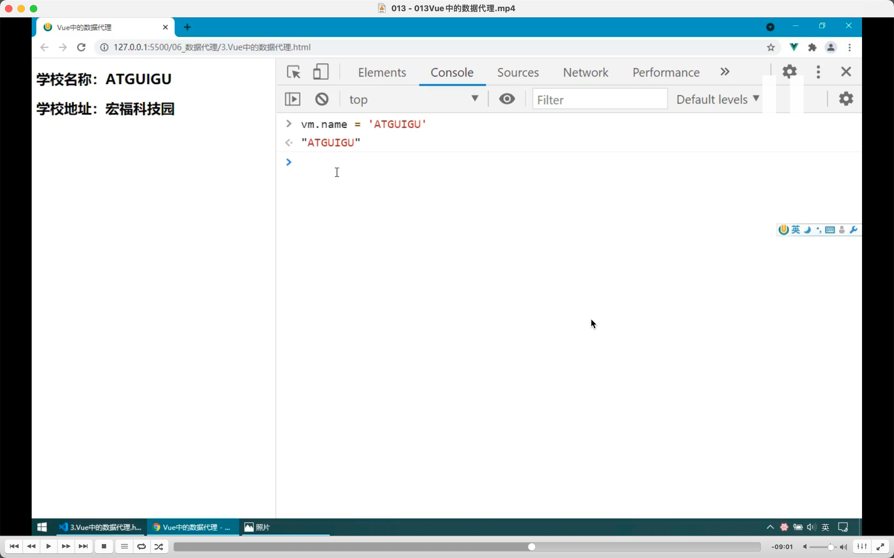
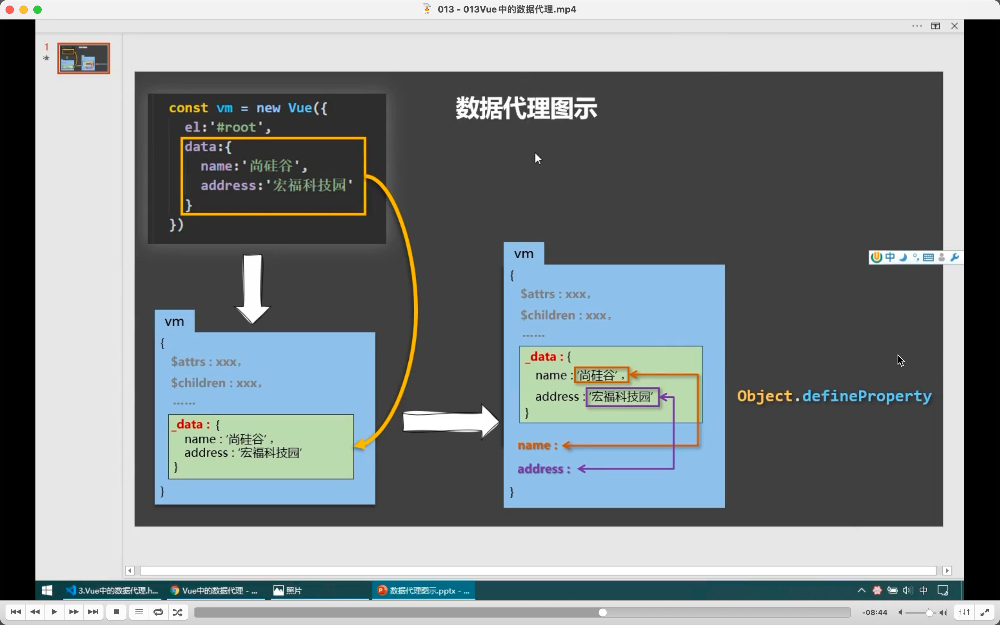
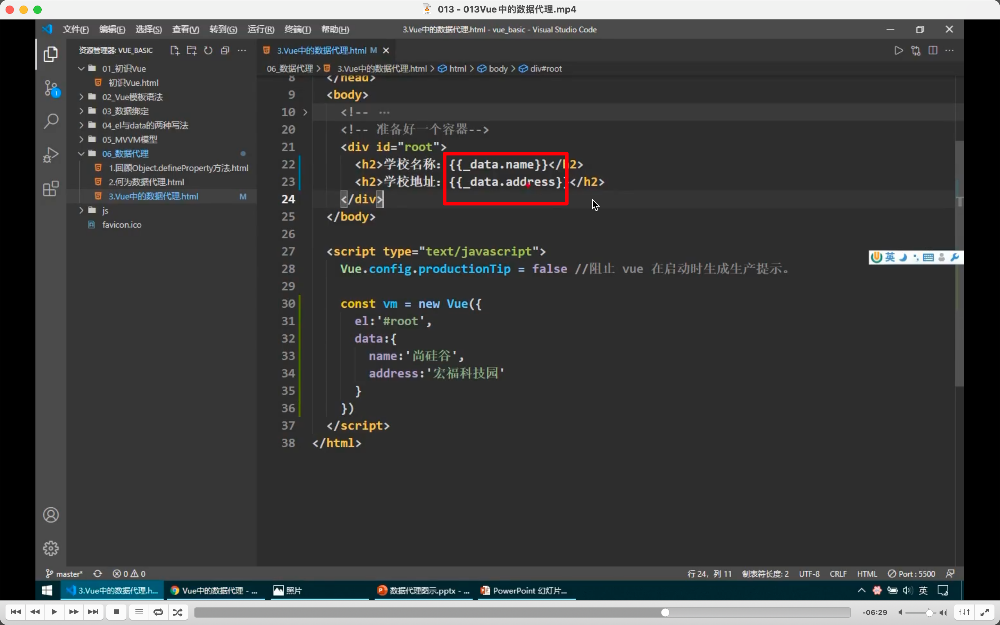
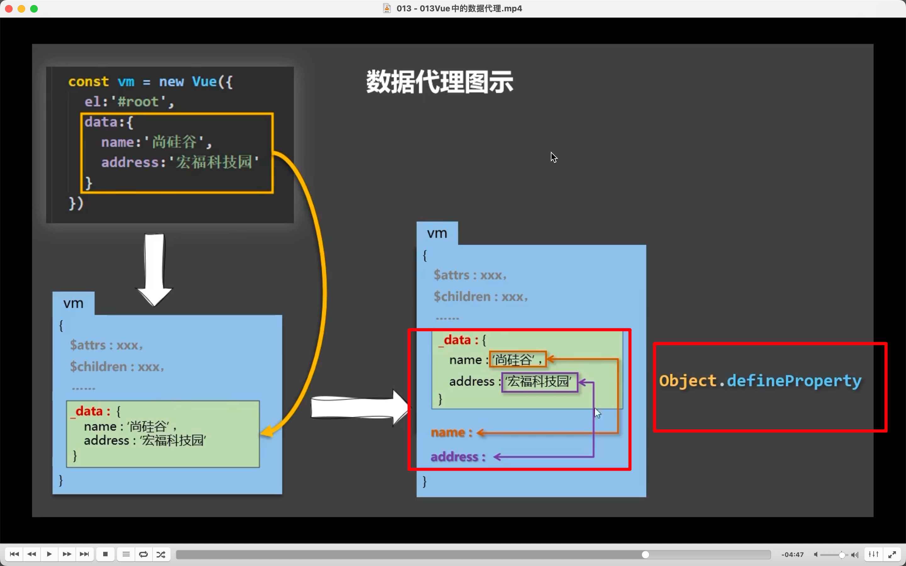
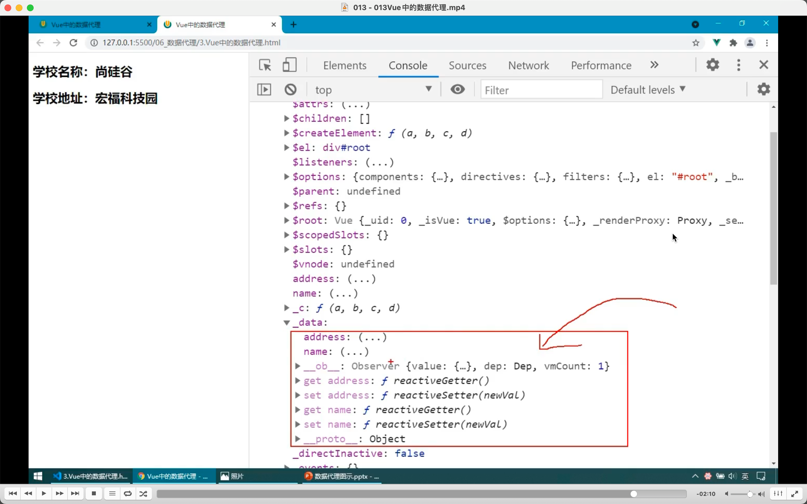

  
data 里写的数据都自动生成 setter getter 方法
  
如有人读取 name，getter 工作，并把 data.name 拿过去。

  
vm.\_data 就是 data。

  
vm.\_data.aaa 也可以写成 vm.aaa?

  
vue 数据代理原理图。看视频

  
如果没有数据代理就得这样写。

这样就是数据代理了，写代码就更方便了。  
使用的就是 object.defineProperty api

  
\_data 里到了数据劫持，需要时再了解。

reviewed 2022/07/29
