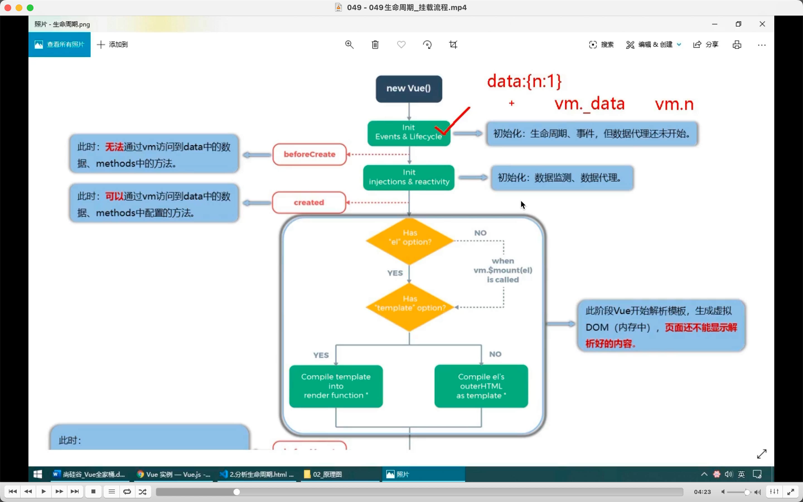
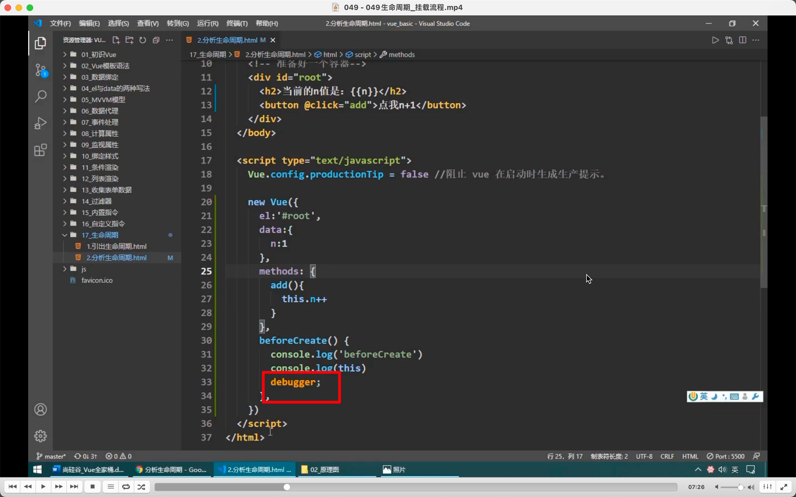
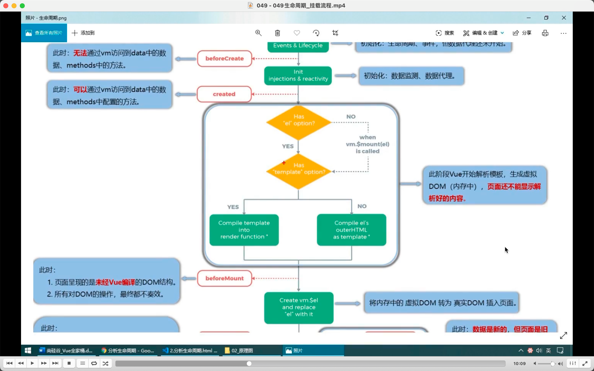
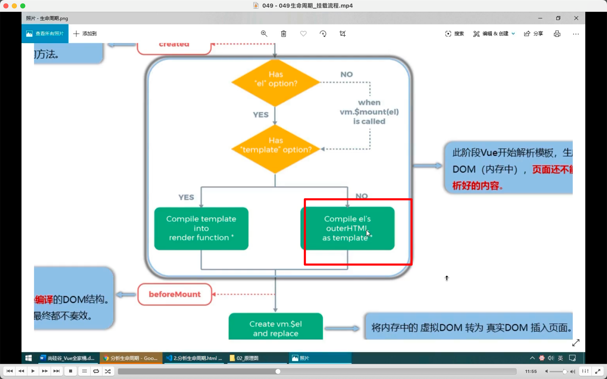
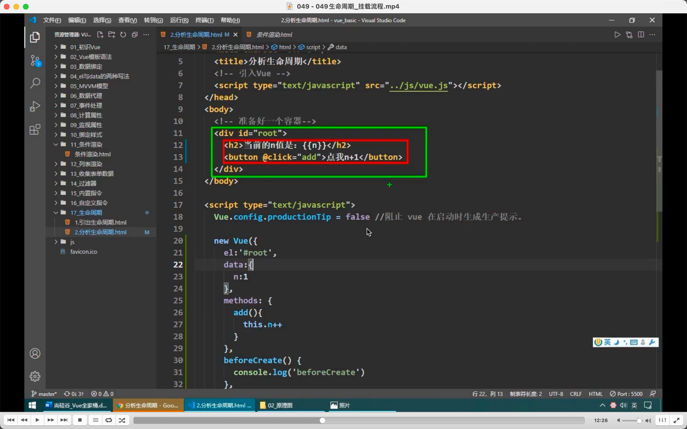
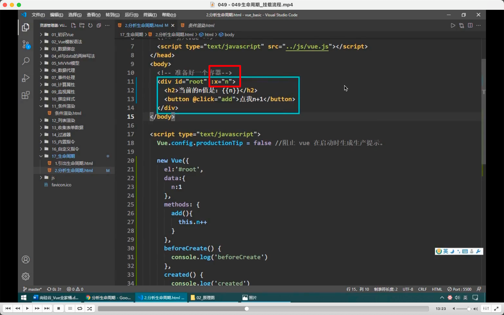
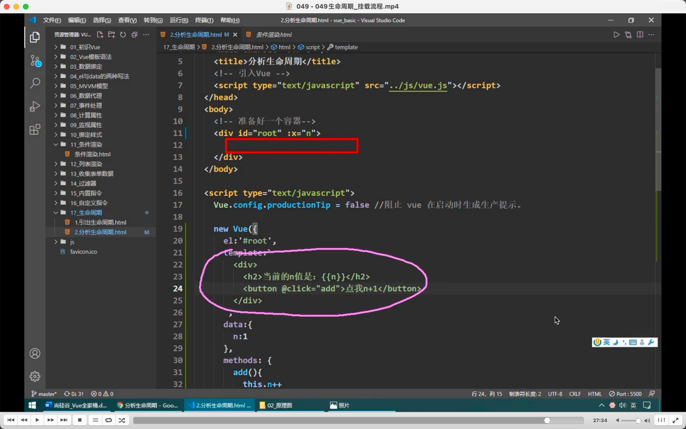
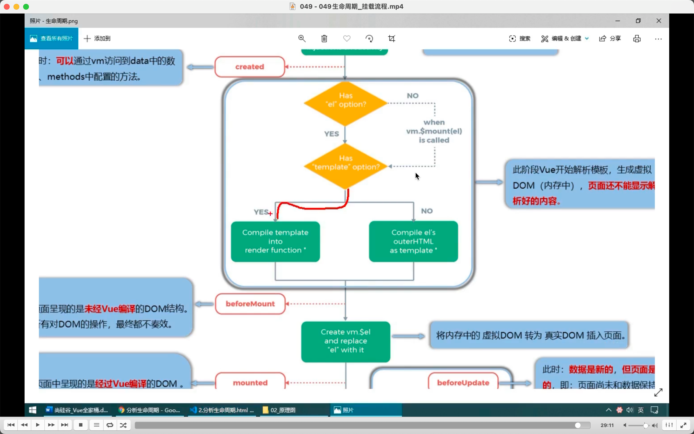

此时定义如生命周期函数有几个，叫啥名，啥时候调等。但数据代理没开始，即 data 里的数据 vm 还未收到。vm 还没有 vm.\_data  
beforeCreate 无法访问 data，methods。

  
注意可以写 debugger 暂停程序

  
created 介绍。

  
  

绿色是 el's outer，红色是 el's inner。  
此时:x 也解析了，所以是 el's outer 被解析。

  

容器里面可以什么都不写，用 template 代替，但有区别，会替换掉 id=root div。就是图二路线。

### 此节很多内容没记录，需要了解时看视频。
