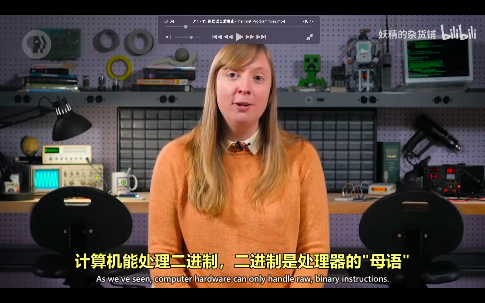
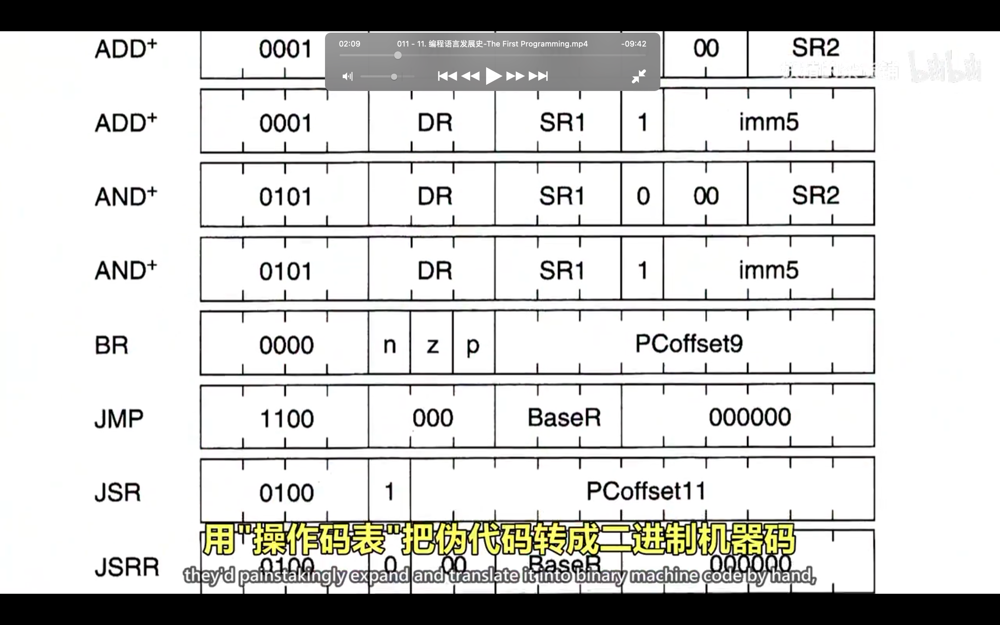
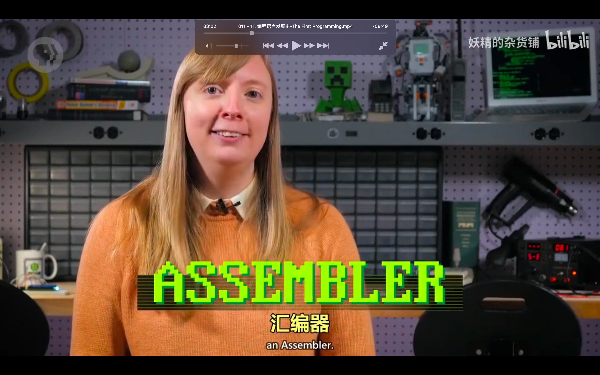
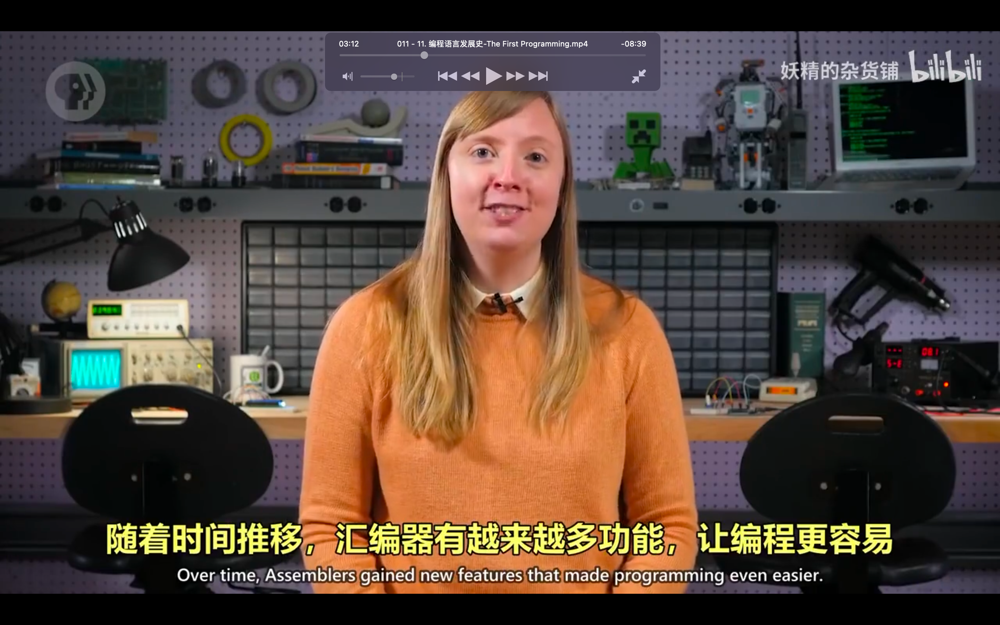
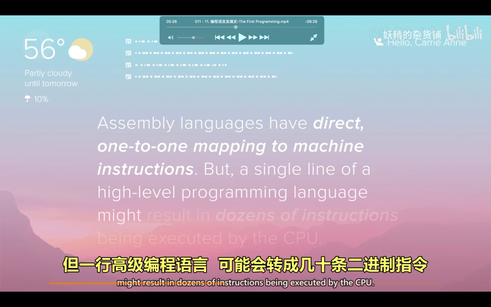
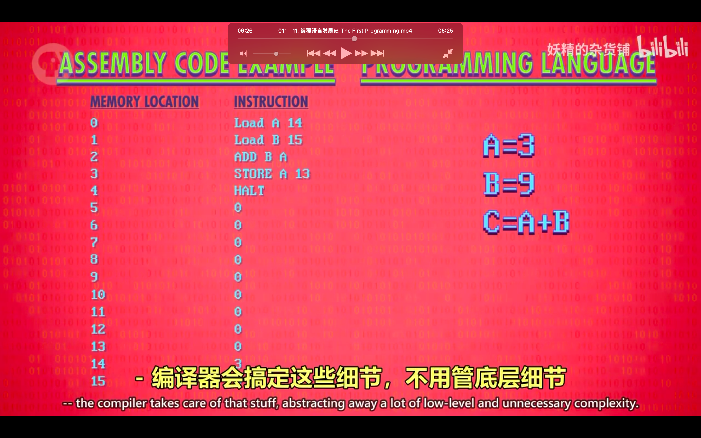
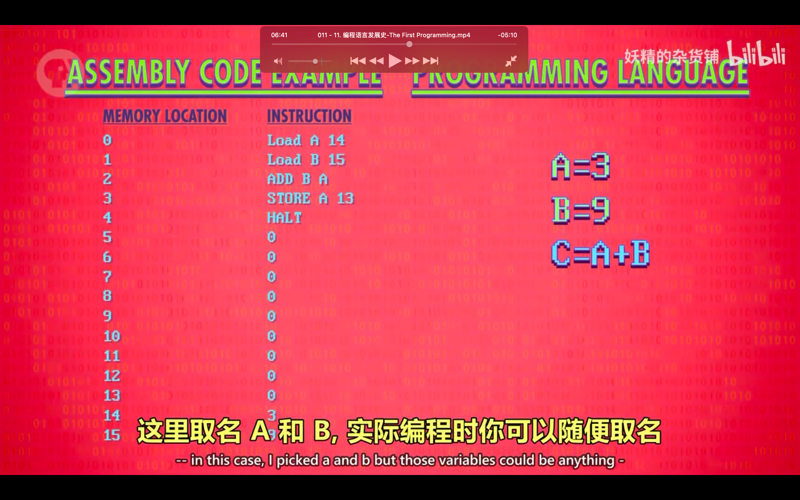

## 221020

</img>  
之前课程第一个指令的具体意思

</img>  
计算机能且仅能处理二进制，这叫机器语言或机器码

</img>  
在早期，必须用机器码写程序，先用英语写个高层次版，aaap，这种对程序的高层次描述叫做伪代码 pseudo-code

</img>  
aaap

</img>  
之前方式太麻烦，所以 aaap，每个操作码分配一个简单的名字，叫助记词，助记词后紧跟数据，形成完整指令，所以以前纯用 1，0 现在可以写为 load_a 14 这样的形式

</img>  
cpu 不懂什么是 load a 14，因为它只懂二进制，所以需要一个二进制程序帮忙把文字指令自动转为二进制，这种程序叫做汇编器 assembler，  
汇编器读取用汇编语言写的程序，转为机器码，load a 14 就是个汇编指令

</img>  
汇编器随时间增加了越来越多的功能，如给 jump 地址增加标签，方便了更新代码  
aaav

</img>  
aaap

</img>  
虽然汇编与机器指令一一对应，aaap

</img>  
以下用 python 举例

</img>  
左侧汇编，右侧 python

</img>  
--=  
</img>  
aaap

</img>  
fortran 相关
aaav

</img>  
普通面向商业语言，cobol。让语言适应不同机器。  
aaav

</img>  
如今大多数编程语言不必接触 cpu 特有的汇编码和机器码

</img>  
各种现代语言  
aaav
