## 221022

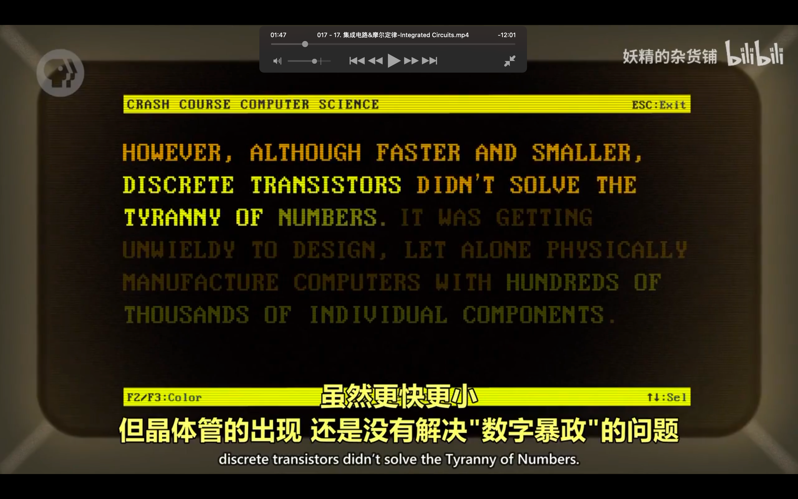</img>  
数字暴政

</img>  
aaap

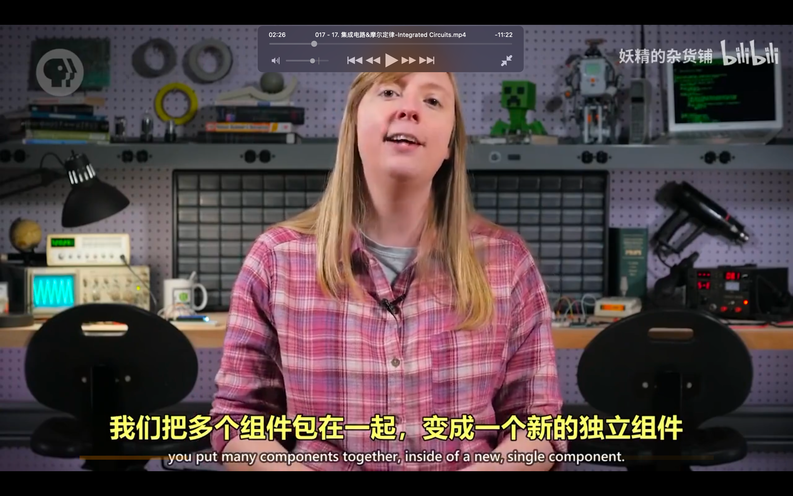</img>  
aaap，集成电路

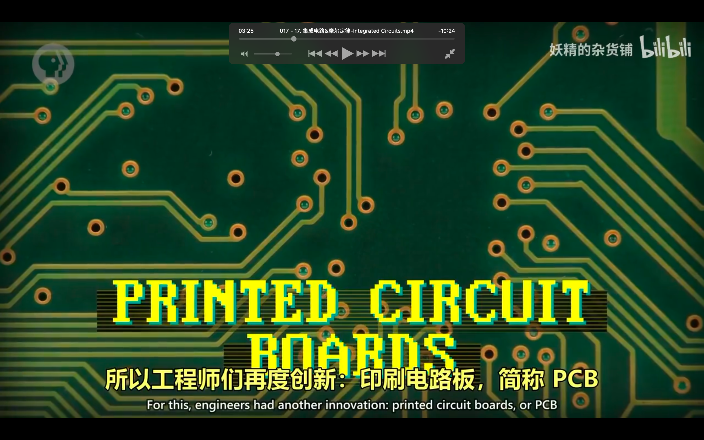</img>  
印刷电路板

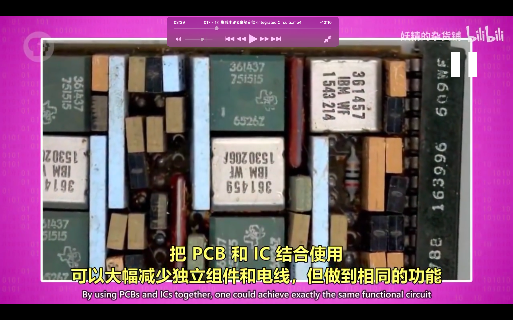</img>  
aaap

</img>  
光刻 aaap

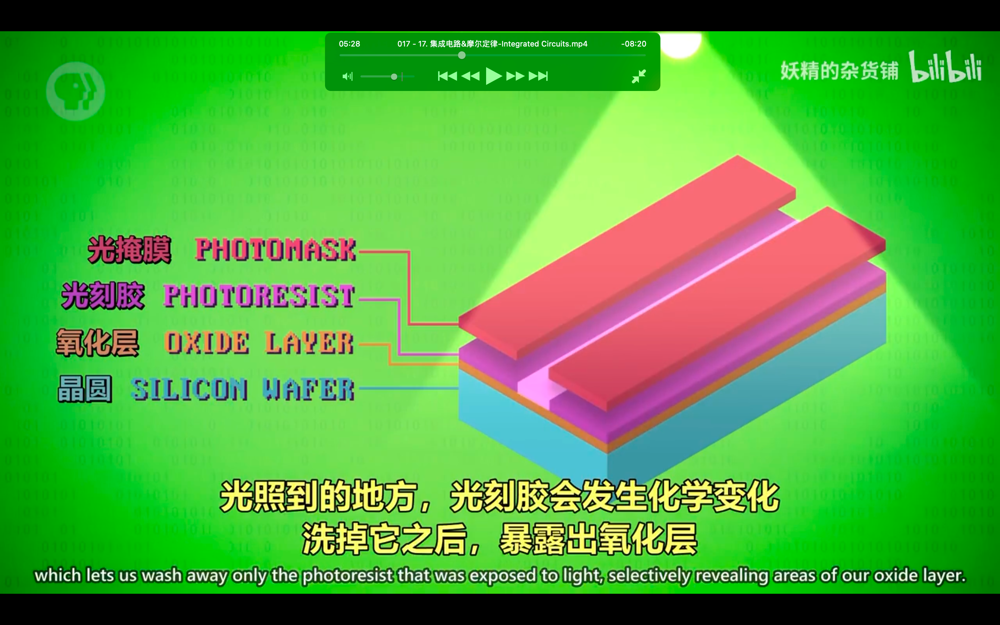</img>  
光刻技术实现 aaav  
dddi  
较复杂，需要时再看

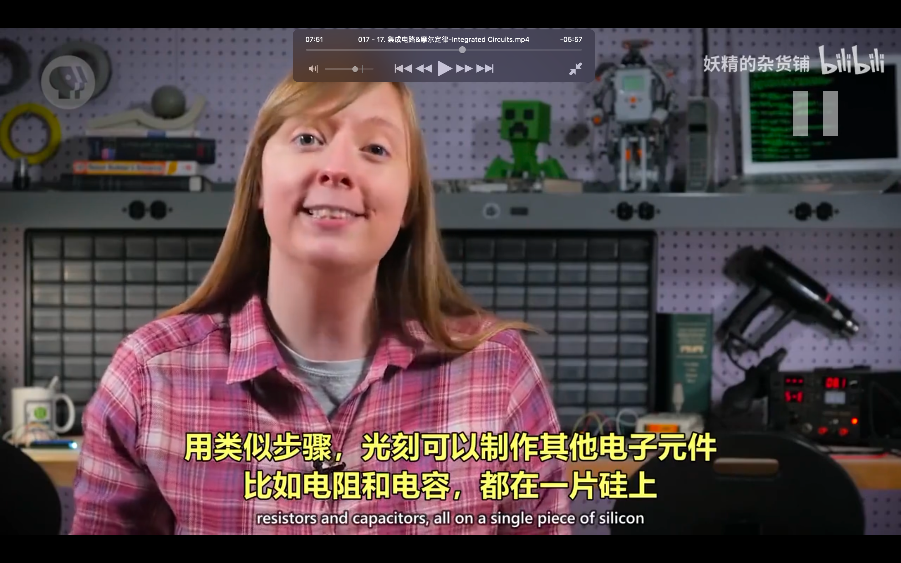</img>        
其它元件也可以用光刻实现

</img>  
aaap

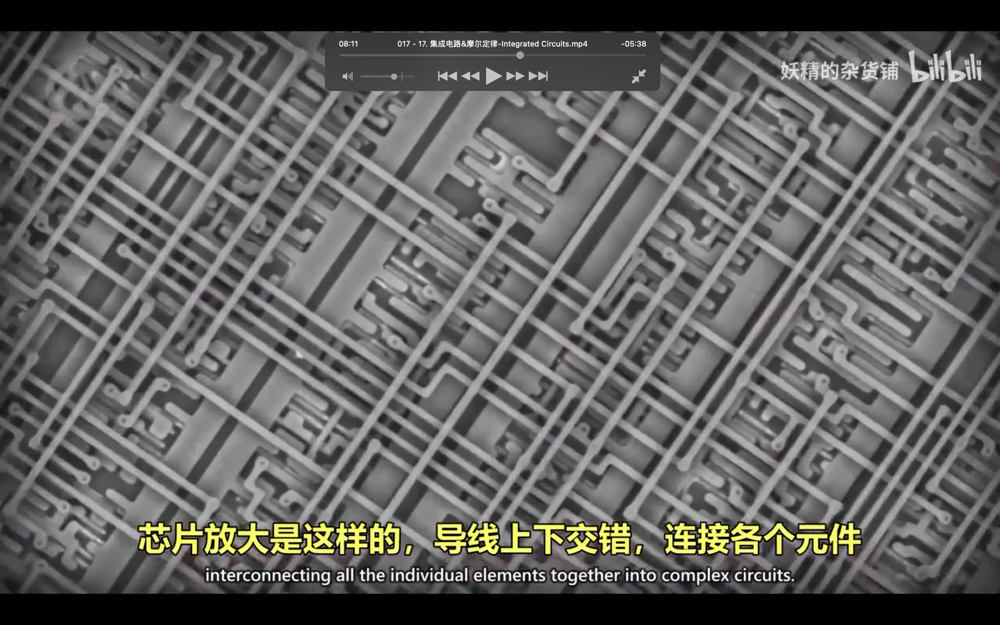</img>  
aaap

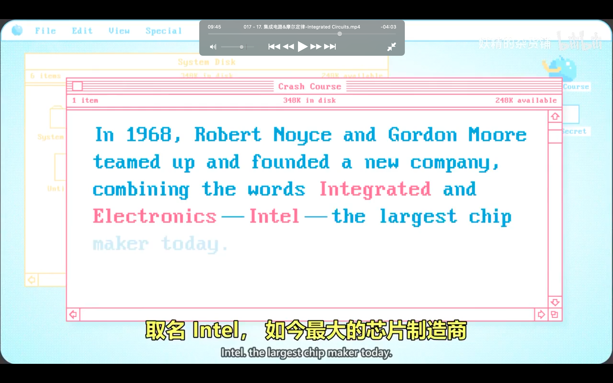</img>  
intel取名

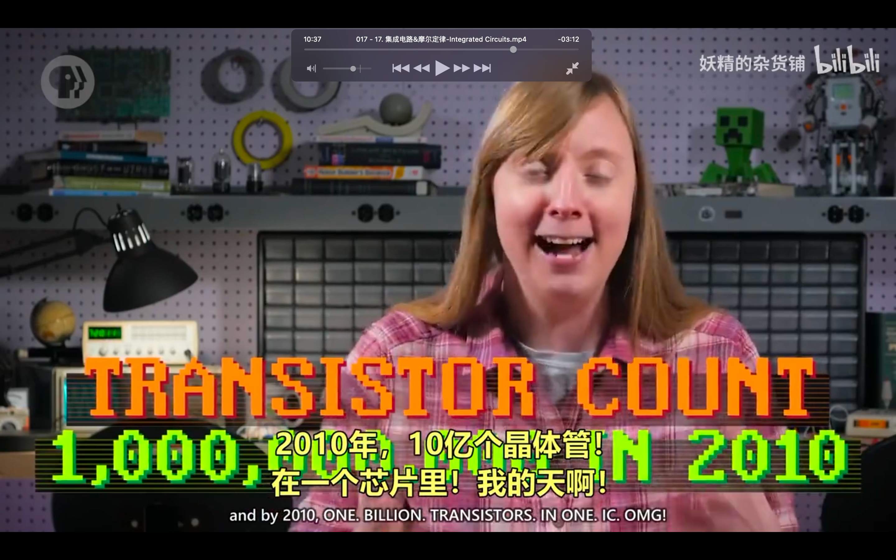</img>  
1个芯片10亿个晶体管

</img>  
--=     
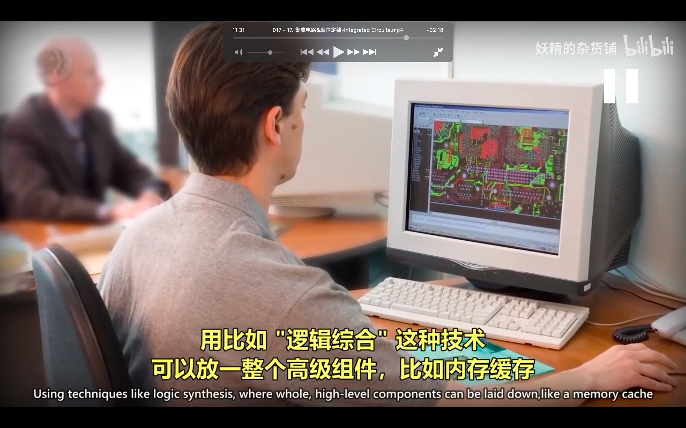</img>  
--=     
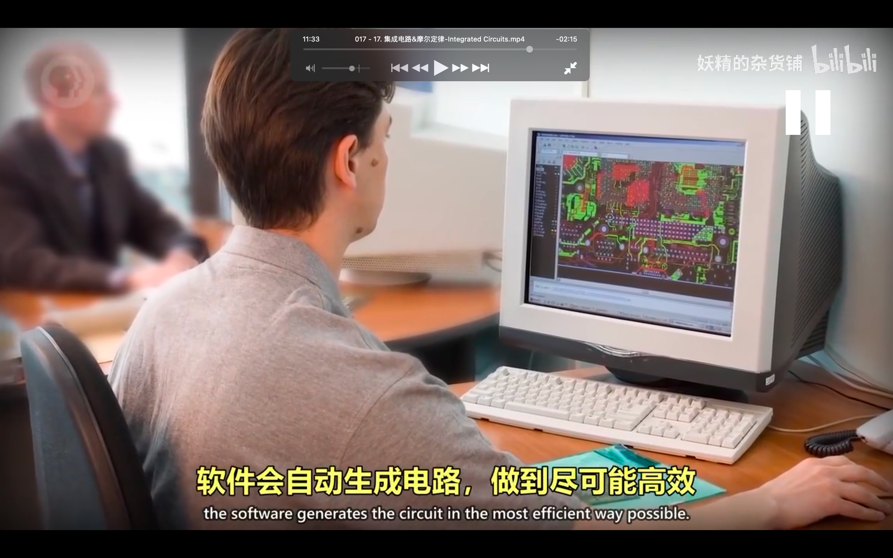</img>  
软件自动生成电路

</img>  
--=     
</img>  
技术瓶颈

