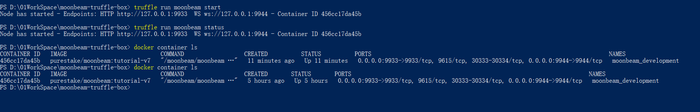
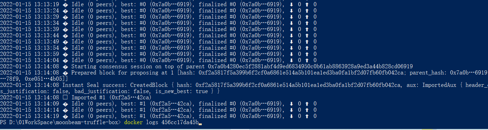
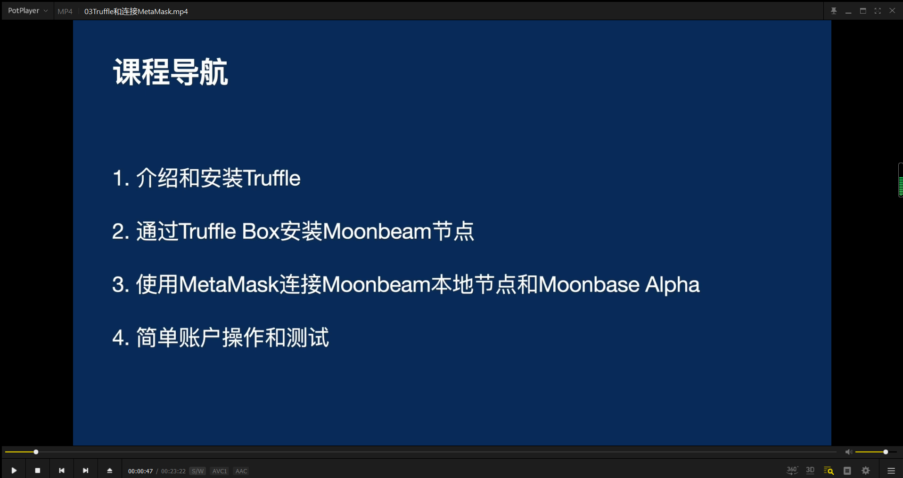
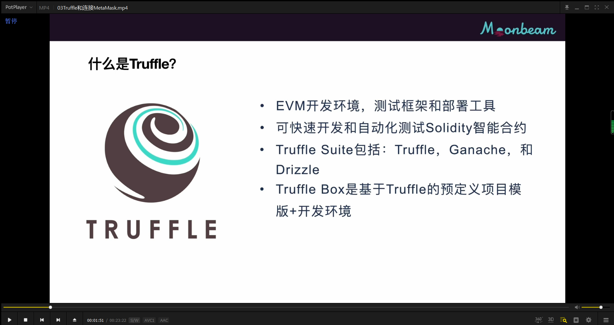
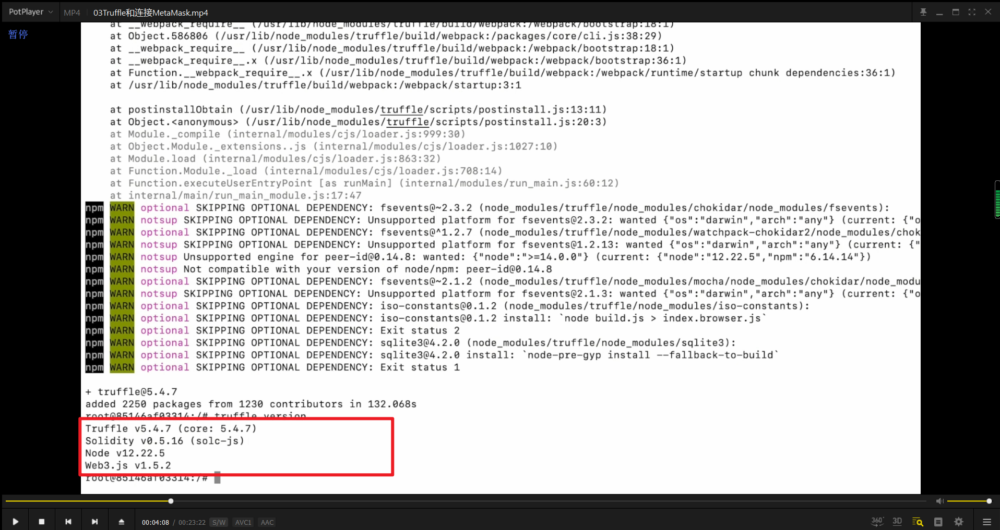
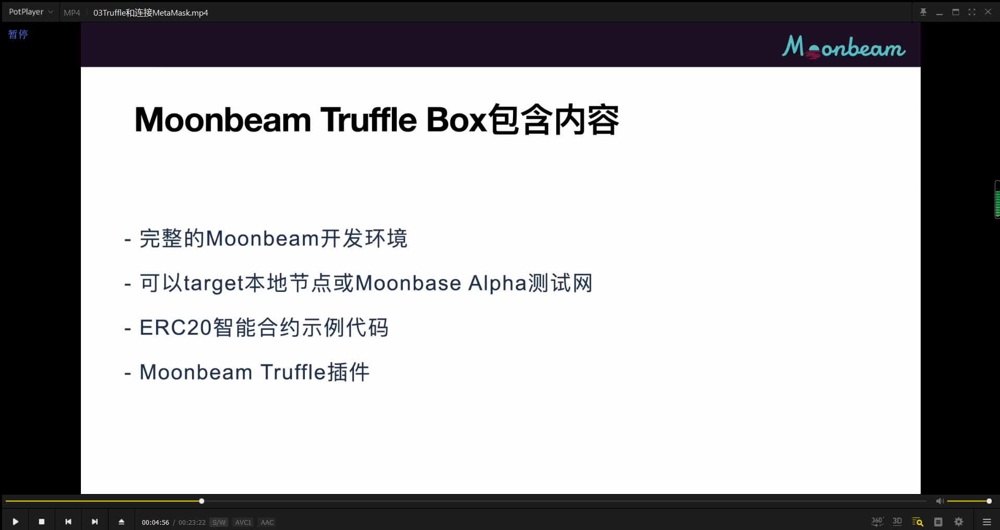

### 此节 7：30 以前不用按照教程做，如果按照教程就会在 docker 里继续嵌套 docker，会出现问题。应该在 win10 里 git clone 下来 moonbeam 容器，再启动 docker。具体步骤如下

git clone https://github.com/PureStake/moonbeam-truffle-box （这是个 truffle 工具，用来编译部署合约等）
cd moonbeam-truffle-box  
可能需要先 npm install @truffle/hdwallet-provider  
npm install  
开启 docker 后  
truffle run moonbeam install （这是开启一个 docker 容器）（可能会遇到 truffle 虽然 install 了还无法使用的问题，就只有先全局 npm 安装 truffle） （可能会因为源的问题，速度很慢，直接按网上的方法修改源可能会出现 docker 启动不了问题，可以 powershell 开启代理来处理）   

    
truffle run moonbeam start 启动一个镜像     
truffle run moonbeam status 可以查看镜像状态。      
docker container ls 也可查看状态        

https://docs.moonbeam.network/tokens/connect/metamask/#import-accounts 找到开发账号，并导入开发账号的私钥，测试一下转账     

      
docker logs 镜像id 可以查看到记录

  
ganache 是测试用的模拟以太坊的本地区块链，drizzle 是制作 dapp 前端 ui 的工具，truffle box 类似于 docker。

  
安装 truffle 会直接安装 solidity 和 web3.

  
安装 moonbeam truffle box。其实就是个提前配置好的包含 moonbeam 环境的 docker 镜像。
