      

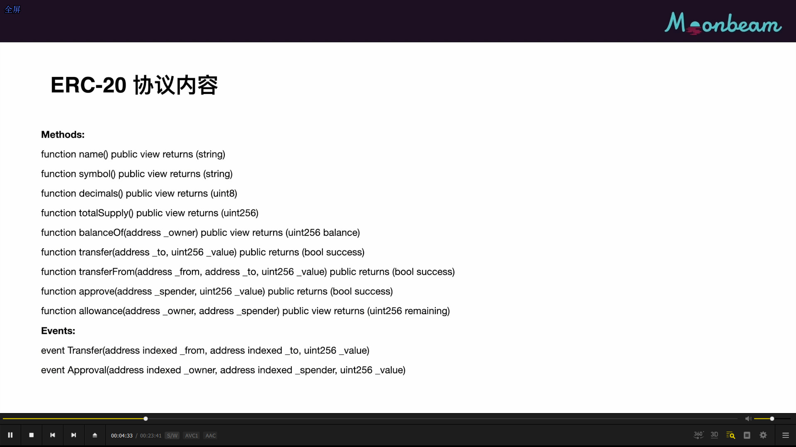

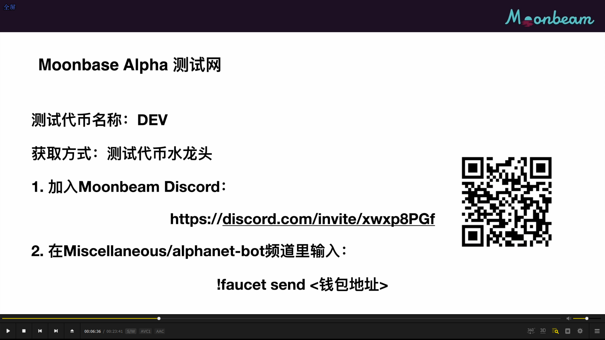
moonbeam 阿尔法测试网代币申请

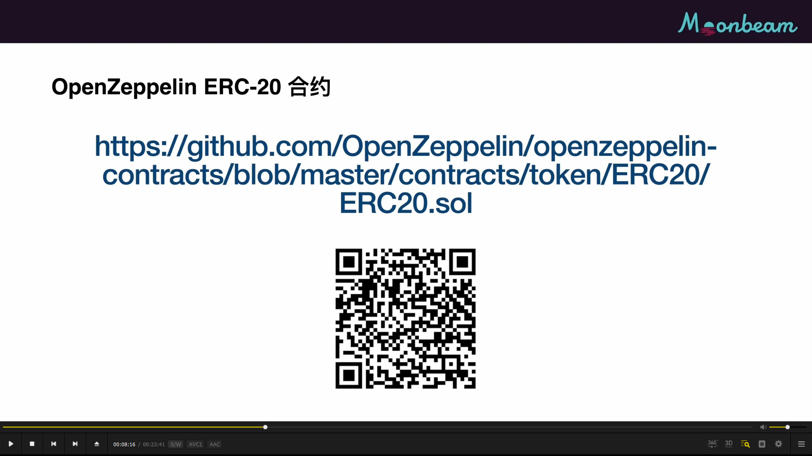
这节课要部署的是openZeppelin erc20合约。openZeppelin是开源的智能合约库，经过审计，所以安全性有保证。

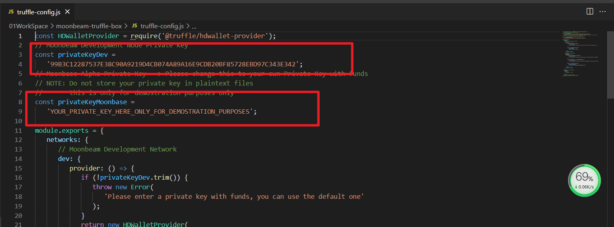      
视频有问题，所以截图自己的代码。truffle-config.js最上面是本地开发节点私钥和阿尔法测试链私钥。此文件可以部署两个不同网络     

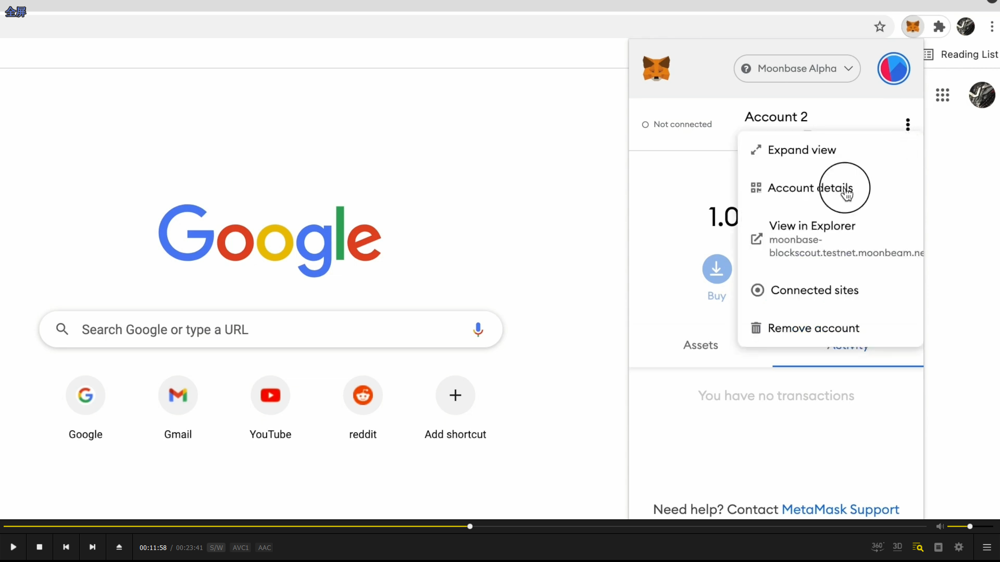      
导出账户私钥的方法，并粘贴私钥进config.js。这样truffle就可以使用这个账户来部署智能合约。        

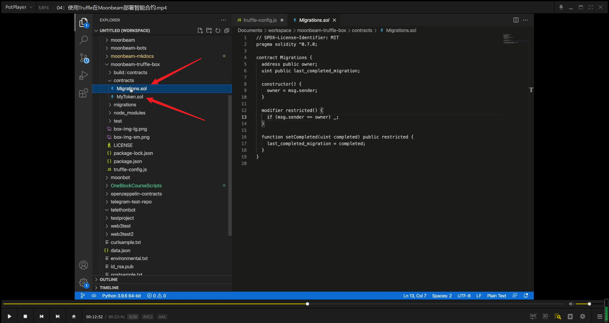      
contract里有两个智能合约migration是帮助部署的合约。mytoken则是这次要部署的合约。        

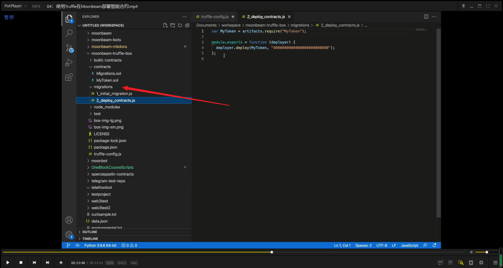      
migrations是truffle的目录，第一个文件不重要。第二个文件决定部署哪些智能合约以及部署顺序。       

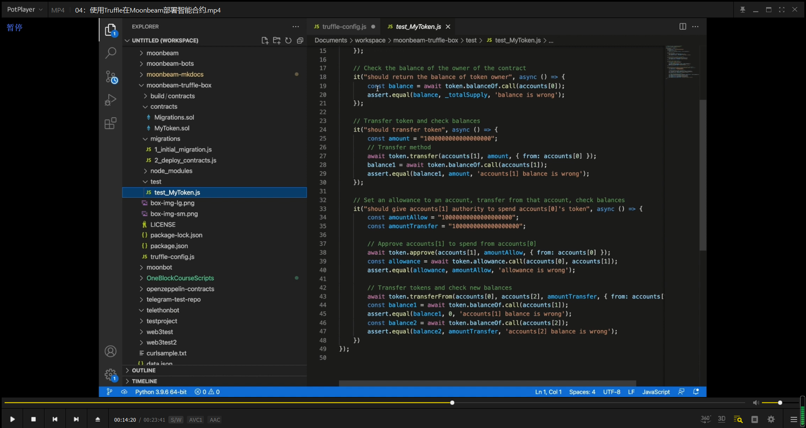
这个是用truffle ganache功能写的本地的智能合约测试。     

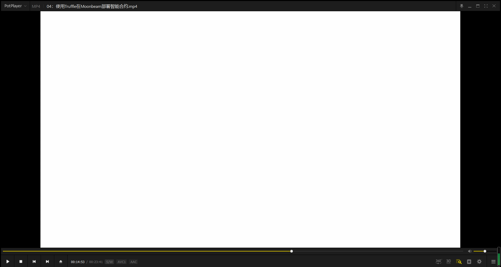      
truffle run moonbeam start启动本地节点，truffle compile编译合约。录像没显示出来。       

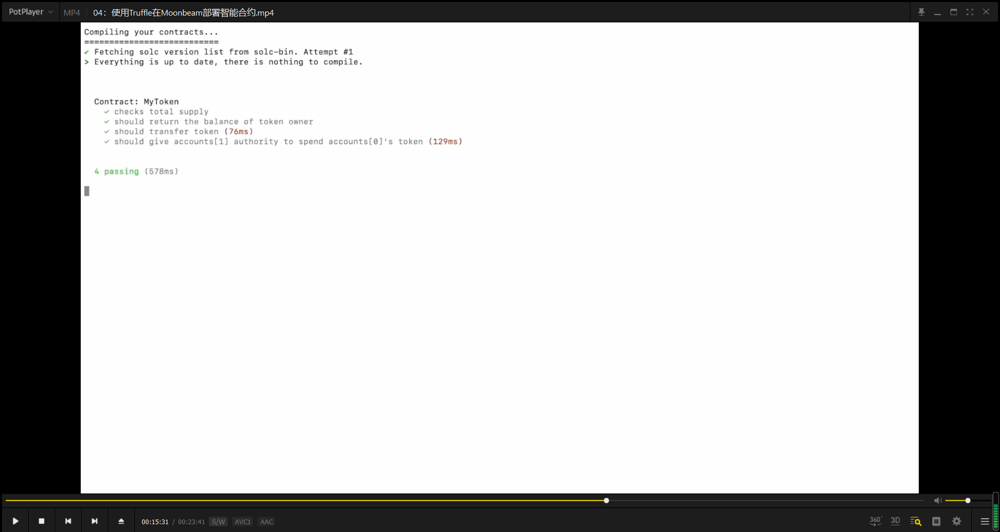
用truffle test做智能合约测试。用了truffle ganache功能。

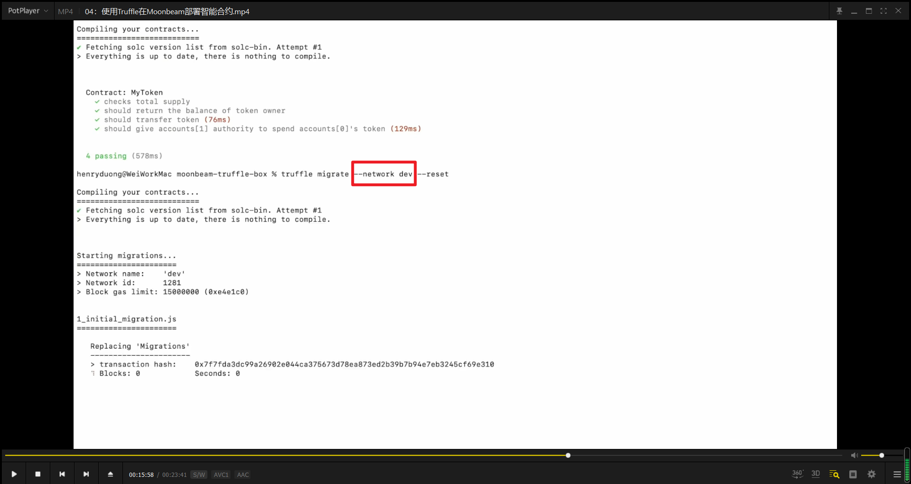
truffle migrate --network dev部署智能合约到本地节点。这里用reset是因为部署了一次。第一次部署不用加。

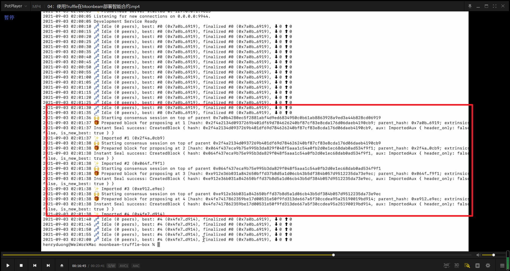      
docker logs ID   本地节点显示收到了部署合约的交易。     

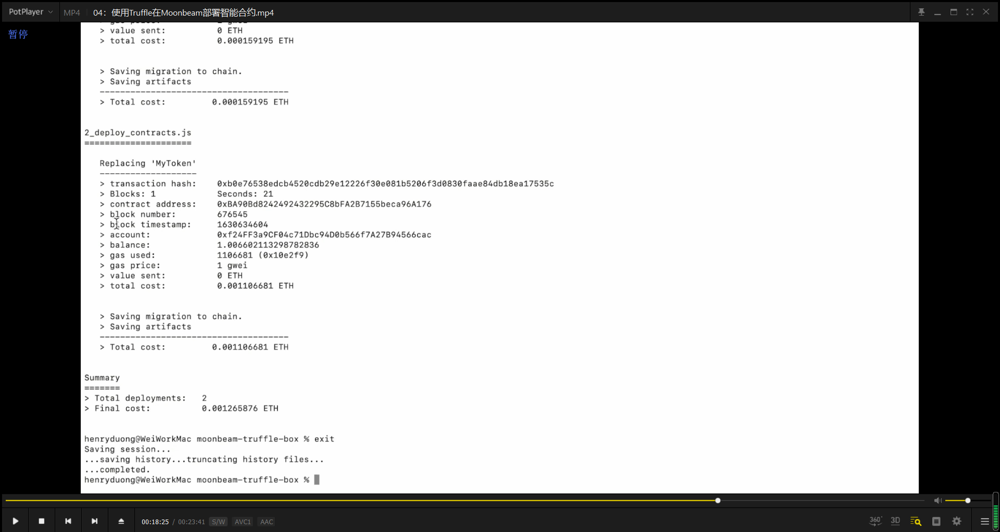
truffle migrate --network moonbase 部署到moonbeam测试网     

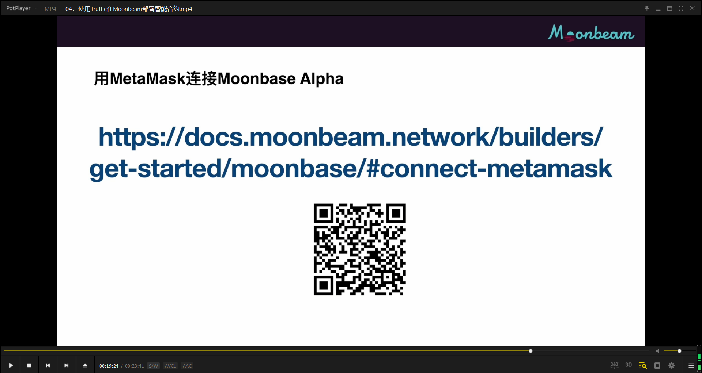
metamask连接到moonbase alpha        

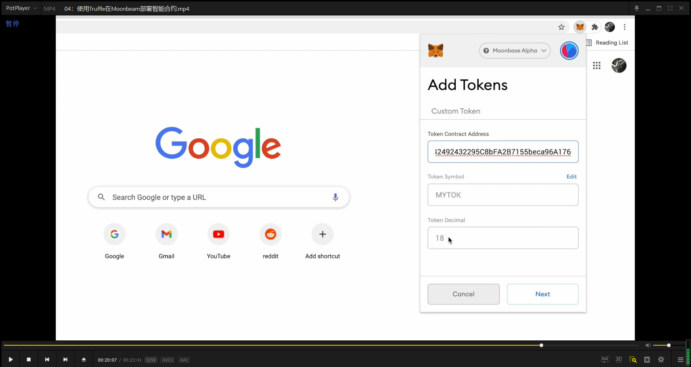      
填写智能合约地址就可显示代币。