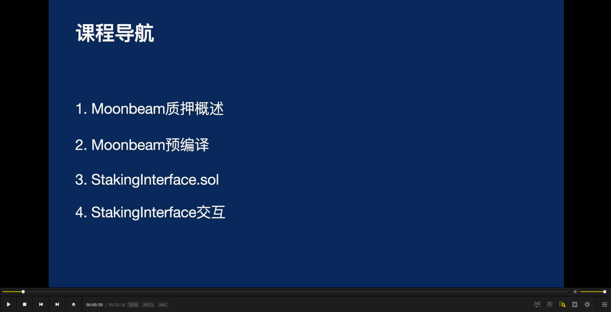
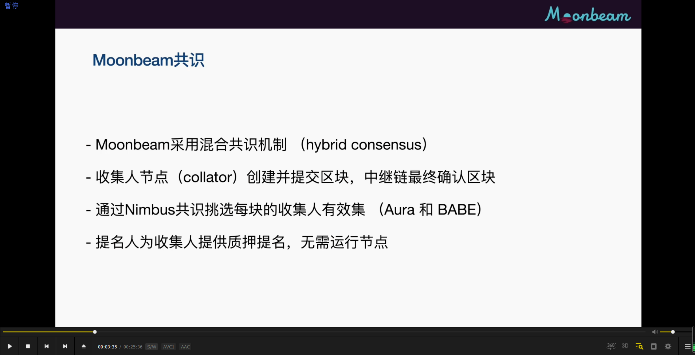
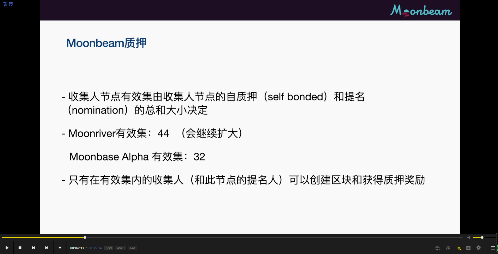
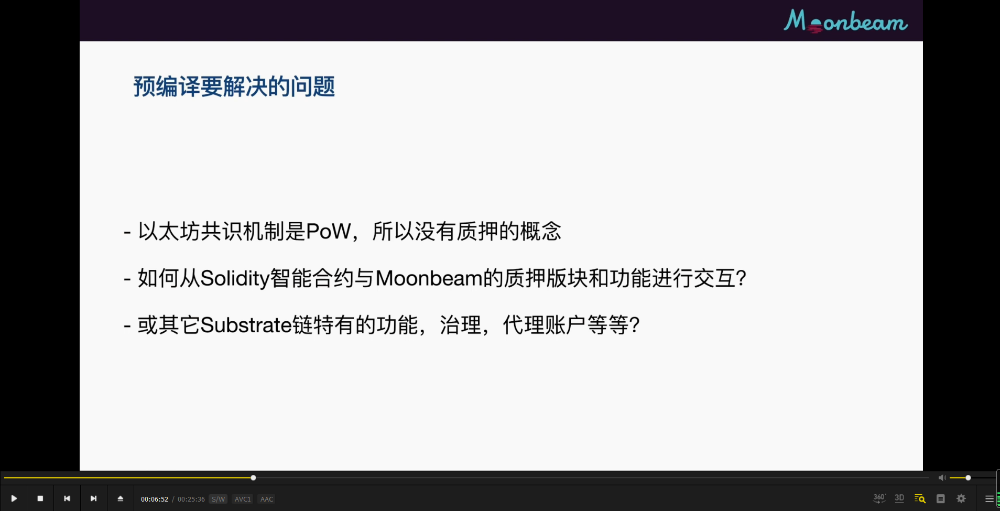
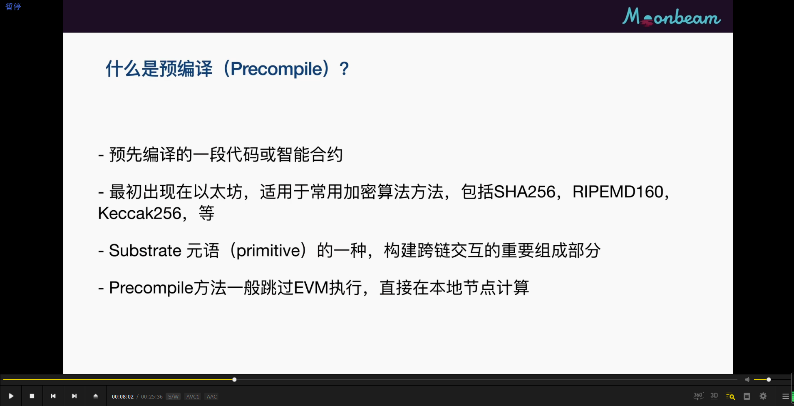

      

      

      

      

      

合约是interface也就是接口，方法定义只包括签名，不包括具体实现代码。因为预编译合约不会通过evm实行。所以里面的智能合约没有必要有方法的实现。节点接到方法调用后会直接交给substrate（或其它）的runtime执行。        
方法的注释里都有个selector，后面接着hash。这是solidity在调用方法时使用的id。hash获得方法见1150。        
涉及到substrate，暂停学习此教程。