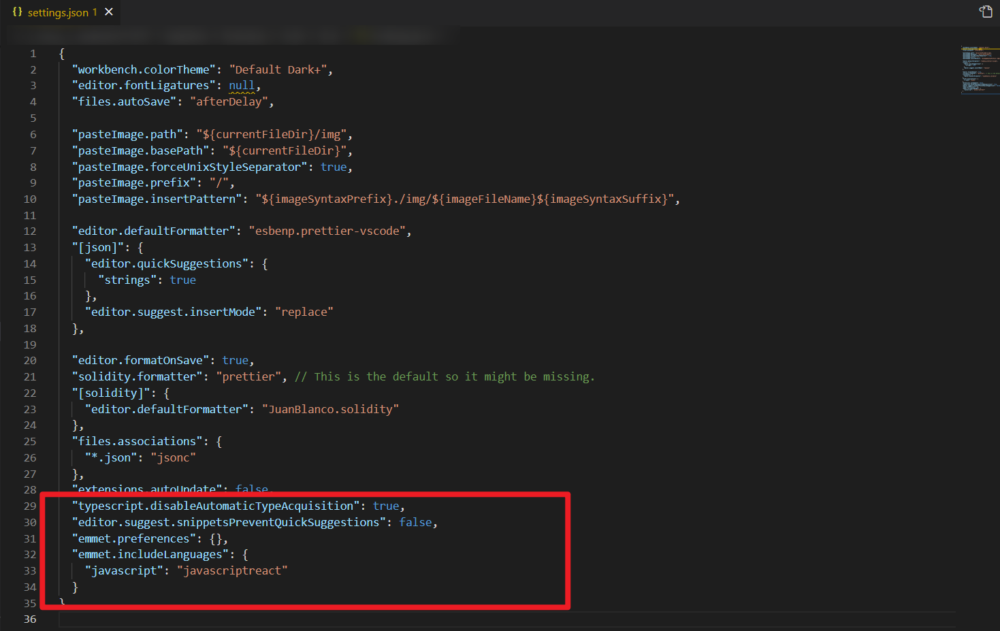
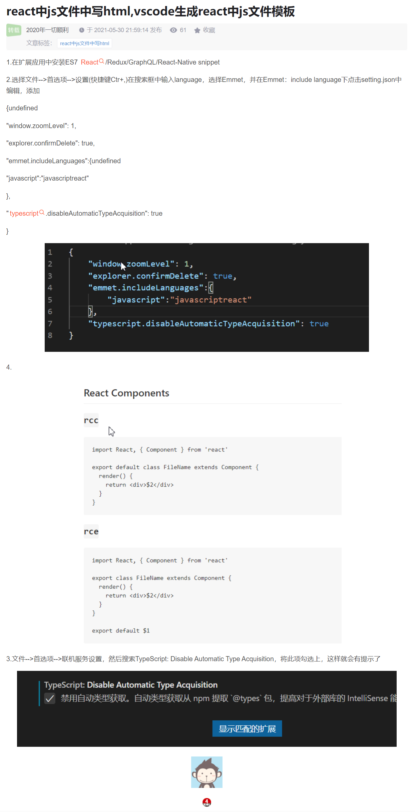

react snippet 插件在 js 文件中无法联想 html 代码片段，则在 settings.json 中输入：

```
  "typescript.disableAutomaticTypeAcquisition": true,
  "editor.suggest.snippetsPreventQuickSuggestions": false,
  "emmet.preferences": {},
  "emmet.includeLanguages": {
    "javascript": "javascriptreact"
  }
```


