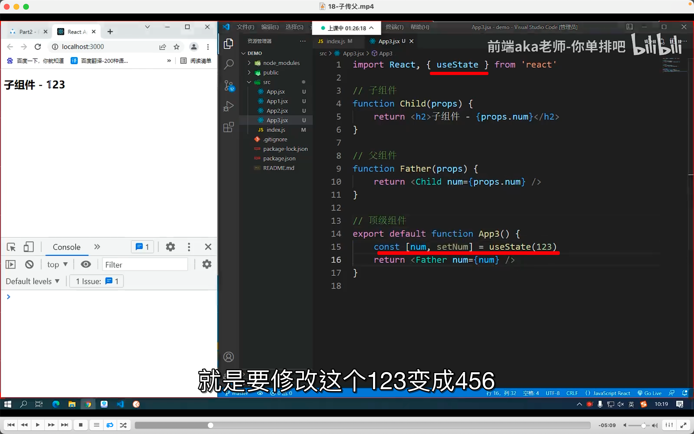
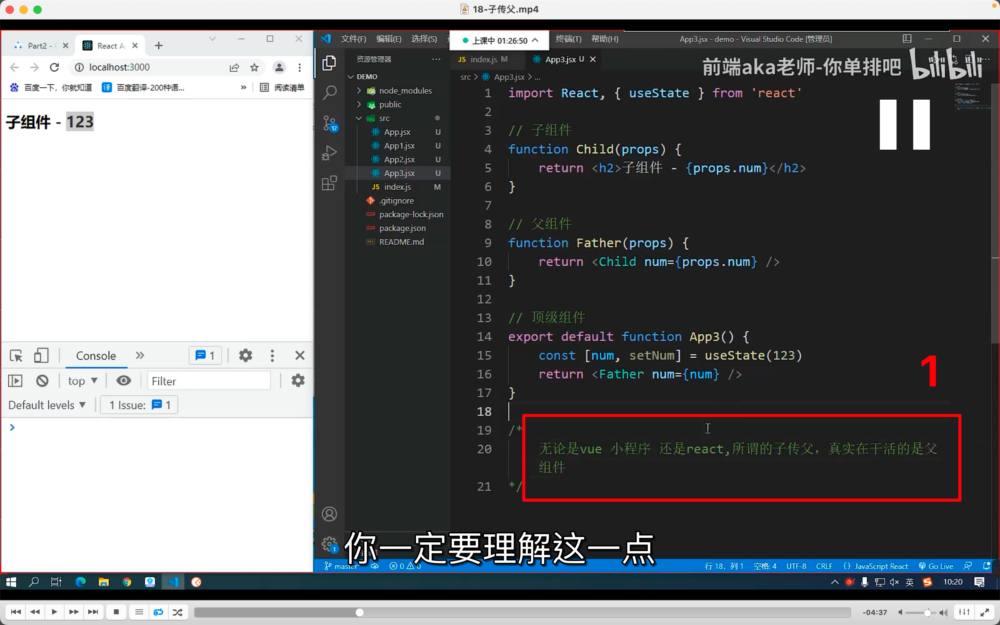
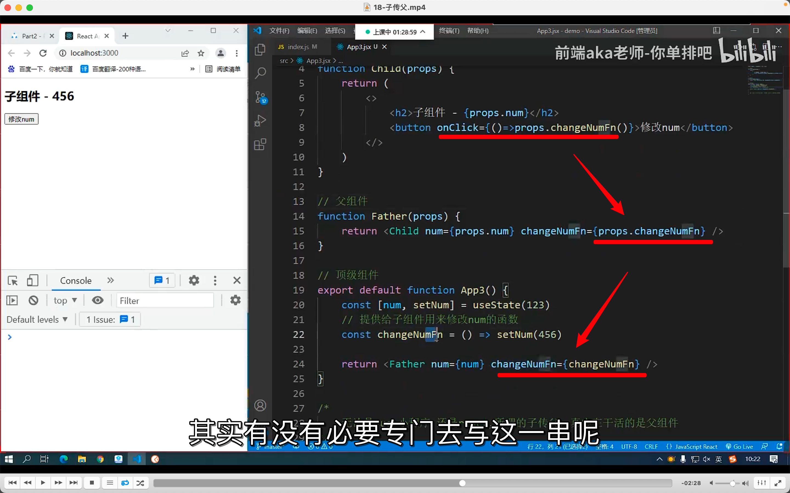
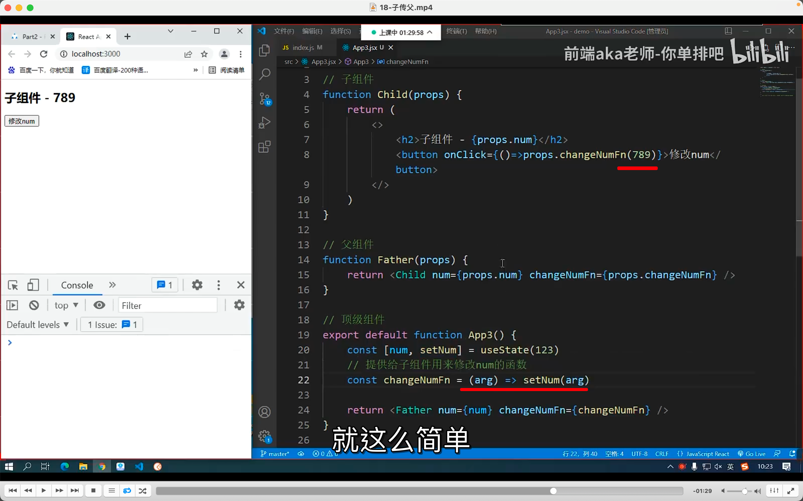
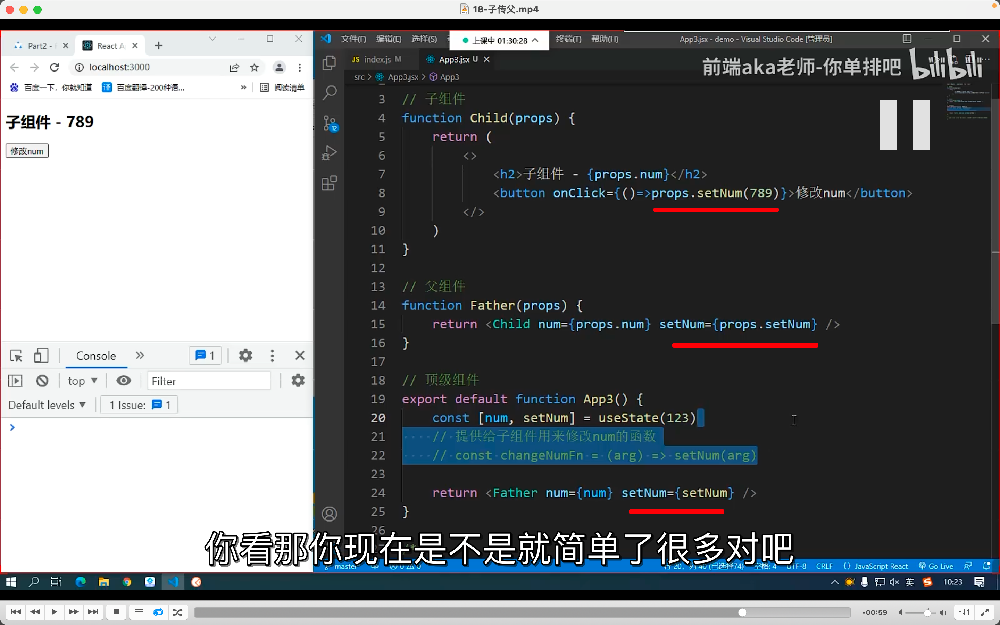

## 220921

  
上一节的方法无法动态显示，需要加上 usestate

  
1

  
方法的传递，也是定义在顶，再通过 props 顶穿父，父传子

  
需要子组件里设置数据，就在顶级中定义行参，子组件中传递实参。

  
也可以直接用 setNum，实际中也大多是直接用 setNum，为了教学才弄了之前较复杂的例子  
最终是顶级在处理事情，子级相当于只起到传参作用？？？
