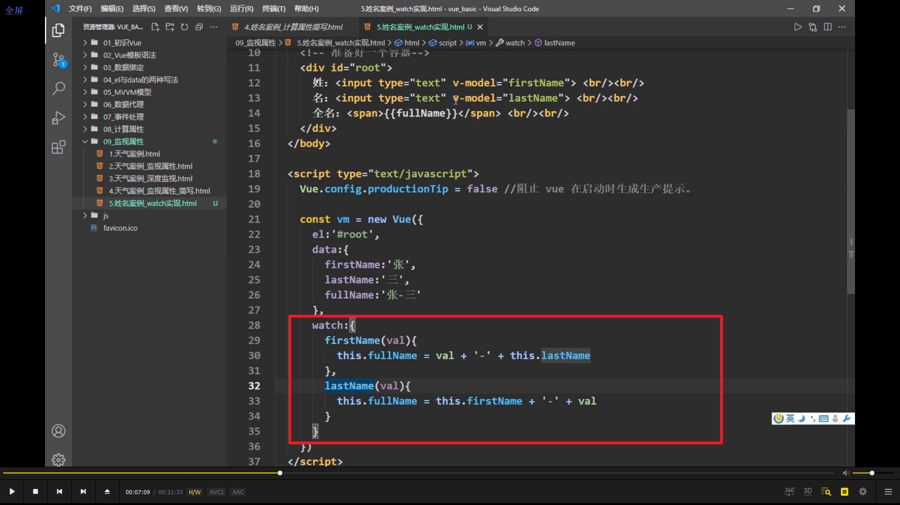
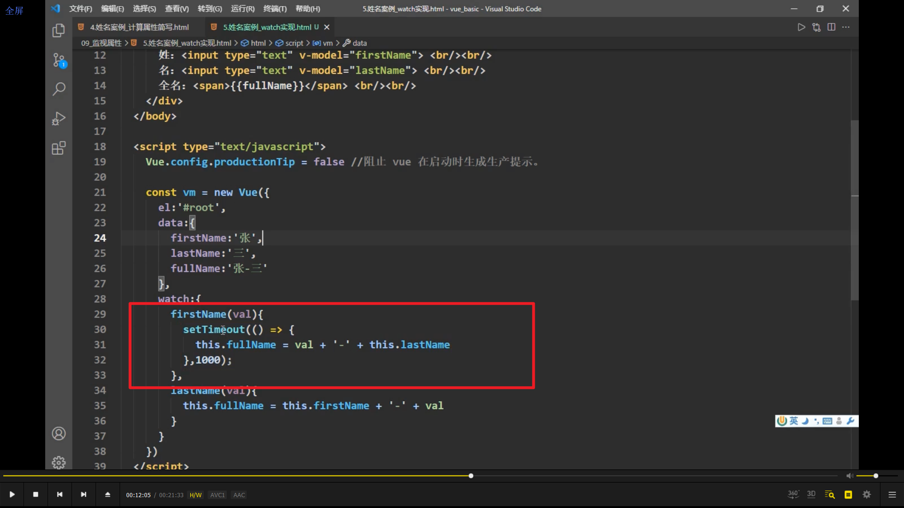
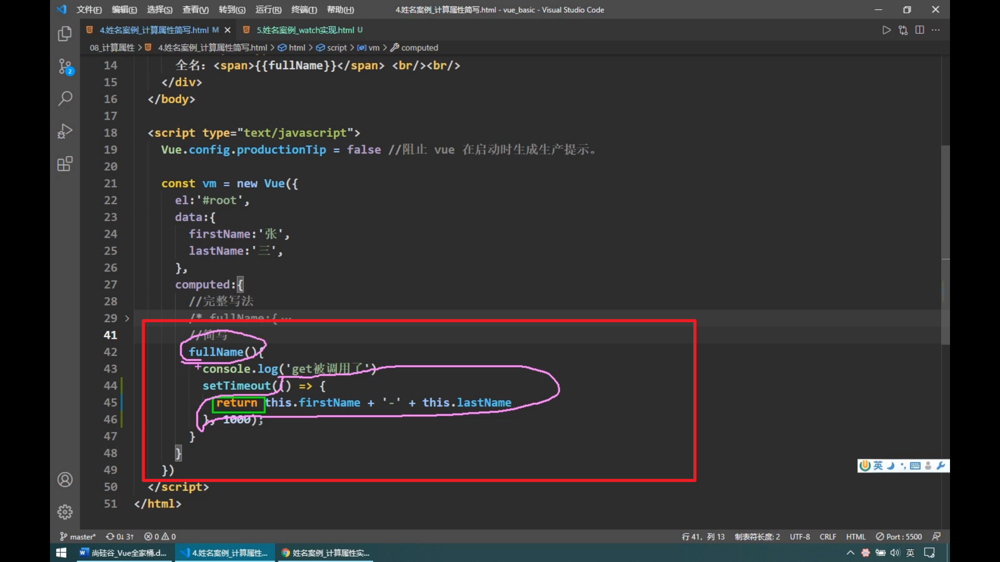
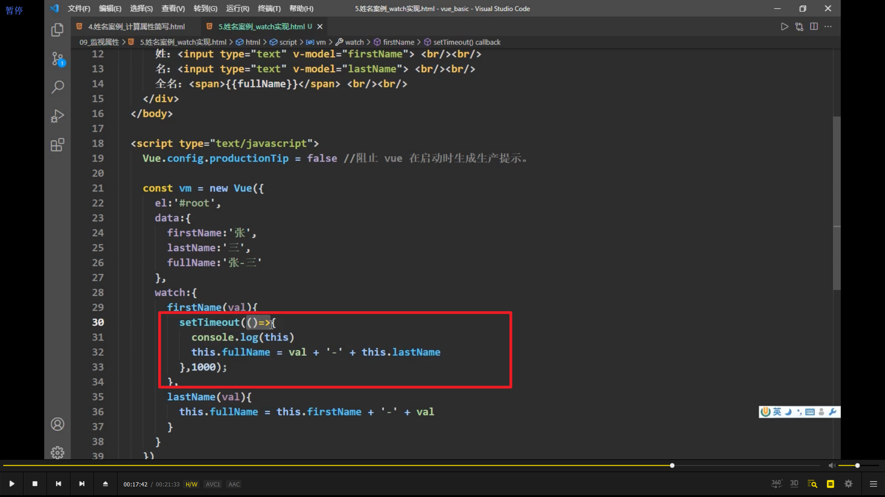
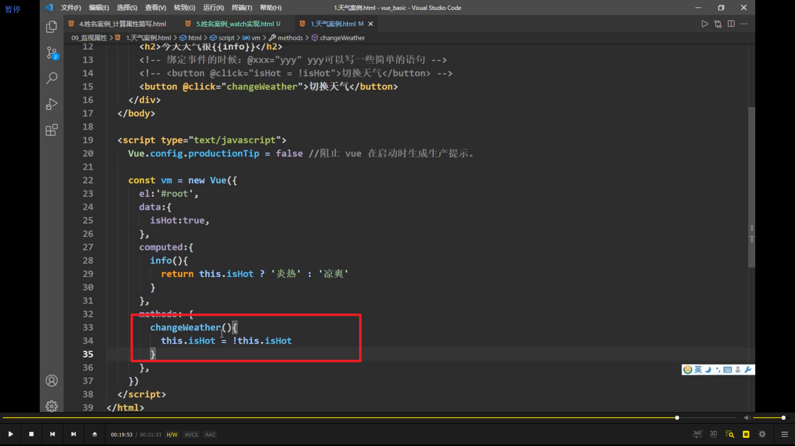
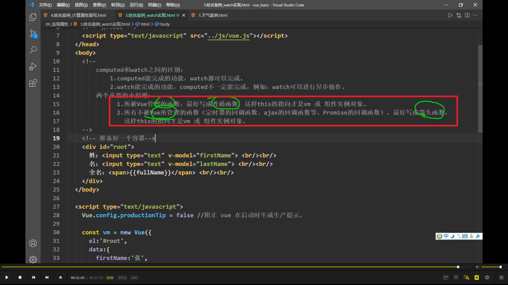

  
用 watch 写了一遍案例。

之前的案例用计算属性更方便。但现在希望等 1s 再发生变化，就最好用 watch，因为 watch 能开启异步任务。而 computed 不行。

  
computed 这样写的话是错误的。

  
watch 里面必须用箭头函数，具体论证较复杂，需要时再学习。

  
函数最好用普通函数，不要用箭头函数，因为用了箭头函数就用不了 vm。

  
总结，vue 管理的，最好写出普通函数。不是 vue 管理的，最好写成箭头函数。目标都是让 this 指向 vm。
