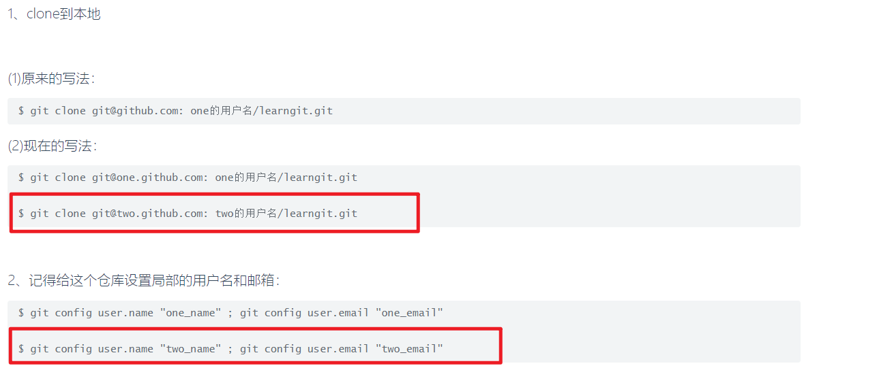
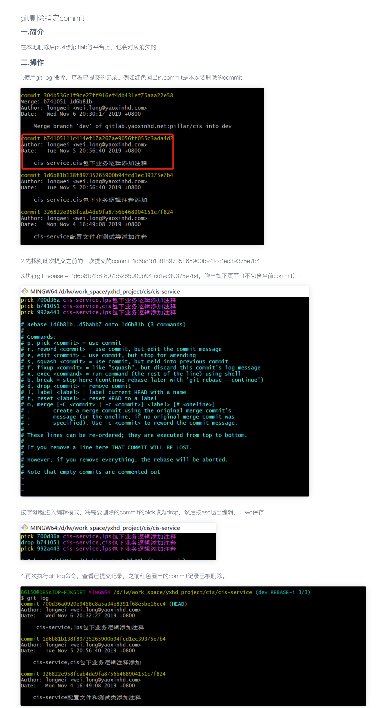

### 设置全局用户名和密码

git config --global user.name "username"  
git config --global user.email "email"

### 全局 git 设置默认文件地址

C:\Users\username\.gitconfig

### 设置本地用户名和密码

git config user.name "username"  
git config user.email "email"

### 本地 git 设置默认文件地址

/.git/config

### 合并 add commit push 命令

git config --global alias.aaa '!f() { git add -A . && git commit -m "$@" && git push origin main; }; f'

git config --global alias.zzz '!f() { git add -A . && git commit -m "$@";}; f'
add，只提交到本地，不上传到 github。git zzz （有错误，暂不知道什么原因）  
add, 合并 git add 和 git commit -m 只用写为 git commit -am 即可。

楼上提到了 git revert。其实，git reset --hard 和 git revert 都可以实现“回滚代码”。但区别在于：

git revert 会把你的本地变成 A -> B -> C -> D -> E。其中，E 干的事儿是删除 C 和 D。这样做的好处在于，你 git push origin master 就不会有上面的报错了。但，历史线上还是会保留 C 和 D 这两个 commit。如果使用这个命令，记得要 add 然后 commit。

git reset --hard 会直接删掉 C 和 D，形成 A -> B 这样的结果。好处在于更直接更彻底。缺点在于，首先要通过 git push origin master --force 去强行更改。其次，一旦你后悔了，除非根据本地的 reflog 直接恢复 HEAD 指针，此外没有其他办法。

### 分支相关

git checkout -b new-branch 创建并进入 new-branch  
git add git commit 和正常提交一样  
git push origin new-branch 提交到 github。
git checkout main 返回 main 分支
git branch -d new-branch 删除 new-branch 分支 (未 merge 的分支 -d 需写为-D)

###

想回到某次提交 git reset --hard \*\*\*  
但再提交到 github 需要增加 -f 参数，且 github 上会丢失掉该次提交以后的提交。

### 删掉增加但还未提交的文件和修改，即还原得跟上次提交一模一样。

git checkout head . 修改被还原  
git clean -nfd 查看即将被删除的文件  
git clean -fd 增加的文件被删除

### 先参考 231013 ，不能解决再看这条。为一台电脑配置多个 GitHub 账号

https://www.cnblogs.com/xjnotxj/p/5845574.html

ssh-agent -s 可能遇到报错，输入 Set-Service -Name ssh-agent -StartupType automatic （https://www.jianshu.com/p/7bf7047af0f1）

添加私钥 ssh-add ~/.ssh/id_rsa_one 时可能需要改为./id_rsa_one。

config 文件仍使用~/.ssh/id_rsa_one 方式，且注意修改掉多余的空格

  
注意使用第二个库 git clone 时：git clone git@two.github.com:two 的用户名/learngit.git （截图中 “two 的用户名”前多了个空格）。  
git clone 下来后设置 git config user.name "two_name" ; git config user.email "two_email"

### github 使用技巧

1，按 s 直接到搜索框

2，搜索界面左下角，高级搜索，还有更多搜索选项需要查 github 官方文档

3，仓库内 t 键盘既可以搜索所有文件，不用依次进入文件夹

4， 按 l 跳转到某行，在某行左侧三点处可以生成该行永久链接

5，ctrl k 打开命令面板

6，仓库界面按。键，生成网页版 vscode

7，项目地址前加上 gitpod.io/#/前缀，自动装依赖，生成 docker 镜像等。

### github 搜索完全一致的代码

如搜索 provider.on 显示结果均为 provider on 之类的。参考此答案，由于 github 搜索机制，带有一些标点符号都会被忽略。但可以使用 google 如下所示搜索。

https://stackoverflow.com/questions/26433561/how-to-search-on-github-to-get-exact-string-matches-including-special-character

"provider.on" site::https://github.com  
"provider.on" site::https://gist.github.com

### 修改源地址，.git config 里直接修改。

### git 遇到网络迟缓或 timeout 报错

https://www.csdn.net/tags/NtzaggxsMTM1MC1ibG9n.html  
https://www.ipaddress.com/  
mac 更新 hosts 命令：sudo killall -HUP mDNSResponder;say DNS cache has been flushed

### 回退到了之前版本，想再回退到最新版本。使用 git reflog，找到最新版本，但只能本地使用。

### git clone 不使用 github 提供的目录，自定义目录，后面接目录名就行。

git clone https://github.com/substrate-developer-hub/substrate-node-template ./node-template-ori

### 默认初始分支设置为 main

git config --global init.defaultBranch main

### git push 时报错 Support for password authentication was removed on August 13, 2021 或 fatal: Authentication failed for

此时 git push 时并不是输入密码，而是粘贴 Personal access tokens，https://github.com/settings/tokens，注意此token会定期expired，更新后git push 时需重新粘贴此 token。

### github 精准搜索

实例："type KittyIndex" path:runtime/src language:rust filename:lib.rs NOT excludedword
另外搜索时间限制似乎有问题，加了就搜不到代码了，可能不是限制的代码，而是 commit 名或描述名  
add220910,可以通过搜索页面右上角 search option 按时间排序搜索结果。

### git 删除某一指定 commit

https://www.cnblogs.com/rxysg/p/15672210.html  
此方法有问题，本地显示有问题，且 push 到远程时会出错。

### 本地 git 提交数少于远程提交数（可能是回退到了之前的 commit），想 push 到远程，又不想合并远程内容的话，就 git push origin main -f。但这样远程多余的 commit 会消失。

### 更改 git remote origin，也就是 git clone 一个项目后，可以将新增的 commit 上传到自己新建的库

首先在 github 新建一个 repo  
git remote remove origin  
git remote add origin git@github.com:rusty-peilin/new-repo.git

### git tag

</img>  
https://blog.csdn.net/YOUYOU0710/article/details/108128431

git tag -a tagname -m “description”  
git push origin --tags

### git token 过期后新增 token 要选 classic 的，选 fine 的会遇到报错。

### 先参考 231013 ，不能解决再看这条。多 git 账号

https://zhuanlan.zhihu.com/p/468501219

这个教程较好，但仍遇到了 remote: Permission to XXXA/xxxx.git denied to XXXB 问题无法解决

原因是即使执行了  
git config --global user.name "Your Name"  
git config --global user.email "your-email@example.com"  
电脑 keychain 里仍然保留的是之前账号的账号名和密码（github 是 personal access token），  
mac 电脑搜索钥匙串访问，再搜索 git，删除 github.com 对应的钥匙串，可能删除不成功，则切换左侧登陆/本地项目选项。再自己找 github.com 项目删除（而不是搜索删除），则能删除成功  
之后再 push，输入用户名，再输入密码即 personal access token，即可。新的账号和 pat 就存入了钥匙串。（注意 ssh key 和 pat 是两个概念，应该是两个都满足了后才能成功执行）

## 231013 多 git 账号

参考此教程：https://www.haccks.com/posts/github-multi-ssh-key/

</img>

自己实践没有问题，只是有些步骤是之前已经做过的，如使用的是 rsa 而不是 ed25519 加密。  
</img>  
注意最后 git push 项目时，要选 ssh 而不是 https，且要修改 github.com 为第二个账号的 host（保存在～/.ssh/config 中）
