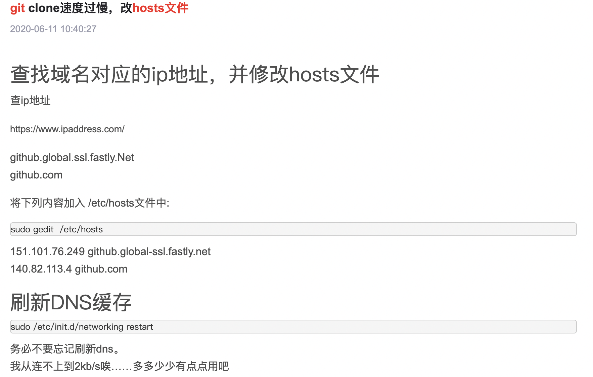
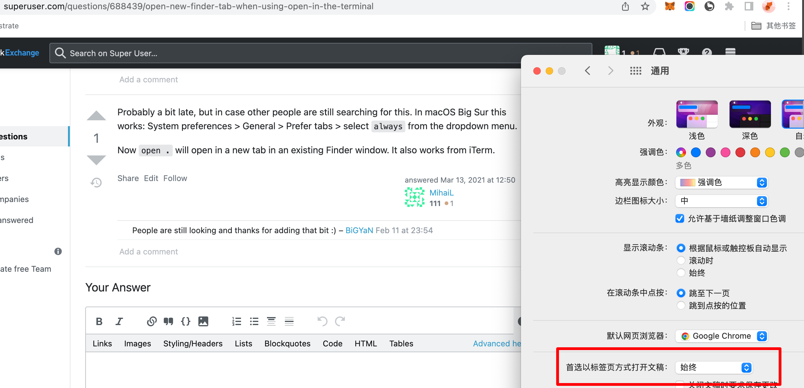
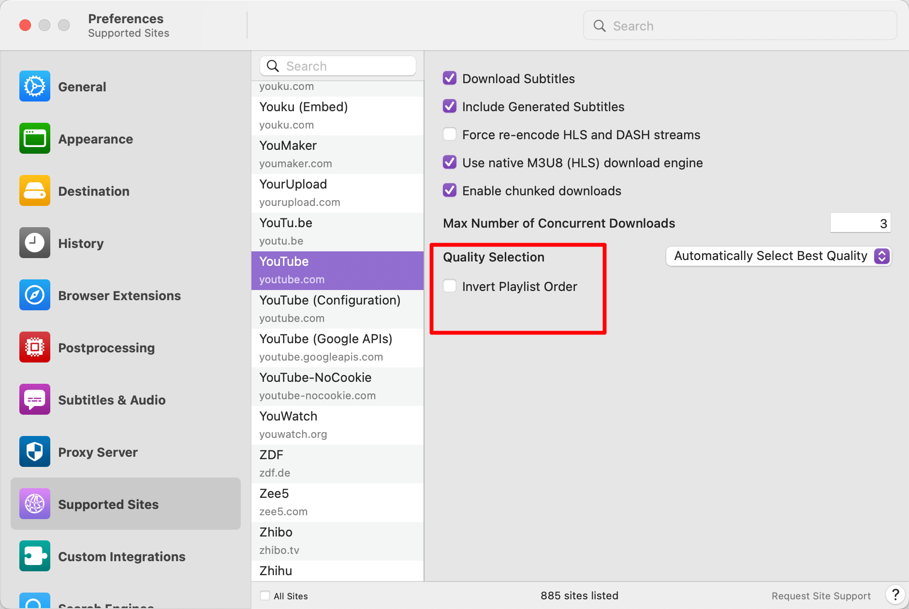

## m1 芯片开启系统工具的方法不是网上说的开机后按 cmd r，而是一直按开机键

## 触控板拖动窗口和选择文字 系统偏好设置-->辅助功能--->鼠标与触控板--->触控板选项 启用拖移 三指拖移（add，选不使用拖移锁定就类似 win10。）

## git 遇到网络迟缓或 timeout 报错

  
https://www.csdn.net/tags/NtzaggxsMTM1MC1ibG9n.html  
https://www.ipaddress.com/  
mac 更新 hosts 命令：sudo killall -HUP mDNSResponder;say DNS cache has been flushed

## mac 使用 code 命令打开 VSCode

安装 code：打开 VSCode –> command+shift+p –> 输入 shell command –> 点击提示 Shell Command: Install ‘code’ command in PATH 运行

## 常用快捷键

commant tab：切换不同程序，但如程序已经最小化则无法切换。  
control command f：最大化，正常切换。（有些程序似乎无效果）。

cmd n：新建终端。  
cmd t：在当前终端新增一个页面。
cmd 上：访达中到上级目录。（可以访达，显示，分栏。则更方便）
cmd shift z: 恢复撤销。与 win10 里 ctrl y 一样。
cmd shift .: 访达中显示隐藏 隐藏文件。
cmd opt 左右键：不同 tab 左右切换。control tab 只能单方向切换。
cmd shift m: chrome 不同用户之间切换
cmd ·：据说能切换同一程序不同窗口，但在 chrome 实验无效。

opt shift h:中文输入法下切换中文标点,英文标点
add220912,以上方法部分标点无效,如下划线必须在英文模式输入,不然就是破折号。
可在键盘，文本，输入码中输入 xh，这样在 chrome 等地方英文输入 xh，就能空格选择下划线。但 vscode 不行，但可中文状态下输入 xh，数字选择下划线。

220930
cmd ctrl 1 文件夹按名称排序
2 按类型排序
3 按时间排序

## mac 启动拖选

设置，辅助功能，鼠标与触控板，触控板选项，启用拖移。

## 触发角设置


## chrome 全屏时标签和地址栏消失

cmd shift f

## Iterm2 + zsh 安装教程


https://blog.csdn.net/Top_xiao/article/details/119790555

## 快捷键打开 iterm2 并进入指定目录实例。

automator.app，新建文稿，快速操作，运行 applescript。粘贴以下代码。cmd 保存，键盘，快捷键，服务，通用，点选并配置快捷键即可。

```
--此段代码有bug
tell application "iTerm"
	activate
end tell

tell application "System Events"
	tell process "Iterm"
		delay 0.2
		keystroke "cd Desktop/"
		key code 29
		key code 18
		keystroke "workspace"
		key code 36
	end tell
end tell
```

keystroke 里不能输入数字，用 key code 代替。
key code 列表。
https://eastmanreference.com/complete-list-of-applescript-key-codes

```
--使用这段代码
tell application "iTerm"
	reopen
	activate
	tell current window
		--create tab with default profile
		tell current session
			write text "cd ~/Desktop/01workspace"
		end tell
	end tell
end tell
```

## permission denied 错误

sudo chmod -R 777 某一目录
-R 是指级联应用到目录里的所有子目录和文件
777 是所有用户都拥有最高权限

## 剪切

cmd c，cmd option v

## esc 键失效，删除掉 ishot 截图程序

## open . 打开 tab 而不是 window



## 安装一些软件可能遇到 can't be opened because apple can't check it for malicious software 报错

此时打开系统偏好，安全与隐私可能就有解锁此软件的选项

## downie 下载 YouTube 视频，取消反序

</img>

## cmd shift \ 显示所有访达标签页

## 找到并关闭某个进程，特别是用 nohup 执行的隐藏进程

ps -ef | grep \*

kill -9 pid (上面指令的结果中的第二列数字)

## karabiner，键位映射

## 输入希腊字母

</img>

## 230605 哪种硬盘格式既支持 win，又支持 mac。

FAT32（单个文件不可超过 4GB），exFAT（部分安卓手机不支持）

有些情况需要用 NTFS+插件形式，原因如下：

```
折腾了很久，最后还是选择了NTFS+插件的形式。原因有2个：1.exFAT不支持硬盘索引、压缩。不支持索引意味着无法支持像Git这样进行仓库管理的程序。不支持压缩意味着一些文件将占用极大的空间（比如虚拟机文件）2.NTFS格式更稳定，exFAT在macos使用过程中，很容易出现卡死，需要到windows系统下进行修复的情况。一般跨两个系统的磁盘是存储盘，在使用exFAT长达半年后，发现各种不顺畅。其中卡死现象出现十余次，及其影响体验。目前已重新格式化为NTFS，使用上暂未发现问题。
```

## 怎么整齐排列 mac 的文件夹

快捷键 control+command+1 自动排列，control+command+2 按照种类自动排列，mac 下的文件夹设置一次，以后所有的文件都按照最后一次设定来执行

## 批量重命名：在 mac 中，怎么用 python 的方法批量删除一个文件夹内所有文件的文件名的前 2 个字符

```
import os

# 设置要操作的文件夹路径
folder_path = "/path/to/your/folder"

# 获取文件夹中的所有文件和子文件夹
items = os.listdir(folder_path)

# 遍历文件夹中的每个项目
for item in items:
    item_path = os.path.join(folder_path, item)

    # 检查项目是否为文件而不是子文件夹
    if os.path.isfile(item_path):
        # 提取文件名的前2个字符以后的部分
        new_name = item[2:]

        # 构建新的文件名的完整路径
        new_path = os.path.join(folder_path, new_name)

        # 使用os.rename()来重命名文件
        os.rename(item_path, new_path)

```

## 写一个在 mac 系统中删除当前文件夹下所有后缀名为.srt 的文件都 python 脚本

```
import os

# 获取当前工作目录
current_directory = os.getcwd()

# 遍历当前文件夹下的所有文件
for filename in os.listdir(current_directory):
    if filename.endswith('.srt'):
        file_path = os.path.join(current_directory, filename)
        try:
            # 删除文件
            os.remove(file_path)
            print(f"已删除文件: {file_path}")
        except Exception as e:
            print(f"删除文件时出错: {file_path}")
            print(f"错误信息: {str(e)}")

```

## 231003 修改程序图标

gpt 说的修改 icns 文件的方法无效，用以下方法有效：cmd c 想使用的图标，选择程序显示简介，点击左上角图标处 cmd v。则图标立即改变，cmd tab 时显示的图标可能要延迟一段时间或者退出重启后再改变。
