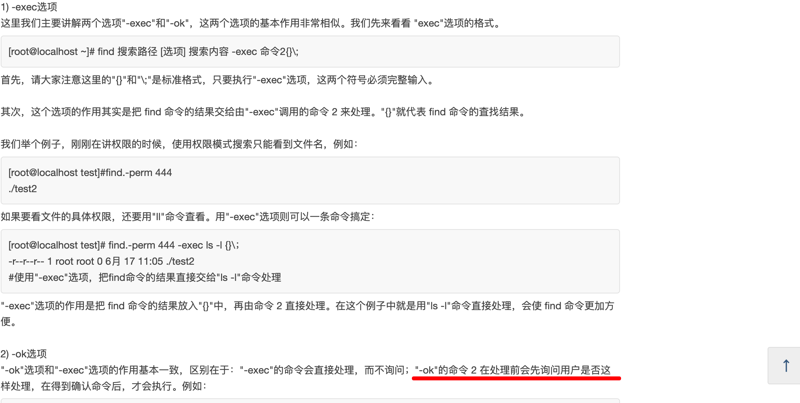
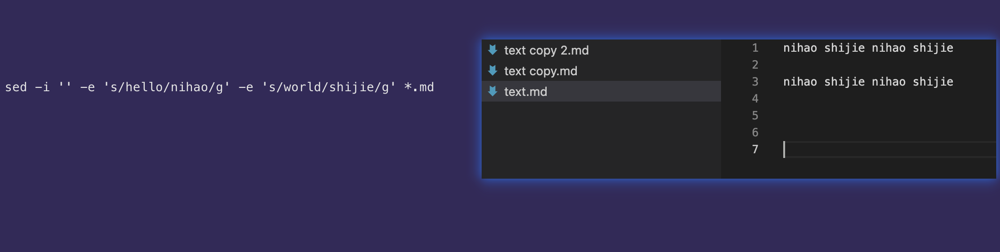
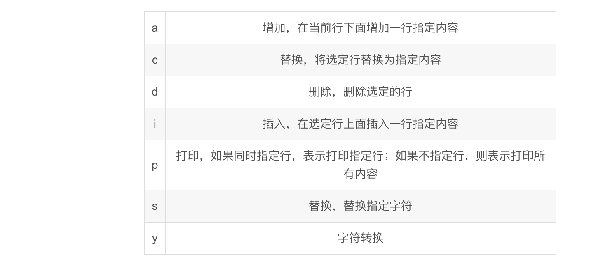

## linux，mac，win 很多终端命令都是通用的，所以将终端命令相关笔记存在这里

## find

  
--=  
  
--=  
  
实例 find ./ -name 'target' -ok rm -rf {} \;  
注意截图有错，{} \; 之间有空格  
add  
需要输入 y 并回车，只回车无效

## sed 命令实例

</img>

```
sed -i '' -e 's/hello/nihao/g' -e 's/world/shijie/g' *.md

```

mac 系统需加''，用于备份文件扩展名，不需要时留空

```
sed -i '' -e 's,!\[\](,</img>  ,g'  *.md
```

s 后不仅可接/，还能接如逗号的其它符合作为分隔符  
\x27 代表单引号

```
sed -i '' -e 's,$,  ,g' *.md
```

在每行末尾添加两个空格  
\$代表每行末尾

 </img>

s 意思是替换，替换指定字符

## 221005

## 删除除了 .git 文件夹以外的所有文件/文件夹

```

mv .git/ ../
rm -rf *
rm -rf .*
mv ../.git/ ./

```

rm -rf .\*是为了删除隐藏文件

